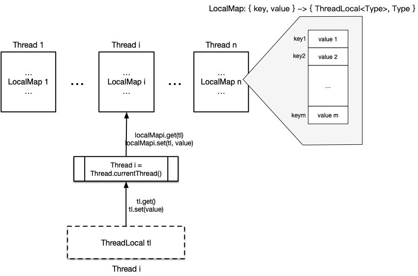
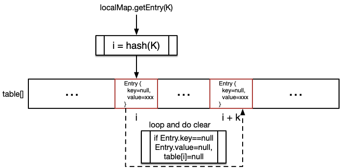
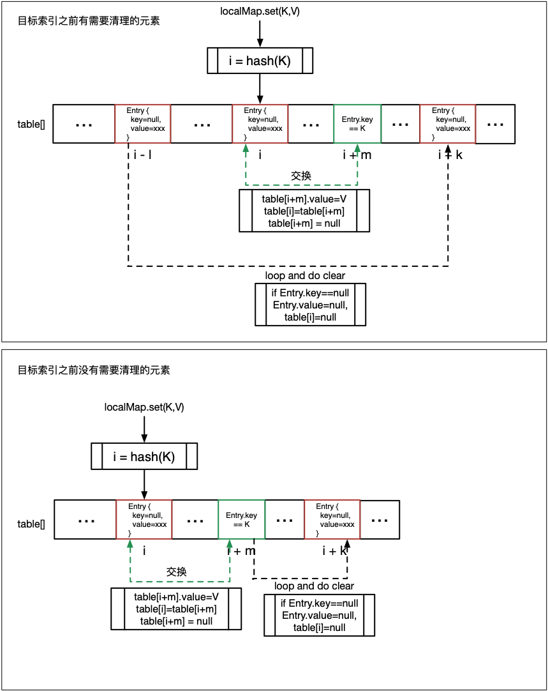

<a name="index">**目录**</a>

- <a href="#ch1">**1 预备知识——斐波拉契散列**</a>

<br>
<br>

### <a name="ch1">1 预备知识——斐波拉契散列</a><a style="float:right;text-decoration:none;" href="#index">[Top]</a>

Java ThreadLocal 的作用是在当前线程维护一块线程独立（除了本线程外，其它线程无法访问到）的数据区来规避并发问题。其中为了实现对线程独立数据区的快速访问，ThreadLocal 将这块数据区保存在一个散列表中。我们暂且将该散列表叫做 **ThreadLocal散列表**。

ThreadLocal散列表采用 **斐波拉契散列** 方法实现散列函数。

具体而言，ThreadLocal散列方法用 **黄金分割比魔数（0x61c88647）** 作为散列乘数，以如下公式作为散列函数以实现最大程度减少冲突的目的：

```
hash(K) = (K * 0x61c88647) & (hashtable.len - 1)
```

其具体的散列原理可以参考 [斐波拉契散列](https://github.com/huanzhiyazi/articles/issues/17)。

<br>
<br>

### <a name="ch2">2 ThreadLocal 核心结构</a><a style="float:right;text-decoration:none;" href="#index">[Top]</a>

上一节讲到，ThreadLocal 在当前线程维护了一个散列表，而这个散列表只能由当前线程自己访问，以此来避免该散列表内的数据并发问题。所以 ThreadLocal 基本的结构图如下：



如图所示，关键点如下：

- **每一个 Java Thread 对象都保存一个散列表——LocalMap**。实际定义如下：

```java
public
class Thread implements Runnable {
    // ...省略

    /* ThreadLocal values pertaining to this thread. This map is maintained
     * by the ThreadLocal class. */
    ThreadLocal.ThreadLocalMap threadLocals = null; // 图中的 LocalMap

    // ...省略
}
```

LocalMap 的实际维护者为 ThreadLocal。

- **应用程序通过 ThreadLocal 确保只访问当前线程的 LocalMap**。这包含两层意思：

    1. ThreadLocal 只访问当前线程的 LocalMap。这实际由 `Thread.currentThread()` 这个静态方法来保证。比如，在 ThreadLocal.get() 方法中，先通过 Thread.currentThread() 得到当前 Thread 对象，然后再读该对象中的 LocalMap 散列表：
    
    ```java
    public T get() {
        Thread t = Thread.currentThread();
        ThreadLocalMap map = getMap(t);

        // ...从 map 中读并返回值
    }
    ```

    2. 如果不通过 ThreadLocal 也能引用到其它线程的 LocalMap。但是除非用反射，否则虽然有其它线程的 LocalMap 引用，但是却无法访问它。因为 LocalMap 中的所有方法都是私有的，只有外部类 ThreadLocal 有权限访问它们。

有了这个保证，如果有数据不希望被其它线程看到，就可以放心通过 ThreadLocal 存入 LocalMap 散列表。**它的效果类似于一个局部变量（local parameter），都只对当前线程可见；只不过一般来说，其生命周期要长于局部变量，可访问范围也要大于局部变量**。

- **每一个 ThreadLocal 对象都是散列表中的一个键（key）**。键值从 1 开始递增，并通过以下散列函数映射到散列表中的索引位置：

```
hash(key) = (key * 黄金分割比魔数) & (散列表长度 -1)
```


<br>
<br>

### <a name="ch3">3 ThreadLocal 散列表读写</a><a style="float:right;text-decoration:none;" href="#index">[Top]</a>

LocalMap 是一个数组，根据斐波拉契散列原理，其长度必须是 2 的倍数。LocalMap 的读写需要解决三个关键问题：**清理、冲突、扩容**。

#### <a name="ch3.1">3.1 散列表的清理</a>

LocalMap 中的元素是可被系统回收的，这样可以避免不再使用的对象长期滞留在散列表中占用内存空间。其散列表的定义如下：

```java
static class ThreadLocalMap {

    // 散列表元素，是一个弱引用，本质是 ThreadLocal 是一个弱引用
    static class Entry extends WeakReference<ThreadLocal<?>> {
        /** The value associated with this ThreadLocal. */
        Object value;

        Entry(ThreadLocal<?> k, Object v) {
            super(k);
            value = v;
        }
    }

    // 散列数组
    private Entry[] table;

    // ...省略
}
```

可以想象这样一种情况，外部应用程序先生成了一个 ThreadLocal 对象，并保存在当前线程的散列表中。当外部应用程序不再用到该 ThreadLocal 对象时，将解除其引用（即设置成 null），其本意是要告诉 JVM，该对象可以被回收了。此时，如果 LocalMap 中仍然持有对该对象的强引用，则该对象虽然不再被使用，但是永远得不到回收的机会了，从而会导致内存泄露。所以散列表中对 ThreadLocal 的引用必须是 WeakReference 的，这样 JVM 才有机会释放它。

LocalMap 的清理过程是在读写 LocalMap 时进行的。

其中，LocalMap 的读清理示意图如下：



读步骤如下：

1. 以 ThreadLocal 作为 key（用 K 表示），用斐波拉契散列计算出在散列表（table）中的索引 i。
2. 若 `table[i].key==null` 说明存放在索引 i 处的 ThreadLocal 已经被系统回收，于是执行散列表读清理过程（步骤3）；否则找到，返回 `table[i]`。
3. 从索引 i+1 开始遍历整个散列表，若 `table[i].key==null` 则清理其 value 并将该位置置null；否则如果 `hash(table[i].key)!=i`，说明该元素是再散列过来的，将其重新散列到与 `hash(table[i].key)` 更近的位置。
4. 散列表读清理完成后，从 i 开始继续遍历散列表，如遇 `table[i].key==K`，说明要读的 ThreadLocal 是因为冲突通过再散列到该位置的，返回 `table[i]` 即可。
5. 没有找到符合要求的 ThreadLocal，返回 null。

值得注意的是，在散列表读清理步骤（步骤3）中，对不需要清理的元素又执行了一次再散列，目的是尽可能地将再散列过的元素重新散列到原来的位置，这样下次再读取该元素时，可以更快地命中。其关键代码如下：

```java
private int expungeStaleEntry(int staleSlot) {
    Entry[] tab = table;
    int len = tab.length;

    // expunge entry at staleSlot
    tab[staleSlot].value = null;
    tab[staleSlot] = null;
    size--;

    // Rehash until we encounter null
    Entry e;
    int i;
    for (i = nextIndex(staleSlot, len);
         (e = tab[i]) != null;
         i = nextIndex(i, len)) {
        ThreadLocal<?> k = e.get();
        if (k == null) { 
            // 执行正常读清理过程
            e.value = null;
            tab[i] = null;
            size--;
        } else {
            // 执行再散列过程
            int h = k.threadLocalHashCode & (len - 1);
            if (h != i) { // 不在原来的位置，散列到与原位置更近的位置
                tab[i] = null;
                while (tab[h] != null)
                    h = nextIndex(h, len);
                tab[h] = e;
            }
        }
    }
    return i;
}
```

现在，看一下 LocalMap 的写清理过程：



写步骤如下：

1. 以 ThreadLocal 作为 key（用 K 表示），用斐波拉契散列计算出在散列表（table）中的索引 i。
2. 若 `table[i].key==null` 说明存放在索引 i 处的 ThreadLocal 已经被系统回收，于是执行散列表写清理过程（步骤3）；否则若 `table[i].key==K`，执行写入 `table[i].value=V` 并返回。
3. 从索引 i+1 开始遍历整个散列表，若 `table[i].key==K`，则找到了再散列位置，执行写入并和原位置元素进行交换，这样写入的元素便散列到了原位置处，下次读写可以直接命中。
4. 交换后，如果原位置之前还有需要清理的元素，则从此处开始执行一次读清理过程，否则，则从再散列位置（交换后变为需要回收的元素）开始执行一次读清理过程。执行完读清理之后，再进行一次启发式读清理。
5. 若没有找到可交换的再散列位置，说明是一个新写入的值，直接生成一个新元素并保存到原位置，然后再执行一次启发式读清理。
6. 若步骤 2 的遍历中始终没有找到满足 `table[i].key==null || table[i].key==K` 的元素，说明遇到 **冲突** 了，在散列表下一个空位置中直接写入新值。
7. 最后执行一次启发式读清理，若没有任何元素需要清理且散列表容量达到阈值（>=散列表长度的2/3）则执行散列表 **扩容**。 

可以看到，散列表的写入过程非常复杂，如果不关心太多细节，总的一个流程可以概括为：**找到写入位置，若可写则写入；若不可写且需要清理，则找到再散列位置；若找到再散列位置，则写入并再散列回原位置，然后执行清理；若不可写且无需清理，则再散列到下一个空位置并写入（解决冲突）；最后进行启发式清理和尝试扩容。**

所以，在写入过程中，同时需要解决清理、冲突和扩容三个问题。

步骤中多次遇到启发式清理，实际上是一个对数规模的循环读清理过程，代码如下：

```java
private boolean cleanSomeSlots(int i, int n) {
    boolean removed = false;
    Entry[] tab = table;
    int len = tab.length;
    do { // 对数次循环
        i = nextIndex(i, len);
        Entry e = tab[i];
        if (e != null && e.get() == null) {
            n = len;
            removed = true;
            i = expungeStaleEntry(i); // 读清理
        }
    } while ( (n >>>= 1) != 0);
    return removed;
}
```

#### <a name="ch3.2">3.2 散列表的冲突</a>

从 3.1 节的 LocalMap 写入过程可以看到，LocalMap 解决冲突的办法用的是开放定址法中的 **线性探测再散列**。在线性探测再散列中，如果遇到冲突，则按顺序往后寻找一个空闲位置进行插入。

那么为什么要用线性探测法呢？主要是因为简单和节省内存空间。虽然最坏情况下的时间复杂度需要 O(n)，但是考虑到 ThreadLocal 的使用场景只限制在少量元素的存储，所以时间复杂度并不是性能瓶颈。

接下来还有一个问题是，我们了解到 [斐波拉契散列](https://github.com/huanzhiyazi/articles/issues/17) 是一种可以有效减少冲突的散列方法，甚至在多次测试中我们发现，LocalMap 散列表的散列效果是完美无冲突的（可能测试用例没有覆盖完全，期待证明过程）。所以，我们假定这个散列结果是完美的，似乎就不需要处理冲突了？其实不然，我们考虑一下下面这种情况：

- 对于散列规模为 2^4=16 来说，其散列结果如下：

| 0 | 1 | 2 | 3 | 4 | 5 | 6 | 7 | 8 | 9 | 10 | 11 | 12 | 13 | 14 | 15 |
| - | - | - | - | - | - | - | - | - | - | - | - | - | - | - | - |
| 7 | 14 | 5 | 12 | 3 | 10 | 1 | 8 | 15 | 6 | 13 | 4 | 11 | 2 | 9 | 0 |

- 现假定，在散列表中，中间大部分元素已经被回收或者删除，此时散列表内容如下：


