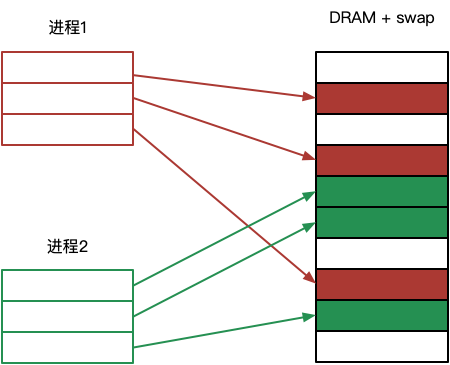
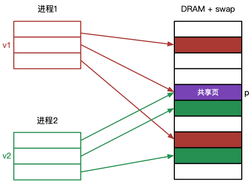

- <a href="#ch1">**1 进程间通信之共享内存**</a>

<br>
<br>

### <a name="ch1">1 进程间通信之共享内存</a><a style="float:right;text-decoration:none;" href="#index">[Top]</a>

Android 匿名共享内存————ashmem，其本质是一种共享内存实现方案，而共享内存是操作系统实现进程间通信（IPC）的一种手段。众所周知，binder 驱动是 Android 运用最广泛的一种 IPC，那么为什么还需要 ashmem 呢？我们将在文章最后给出答案，在此之前，我们将其作为一种共享内存机制来说明其实现原理。

本节我们先复习一下共享内存的原理。

#### <a name="ch1.1">1.1 什么是虚拟内存</a>

虚拟内存————vm 不是一块实际存在的内存，为了缓解物理内存不够用的问题，往往从磁盘空间中开辟一块空间作为物理内存的扩展，这块开辟的磁盘空间被称为交换区——swap。

但是我们知道，CPU 是不能直接访问磁盘空间的，所有的数据都必须先从磁盘空间读入物理内存之后才能被 CPU 访问。所以 swap 的工作方式并不是简单地当物理内存用完之后直接从交换 区读取数据，而是有一个换出（swap out）换入（swap in）的过程。

具体来说，根据局部访问原理，我们总是认为物理内存中存储的总是最近最常访问的数据，所以当我们要访问数据时，大多数时候可以直接从物理内存中访问到。但是，当访问数据不在物理内存中时，内核需要将数据从磁盘载入物理内存（换入），同时将最近最不常使用的数据从内存中暂存到磁盘交换区以留出足够的空间来存储换入的数据（换出）。

这样，即使我们需要运行的程序和数据量超过了物理内存的上限，但是我们仍然感觉内存空间比实际物理内存要大，而这块更大的内存并不是因为实际物理内存有这么大，而是通过动态的换入换出过程虚拟出来的。由于实际不是一块真实的内存，所以将其称为虚拟空间更为合适，这个虚拟空间的大为：

```
vm = 物理内存 + swap
```

对于进程来说，它能看到的是虚拟空间，所以虚拟空间需要进行统一编址。一个进程在访问一个虚拟内存页的时候，实际是要去访问其对应的物理内存页，所以虚拟地址和物理地址之间需要一张映射表去根据虚拟地址查找到对应的物理地址，这个工作由内存管理单元————MMU（一般集成在 CPU 中）来完成。如果 MMU 映射到的物理页面存在，则直接访问，否则触发缺页中断，需要启动磁盘执行换入换出操作，重新建立该页的映射关系。


#### <a name="ch1.2">1.2 什么是内存共享</a>

通常情况下，各个进程的内存空间是相互独立的，这不光是指其虚拟空间独立，同时也意味着其对应的物理空间也是独立的。这样，一个进程是不能访问到另外一个进程的内存空间的，如下图所示：



为了简单起见，图中省略了 MMU 部分，且我们把物理空间统一标识为 DRAM+swap，即物理内存和交换区，隐藏不必要的缺页细节。

若两个进程需要通过内存共享来实现 IPC，那么两个进程的虚拟空间仍然是独立的，而物理空间则出现了重叠，即来自两个进程不同的虚拟页面共同指向了物理空间的同一个页面，如下图所示：



这样一来，v1 和 v2 两个页面共同指向了物理空间的 p 页面，当进程1往 v1 中写入数据的时候，实际就是往 p 写入数据，而进程2从 v2 中读到的即是 p 中的数据，即刚刚进程1写入的数据，反过来也一样。这样便实现了共享内存 IPC。

像这种共享的物理 p 页面，根据应用的不同，有两种指代：一是指相同的只读数据，比如两个不同的进程都从磁盘载入相同的可运行代码，为了节省内存，在物理空间只需要维护一个副本；二是手动创建一个新的内存映射，将同一部分物理页面分别映射到不同进程的虚拟空间中，其核心的实现往往需要借助 mmap 系统调用来完成（我们只讨论 POSIX 的实现，对于 System V 有不同的共享内存实现，但是原理差不多），而这才是共享内存最广泛的应用。

#### <a name="ch1.3">1.3 基于 mmap 实现的内存共享</a>

mmap 系统调用将创建一个物理空间与调用进程虚拟空间之间的新映射。我们先看一下 mmap 的函数定义：

```c
void *mmap(void* addr, size_t length, int prot, int flags, int fd, off_t offset);
```

- addr 参数指定映射被放置的虚拟地址，实际上内核只将其作为参考，尽可能的进行匹配，可以传 NULL 完全由内核决定。
- length 参数指定了映射的字节数，会被向上提升为一个分页大小的下一个倍数。
- prot 参数是一个位掩码组合（用 OR 组合），指定了映射上的保护信息（可读、可写、可执行）。
- flags 参数是映射控制码。若为 MAP_PRIVATE 表示私有映射，映射只发生在当前进程中，变更只对当前进程可见，对于文件映射，变更也不会修改相应的底层文件；若为 MAP_SHARED 表示共享映射，即对相同映射都设置了 MAP_SHARED 的不同进程，变更对所有进程都是可见的，对于文件映射，其变更将反映到底层文件；若为 MAP_ANONYMOUS 表示匿名映射。
- fd 参数表示文件描述符，如果需要将一个文件所表示的区域映射到进程虚拟空间时，可以设置一个有效的文件描述符。
- offset 只对于文件映射有效，表示文件映射区域的起始位置。

mmap 系统调用成功后，将返回新映射的起始虚拟地址。

我们把基于 mmap 实现共享内存的讨论范围进行一下约定：

1. 由于 MAP_PRIVATE 私有映射往往用于内存分配场景，不具备共享内存的功能，所以我们只考虑 MAP_SHARED 共享映射。
2. 另外 linux 自带的匿名映射会忽略 fd 参数，此时 fd 可以设置为 -1，那么基于 MAP_SHARED|MAP_ANONYMOUS 和 fd=-1 就可以实现匿名共享内存。但是这样的共享内存只限定在具有继承关系的相关进程之间。比如父进程通过 mmap 返回一个匿名共享内存映射地址，然后通过 fork 系统调用产生一个子进程，子进程将集成父进程的映射地址，由此可以实现父子进程间的内存共享。而我们的讨论不仅仅限制在相关进程之间，所以 linux 原生基于 mmap 的匿名共享内存也不加以深究。

**以上，我们只讨论基于 mmap 的共享（MAP_SHARED）文件映射。**


