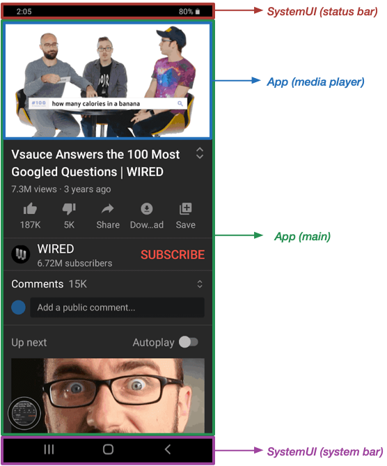
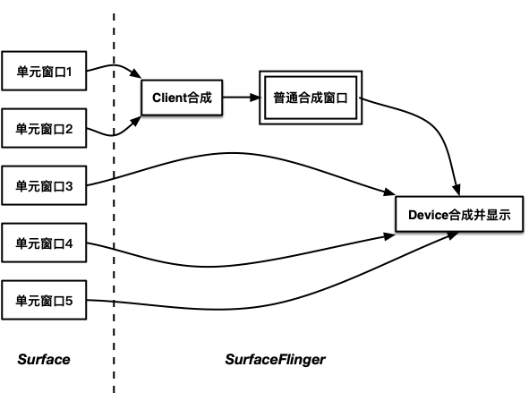
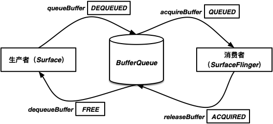
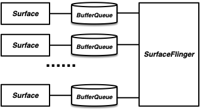

<a name="index">**目录**</a>

- <a href="#ch1">**1 一个帧的构成**</a>

<br>
<br>

### <a name="ch1">1 一个帧的构成</a><a style="float:right;text-decoration:none;" href="#index">[Top]</a>

当我们点亮手机屏幕，看到的某一时刻的全屏画面就是一个 **帧**。

从微观来讲，一个帧的构成就是一个个的像素值，所以理论上来讲，最简单的办法就是由一个进程或服务搜集一屏画面的所有图像数据构成一帧即可。但是通常情况下一个全屏界面是由不同的进程来提供的，如图所示：



这是一个视频播放器的界面，整个界面包含：状态栏（status bar）、系统导航栏栏（system bar）、APP主窗口（main）、视频播放窗口（media player）4 个部分，每个部分的界面都是独立渲染的，其中 status bar 和 system bar 都属于 SystemUI进程，main 属于 APP进程，media player可以属于 APP进程也可以有自己独立的进程。可见一个进程既可以独立渲染一个界面，也可以包含多个渲染源，每个源独立渲染一个界面。

总之，一个帧是由不同的渲染源生成的，即先由各自渲染源独立生成子界面，然后再通过一个合成服务将所有子界面合成一个完整的帧。

我们约定，由一个渲染源生成的图像数据叫 **单元窗口**；再递归定义 **合成窗口** 为多个单元窗口合成或单元窗口与其它合成窗口合成所生成的图像数据；单元窗口与合成窗口统称为 **窗口**。显然，一个帧就是一个最终的合成窗口，那么除了帧以外的其它合成窗口我们称之为 **普通合成窗口**。

接下来分别简要介绍一下参与帧生成、合成和显示的各个组件，这些组件包括：窗口的表示——Surface、帧合成服务——SurfaceFlinger、窗口缓冲队列——BufferQueue、Android 硬件抽象层 HAL 以及两个重要的 HAL 模块，然后讲解一下各个模块之间的关系和交互流程，这样结合 [framebuffer和Vsync](https://github.com/huanzhiyazi/articles/issues/28)，整个 Android 的显示系统原理就基本完整了。

<br>
<br>

### <a name="ch2">2 窗口的表示——Surface</a><a style="float:right;text-decoration:none;" href="#index">[Top]</a>

在 Android 中，负责生成窗口的接口叫 Surface，在应用层（java）和本地层（c/c++）中都有相应的实现。在术语上，也通常把 Surface 叫本地窗口。比如，我们在 APP 中看到的渲染的主界面就是一个 Surface，我们看到的顶部状态栏是一个 Surface，底部系统导航栏也是一个 Surface。

一个 Surface 的主要作用如下：

1. 负责管理一个窗口的各种属性，比如宽高、标志位、密度、格式（RGB颜色格式等）等。

2. 提供画布工具，用于绘制图像，生成单元窗口数据，比如我们通常的布局界面绘制用到了基于 Skia 的画布工具。图像数据还可以采用 OpenGL 绘制或者是视频解码器（通常由另一个接口 SurfaceView 实现）。

3. 向窗口缓冲队列（BufferQueue，由合成服务提供）申请窗口缓冲区，并将绘制好的图像数据写入窗口缓冲区中。

4. 将写好的部分帧缓冲区插入窗口缓冲队列，等待帧合成服务读取。

其中，只有作用 2 是单元窗口独有的，其它几个作用是除了帧（最终合成窗口）以外的所有单元窗口和普通合成窗口共有的，所以单元窗口和普通合成窗口都继承一个共同的抽象——ANativeWindow：

*[/frameworks/native/libs/nativewindow/include/system/window.h](http://aospxref.com/android-11.0.0_r21/xref/frameworks/native/libs/nativewindow/include/system/window.h)*
```c
// ...
struct ANativeWindow
{
    // 本地窗口属性
    const uint32_t flags;
    const int   minSwapInterval;
    const int   maxSwapInterval;
    const float xdpi;
    const float ydpi;
    intptr_t    oem[4];

    // 本地窗口功能
    int     (*setSwapInterval)(struct ANativeWindow* window, int interval);
    int     (*query)(const struct ANativeWindow* window, int what, int* value);
    int     (*perform)(struct ANativeWindow* window, int operation, ... );
    int     (*dequeueBuffer)(struct ANativeWindow* window, struct ANativeWindowBuffer** buffer, int* fenceFd);
    int     (*queueBuffer)(struct ANativeWindow* window, struct ANativeWindowBuffer* buffer, int fenceFd);
    int     (*cancelBuffer)(struct ANativeWindow* window, struct ANativeWindowBuffer* buffer, int fenceFd);
}
// ...
```

我们只需要关注其中最重要的两个方法 `dequeueBuffer` 和 `queueBuffer`，它们分别对应 Surface 的作用 3 和 作用 4。我们可以初步发现，从缓冲区的申请过程来看，BufferQueue 是 Surface 的服务提供方，而 BufferQueue 又是由 SurfaceFlinger 提供的，所以 Surface 和 SurfaceFlinger 之间是 CS 的通信模式，通信桥梁毫无疑问是 binder。

<br>
<br>

### <a name="ch3">3 帧合成服务——SurfaceFlinger</a><a style="float:right;text-decoration:none;" href="#index">[Top]</a>

SurfaceFlinger 提供两种合成服务：

- **Client合成**：又叫软件合成，GPU合成，GL合成。其合成过程由 OpenGL 来完成，对于不能用硬件方式来进行合成的窗口，都需要委托 OpenGL 进行合成，比如某些特效的生成（背景模糊），或者窗口数超过硬件合成的限制等。存储 Client合成后的图像数据的缓冲区通常是由 framebuffer 驱动提供的（取决于厂商的实现，比如可能存储在 framebuffer 的 backbuffer 中，至于 backbuffer 是采用的软件缓冲技术还是 page-flipping 的方式，也取决于 OEM 的实现，详情可以参考 [framebuffer多缓冲实现原理](https://github.com/huanzhiyazi/articles/issues/28#ch3)）

- **Device合成**：又叫硬件合成。由具体的 OEM 根据其硬件特性来实现。专门用于 Device合成的模块叫 HWC (Hardware Composer)，HWC 向 OEM 提供用于硬件合成的接口，并由不同的 OEM 根据自身硬件特点来实现具体的合成算法。很显然，这个 HWC 是一个典型的 HAL 模块，我们将在后面具体介绍 HAL。

通常而言，Device合成的性能会比 Client合成要好。

目前主流的实现都是提前将不能进行 Device合成的窗口采用 Client合成，然后把 Client合成窗口和剩余的窗口一起进行 Device合成。所以，我们看到的合成模式通常如下图所示：



如图所示，在 SurfaceFlinger 中也有一个 Surface 充当普通合成窗口。值得注意的是，在 Android 5.0 之前，普通合成窗口并不是由 Surface 表示的，而是有一个专门的类叫——FramebufferNativeWindow，因为事实上，只有一个普通合成窗口，它的合成数据是存储在 framebuffer 中的，这也是其名字 FramebufferNativeWindow 的由来。在 Android 5.0 之后，普通合成窗口也由普通的 Surface 表示，因为无论是单元窗口还是普通合成窗口，都可以抽象出来相同的三个操作：产生数据、申请缓冲区、填充缓冲区。这样对于 BufferQueue 而言，不用区分是单元窗口还是合成窗口了，简化了接口设计。

SurfaceFlinger 作为一个常驻的 binder 服务，在 init 进程启动时就被启动了。在 SurfaceFlinger 被启动之前，有两个重要的 HAL 模块也需要启动，一个是 Gralloc，用于 BufferQueue 缓冲区的实际分配；另一个是 HWC，用于进行 Device合成，还负责触发 Vsync 信号，通知 SurfaceFlinger 执行合成流程，另外 framebuffer 驱动一般也随 HWC 的启动而打开，以便提供屏幕基础信息和为 Client合成提供缓冲区。

Gralloc 和 HWC 都是由 init 进程触发启动的。

不难发现，Gralloc 和 HWC 充当了 SurfaceFlinger 的服务方，实际上它们也是通过 binder 完成的 CS 通信。从 Android 8.0 开始，framework 和 hal 层之间也通过 binder 驱动进行了隔离，以便于 framework 不用耦合与硬件无关的代码，也便于 OEM 更灵活地实现与自身硬件特性相关的模块。framework 与硬件服务之间进行通信的 binder 称作 hwbinder。

SurfaceFlinger 启动后，有几个重要的初始化：

1. Gralloc 客户端初始化，即建立 SurfaceFlinger 于 Gralloc HAL 之间的联系，用于缓冲区的分配。

2. GL渲染引擎初始化，用于 Client合成。

3. HWC 客户端初始化，即建立 SurfaceFlinger（客户端） 与 HWC HAL（服务方） 之间的联系，用于 Device合成以及注册 Vsync 通知触发合成过程。

4. 初始化并启动事件队列（类似于 Android 应用层的 Handler 机制），诸如 Vsync 通知合成、显示屏修改插拔等都将以事件的形式通知 SurfaceFlinger 进行处理。

值得注意的是，事件队列中显示屏增加事件产生后，将生成并初始化该显示屏对应的普通合成窗口 Surface。

<br>
<br>

### <a name="ch4">4 窗口缓冲队列——BufferQueue</a><a style="float:right;text-decoration:none;" href="#index">[Top]</a>

BufferQueue 作为共享资源，连接 Surface 和 SurfaceFlinger。其中，Surface 是资源生产者，SurfaceFlinger 是资源消费者。BufferQueue 的实现在 Android 不同版本中会有一些差异，但是作为生产者消费者模式的核心逻辑是不变的。

BufferQueue 有四个核心操作：

1. **dequeueBuffer**：向 BufferQueue 申请一块空闲缓冲区（目前版本中主流的最大缓冲区数量为 64 个，之前为 32 个，通常设置为 2 个或者 3 个），发起方为生产者（Surface）。之前已经申请过的缓冲区可以被复用，如果不符合要求（比如还没有申请过，缓冲区参数不匹配等）则需要重新申请新的缓冲区。

2. **queueBuffer**：向 BufferQueue 插入一块填充了有效数据的缓冲区，发起方为生产者（Surface）。

3. **acquireBuffer**：从 BufferQueue 摘取一块填充了有效数据的缓冲区用于合成或显示消费，发起方为消费者（SurfaceFlinger）。

4. **releaseBuffer**：将消费完毕的缓冲区释放，并送回 BufferQueue，发起方为消费者（SurfaceFlinger）。

缓冲队列中的每一块缓冲区也有四个核心状态：

1. **FREE**：初始状态，或者已被消费者 release，持有者为 BufferQueue，只能用于 dequeue 操作，可被 Surface 访问。

2. **DEQUEUED**：表示该块缓冲区已被生产者 dequeue，持有者为 Surface，只能用于 queue 操作，可被 Surface 访问。

3. **QUEUED**：表示该块缓冲区已经被生产者 queue，持有者为 BufferQueue，只能用于 acquire 操作，可被 SurfaceFlinger 访问。

4. **ACQUIRED**：表示该块缓冲区已经被消费者 aquire，持有者为 SurfaceFlinger，只能用于 release 操作，可被 SurfaceFlinger 访问。

生产者（Surface）、BufferQueue、消费者（SurfaceFlinger）三者之间的通信过程和缓冲区状态迁移示意图如下所示：



值得注意的是，普通合成窗口 Surface 是在 SurfaceFlinger 里面的，即与 SurfaceFlinger 属于同一个进程，与单元窗口 Surface 的不同有二：

1. 单元窗口与 BufferQueue 之间通过 binder 通信的方式进行 dequeue 和 queue 操作，单元窗口侧访问 BufferQueue 的 binder 客户端叫 IGraphicBufferProducer；而普通合成窗口与 BufferQueue 属于同一进程，只需直接方法调用即可。

2. 单元窗口的生产目的是生成单元窗口数据，消费目的是用于窗口合成，包括 Client合成和 Device合成；而普通合成窗口的生产目的是进行 Client合成，消费目的是用于 Device合成和显示。

另外，每个 Surface 都对应一个 BufferQueue，这样 SurfaceFlinger 从不同的 BufferQueue 中取出来的缓冲区则对应不同的单元窗口或普通合成窗口。即，Surface 和 BufferQueue 是一对第一的关系，而这两者和 SurfaceFlinger 则是多对一的关系，如下图所示：




http://aospxref.com/android-11.0.0_r21/xref/frameworks/native/services/surfaceflinger/surfaceflinger.rc

http://aospxref.com/android-11.0.0_r21/xref/system/core/rootdir/init.rc

http://aospxref.com/android-11.0.0_r21/xref/frameworks/native/services/surfaceflinger/main_surfaceflinger.cpp?fi=startGraphicsAllocatorService#sm

http://aospxref.com/android-11.0.0_r21/xref/frameworks/native/services/surfaceflinger/SurfaceFlinger.cpp#setupNewDisplayDeviceInternal

http://aospxref.com/android-11.0.0_r21/xref/frameworks/native/services/surfaceflinger/DisplayHardware/HWComposer.cpp#149

http://aospxref.com/android-11.0.0_r21/xref/hardware/interfaces/graphics/allocator/2.0/utils/passthrough/include/allocator-passthrough/2.0/GrallocLoader.h#getModuleMajorApiVersion

http://aospxref.com/android-11.0.0_r21/xref/hardware/interfaces/graphics/composer/2.1/utils/passthrough/include/composer-passthrough/2.1/HwcLoader.h#45

http://aospxref.com/android-11.0.0_r21/xref/hardware/qcom/display/msm8960/libgralloc/gralloc.cpp

http://aospxref.com/android-11.0.0_r21/xref/hardware/qcom/display/msm8960/libhwcomposer/hwc.cpp#hwc_device_open

http://aospxref.com/android-11.0.0_r21/xref/frameworks/native/services/surfaceflinger/NativeWindowSurface.cpp#28

http://aospxref.com/android-11.0.0_r21/xref/frameworks/native/services/surfaceflinger/CompositionEngine/src/CompositionEngine.cpp#updateLayerStateFromFE

http://aospxref.com/android-11.0.0_r21/xref/frameworks/native/services/surfaceflinger/CompositionEngine/src/Output.cpp#updateAndWriteCompositionState

http://aospxref.com/android-11.0.0_r21/xref/frameworks/native/services/surfaceflinger/CompositionEngine/src/OutputLayer.cpp?fi=updateCompositionState#writeCompositionTypeToHWC

http://aospxref.com/android-11.0.0_r21/xref/frameworks/native/services/surfaceflinger/CompositionEngine/src/Display.cpp#anyLayersRequireClientComposition

http://aospxref.com/android-11.0.0_r21/xref/frameworks/native/services/surfaceflinger/CompositionEngine/src/RenderSurface.cpp

http://aospxref.com/android-11.0.0_r21/xref/frameworks/native/services/surfaceflinger/DisplayHardware/FramebufferSurface.cpp#78

http://aospxref.com/android-11.0.0_r21/xref/frameworks/native/services/surfaceflinger/DisplayHardware/HWC2.cpp

http://aospxref.com/android-11.0.0_r21/xref/hardware/interfaces/graphics/composer/2.1/utils/

http://aospxref.com/android-11.0.0_r21/xref/frameworks/native/libs/gui/Surface.cpp#perform

http://aospxref.com/android-11.0.0_r21/xref/hardware/qcom/display/msm8960/libgralloc/alloc_controller.cpp

http://aospxref.com/android-11.0.0_r21/xref/hardware/qcom/display/msm8960/libgralloc/ionalloc.cpp

http://aospxref.com/android-11.0.0_r21/xref/frameworks/native/libs/gui/BufferQueueProducer.cpp

http://aospxref.com/android-11.0.0_r21/xref/hardware/interfaces/graphics/composer/2.1/utils/hal/include/composer-hal/2.1/ComposerCommandEngine.h#executePresentDisplay

http://aospxref.com/android-11.0.0_r21/xref/hardware/interfaces/graphics/composer/2.1/utils/hwc2on1adapter/include/hwc2on1adapter/HWC2On1Adapter.h#729

http://aospxref.com/android-11.0.0_r21/xref/hardware/interfaces/graphics/composer/2.1/utils/hwc2on1adapter/HWC2On1Adapter.cpp#updateTypeChanges

http://aospxref.com/android-11.0.0_r21/xref/hardware/qcom/display/msm8960/libhwcomposer/hwc_utils.h#300

http://aospxref.com/android-11.0.0_r21/xref/hardware/qcom/display/msm8960/libhwcomposer/

http://aospxref.com/android-11.0.0_r21/xref/frameworks/native/libs/gui/ConsumerBase.cpp#385

http://aospxref.com/android-11.0.0_r21/xref/frameworks/native/services/surfaceflinger/Layer.cpp?fi=prepareCompositionState#prepareBasicGeometryCompositionState

http://aospxref.com/android-11.0.0_r21/xref/frameworks/native/libs/gui/SurfaceComposerClient.cpp#connectLocked

http://aospxref.com/android-11.0.0_r21/xref/frameworks/native/libs/gui/ISurfaceComposerClient.cpp#createSurface

http://aospxref.com/android-11.0.0_r21/xref/frameworks/native/services/surfaceflinger/Client.cpp

http://aospxref.com/android-11.0.0_r21/xref/frameworks/native/libs/gui/include/gui/ISurfaceComposerClient.h?fi=eFXSurfaceBufferQueue#eFXSurfaceBufferQueue

http://aospxref.com/android-11.0.0_r21/xref/frameworks/base/core/jni/android_view_SurfaceControl.cpp

http://aospxref.com/android-11.0.0_r21/xref/frameworks/native/libs/gui/BufferQueue.cpp#106

http://aospxref.com/android-11.0.0_r21/xref/frameworks/native/libs/gui/ISurfaceComposer.cpp#createConnection

http://aospxref.com/android-11.0.0_r21/xref/frameworks/base/services/core/java/com/android/server/wm/WindowStateAnimator.java?fi=createSurfaceLocked#createSurfaceLocked

http://aospxref.com/android-11.0.0_r21/xref/frameworks/base/core/java/android/view/SurfaceControl.java#707


https://source.android.google.cn/devices/graphics/arch-bq-gralloc?hl=zh-cn

https://source.android.google.cn/devices/graphics


