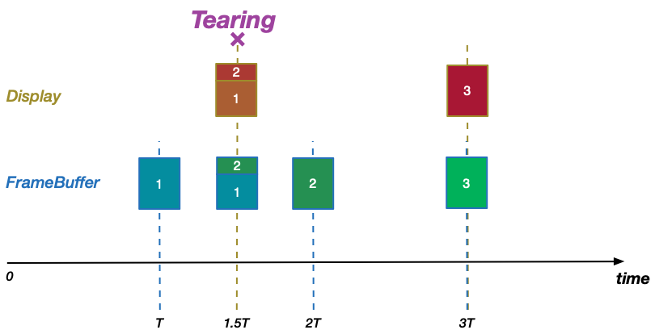
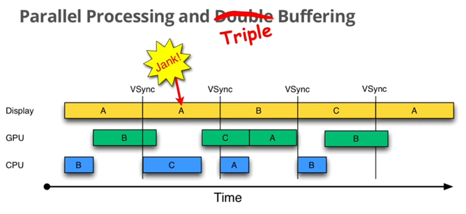

<a name="index">**目录**</a>

- <a href="#ch1">**1 什么是framebuffer**</a>

 
 

### <a name="ch1">1 什么是framebuffer</a><a style="float:right;text-decoration:none;" href="#index">[Top]</a>

我们知道，在计算机中表示一张图像实际就是在一张足够密集的网格中，给每一个网格单元设置不同的像素值（比如用 RGB 表示的像素值）。而手机屏幕就是这样一张网格，每个网格单元都可以”涂上“不同的像素值，所以在屏幕上绘制图像就是把该图像的像素值涂到屏幕的网格里。

那么在将图像涂到屏幕上之前，必须先有一个地方提前把图像的像素值存储起来，也就是说要有一块内存区，里面存储了一整屏画面的像素值，若要显示该屏画面，就从这块内存里把像素值一个个取出来”填“到屏幕对应的格子里。这块内存区叫做 **framebuffer**，即 **帧缓冲区**，实际上它是一块虚拟空间，其对应的物理空间可能在物理内存也可能在显存。

假设屏幕的分辨率是 1920*1080，即屏幕网格有 1920*1080 个像素格子，那么 framebuffer 就是一个长度为 1920*1080=2073600 的一维数组，数组中的每个元素对应一个屏幕格子中的像素值。

在 Linux 中，framebuffer 即是一块缓冲区，也是一个设备，其设备文件名为 `/dev/fb[0|1|...|31]`，主设备号为29，每个设备文件表示一个显示设备，因为允许多个屏幕。所以，理论上，可以通过 open、mmap、ioctl 系统调用来读写 framebuffer，从而实现图像绘制。关于 Linux设备，可以参考 [Android匿名共享内存（ashmem）原理](https://github.com/huanzhiyazi/articles/issues/27#ch1.3) 中的有关说明。

Android 是基于 Linux 的，所以在 Android 设备上绘制图像同样也是通过读写 framebuffer 来实现的。所以我们 **可以把表示 Android 主屏幕的 framebuffer 作为一个全屏窗口来看待**。

需要注意的是，要将 framebuffer 中的数据真正显示到屏幕上，还必须通过总线将数据拷贝到显示屏存储空间。所以在分析绘制原理的时候，我们可以把 framebuffer 直接表示为显示设备，而在分析显示过程的时候应该还有一个 framebuffer -> display 的过程。

 
 

### <a name="ch2">2 VSync 和 framebuffer多缓冲</a><a style="float:right;text-decoration:none;" href="#index">[Top]</a>

#### <a name="ch2.1">2.1 屏幕刷新频率</a>

我们知道，在某一个时刻，将图像数据涂到屏幕上我们就能直观地看到一幅静态的画面，但这显然不能满足用户需求。我们需要看到的是屏幕上的动画——即不断切换的连续衔接的画面。在动画术语中，每一张这样的衔接画面被称作帧。也就是说，为了看到动画，我们需要以恒定的速度取到连续的帧，并将帧涂到屏幕上。

如上，要显示屏幕动画，我们要设置两个时机：

**时机一：生成帧**，产生了新的画面（帧），将其填充到 framebuffer 中，这个过程由 CPU（计算绘制需求）和 GPU（完成数据绘制）完成；
**时机二：显示帧**，显示屏显示完一帧图像之后，等待一个固定的间隔后，从 framebuffer 中取下一帧图像并显示，这个过程由 GPU 完成。

对于设备而言，其 **屏幕的刷新频率** 就相当于显示帧的时机和速度，可以看做是额定不变的（而生成帧速度对应我们通常说的帧率）。一般来讲，屏幕刷新频率为 60HZ，即每秒刷新 60 次，即每隔 1/60≈16ms 刷新一次，我们可以说显示帧时机为 16ms。

在理想状态下，生成帧时机与显示帧时机保持完全一致，这同时也意味着它们的速度也是一致的，这样我们就能看到 **可靠的动画**，即无误且完整的动画序列。

#### <a name="ch2.2">2.2 同步生成帧和显示帧——Vsync和双缓冲</a>

如上节所述，生成帧和显示帧的时机保持同步才能产生可靠的动画，那么在不做任何处理的情况下，我们有理由相信，两个时机的步调是完全有可能不一致的。那么不一致会导致什么后果呢？我们分两种情况讨论：

**情况一：** 生成帧的速度 < 显示帧的速度。

设显示一帧的时间为 T，生成一帧的时间为 1.5T，如下图所示：

可以看到，当第一个显示帧时机到（时间T），因为生成帧还没有完成，framebuffer 中只存储了第一帧的 2/3，这个时候 GPU 取过去的也只有第一帧的 2/3；

当第一个生成帧时机到（时间1.5T），framebuffer 中终于生成了第一个完整帧，但因为第二个显示帧时机还没到，所以第一个完整帧无法显示出来；

当第二个显示帧时机到（时间2T）时，第二帧生成已经开始，且已经有 1/3 填充进 framebuffer 了，此时 framebuffer 中有一部分第一帧，也有一部分第二帧，可惜的是，GPU 在此时把这个半成品的脏帧拿去显示了，从用户视角看，就好像图片撕裂了一样，即产生了 **tearing现象**；

当第二个生成帧时机到（时间3T），此时也是第三个显示时机，第二帧的完整数据已经填充到 framebuffer 中了，正好赶上显示时机，于是第二帧可以完整显示出来。

**情况二：** 生成帧的速度 > 显示帧的速度。

设显示一帧的时间为 1.5T，生成一帧的时间为 T，如下图所示：

可以看到，当第一个生成帧时机到（时间T），第一个完整帧已经生成了，但因为此时显示帧时机还未到，所以还不会显示到屏幕上；

当第一个显示帧时机到（时间1.5T），这时候第二帧的数据已经处于生成过程中，framebuffer 中已经存储了 1/3 的第二帧新数据和 2/3 的第一帧老数据，这是一个半成品的脏帧，可惜因为显示帧时机到了，于是把这个脏帧显示到设备上，产生了 tearing 现象；

当第二个生成帧时机到（时间2T），第二个完整帧终于生成了，但因为第二个显示帧时机是在 3T，所以第二个完整帧没有机会显示；

当第二个显示帧时机到（时间3T），同时也是第三个生成帧时机到了，此时 framebuffer 中已经存放了第三个完整帧，并显示到屏幕上。

可以看到，**由于生成帧和显示帧的步调不一致，会导致很容易产生 tearing 现象**。为了解决这个问题，引入了垂直同步（Vsync）机制。

在解释 Vsync 之前，我们需要理解显示器的扫描顺序：对于一帧画面，在屏幕上的显示是按照先从左往右扫描完一行，然后从上往下扫描下一行的顺序来渲染的。当扫描完一屏之后，需要重新回到第一行继续刚才的过程，而在进入下一轮扫描之前有一个空隙，这段空隙时间叫做 VBI（Vertical Blanking Interval）。在 VBI 期间，正好就是用于生成帧的最佳时间。而要保证这一点，我们需要在一屏扫描完进入下一轮扫描之前，即在一个 VBI 的开始时刻通知 CPU/GPU 去立即产生下一帧。恰好，硬件会在这个时刻触发垂直同步脉冲（Vertical Sync Pulse），正好可以用来进行通知，这个机制就叫 Vsync。

在 Android 中，Vsync 需要的事是：产生 Vsync 信号，通知 CPU/GPU 立即生成下一帧，通知 GPU 从 framebuffer 中将当前帧 post 到显示屏。即，生成帧时机必须和 Vsync 信号保持同步。

如果仅仅是这样，是否就一定能保证不产生 tearing现象呢？前面我们的讨论都假定 framebuffer 的大小只有一个屏幕大小的空间，即单缓冲。这样，每当一个 Vsync 信号到来的时候，CPU/GPU 开始往 framebuffer 中写入当前帧的数据，同时 GPU 将当前帧数据 post 到显示屏。理想情况下，生成速度总是略快于显示速度，且在下一个 Vsync 到来之前，当前帧已经生成完毕，这样就没有 tearing现象产生。但是因为 Vsync 机制只保证了生成时机和显示时机的起点是同步的，并不能保证数据读写过程的同步，一旦在某个时间生成速度慢于显示速度，则某个时刻可能不会有数据传送到显示设备（写入下一帧前清空 framebuffer），或者把上一帧的老数据传送到了显示设备（写入下一帧前不清空 framebuffer），那么显示设备要么显示的是不完全的画面，要么显示的是混合的画面，仍然导致 tearing现象产生。

为了彻底解决 tearing现象，就必须对 framebuffer 空间进行扩展，使得其至少为 2 倍屏幕空间，通常会将其扩展为 **双缓冲** 或 **三缓冲**。

先看看双缓冲+Vsync的情况：

如图所示，缓冲队列里有 A 和 B 两个帧缓冲区。在第一个 Vsync 信号到达时，缓冲区B 准备好了当前帧数据，可传送到显示设备，而缓冲区A 是空闲的，可用来保存新生成的下一帧数据；而第二个 Vsync 信号到达时，缓冲区A 用于显示，缓冲区B 则用于生成。像这样，A 和 B 两个缓冲区交替进行角色互换，保证在每一个 Vsync 信号到来时，显示端（Display）都可以从其中一个缓冲区中取得一个完整的新帧用于显示，而生成端（CPU/GPU）可以向另一个缓冲区填充下一帧数据。所以双缓冲+Vsync 保证了在显示端不会产生 tearing 现象。

那如果只有双缓冲，没有 Vsync 又会怎样呢？我们可以看一下下面的示意图：

如图所示，在第一个 Vsync 信号到达时，虽然缓冲队列中准备好了第1帧的数据可用于显示端进行显示，但生成端没有触发第2帧的生成，该过程延迟到了第二个 Vsync 信号快要到达的时候，且一直持续到第二个 Vsync 信号开始之后；在第二个 Vsync 信号到达后，显示端从缓冲队列中取到的可用缓冲还是上一个存储了第1帧的缓冲区，因为存储第2帧的缓冲区还没有接收完数据，于是此时仍然显示的是第1帧。这样，第1帧多显示了一次，这个叫 **jank现象**，在用户看来是画面产生了卡顿。如果我们加上 Vsync 机制，让第2帧的生成过程提速到第一个 Vsync 信号产生之时，则我们会得到一个可靠的动画，如下图所示：

由此可见，要实现可靠的动画，双缓冲和 Vsync 缺一不可，解决 jank问题需要 Vsync，解决 tearing问题需要双缓冲和 Vsync。

#### <a name="ch2.3">2.3 帧率超过 16ms——三缓冲</a>

前面我们一直假设一个帧的生成是在 16ms 内，即生成一帧所需要的时间不会超过两个 Vsync 信号之间的时间，这对于大多数场景是适应的，双缓冲和 Vsync 足以应付这种普遍场景。但凡事都有特例，如果因为 CPU 工作太饱和，或者一些复杂的画面计算太过耗时（比如3D游戏画面等），就很可能导致一帧的生成时间超过 16ms，那么在帧率超过 16ms 时，会产生什么问题呢？

我们看一下 Google IO 给出的示意图：

我们看到，当帧率超过 16ms，采用双缓冲机制仍然可能产生 jank现象。具体来说，当第一个 Vsync 到达时，生成帧缓冲区B 还没有写完下一帧的数据，缓冲队列中只有缓冲区A 是可以显示的，于是只能再一次显示缓冲区A 中的数据，产生了第一个 jank现象；当第二个 Vsync 到达时，缓冲区B 终于可用了，于是显示缓冲区B 的数据，同时将生成的下一帧数据保存到空闲缓冲区A，但是生成时间又一次超过了 16ms，导致第三个 Vsync 到达时，缓冲区A 也不可用，只能继续显示缓冲区B，于是产生了第二个 jank现象。

如上，因为帧率超过了 16ms，在第一个 Vsync 信号和第三个 Vsync 信号到达时，因为当前帧的数据还没有准备好，显示端只能继续取走保存上一帧数据的缓冲区，不光产生 jank现象，同时因为没有可用的缓冲区用于下一帧数据的生成，在两个帧产生之间出现了一段无事可做的时间区域。

这段无事可做的时间区域之所以存在，是因为这期间生成端没有空闲的缓存区可用了，假如我们增加一个空闲缓冲区，是不是正好就可以在弥补这段空闲区间呢？这就是 **三缓冲** 机制，如图所示：

可以看到，我们增加了第三个缓冲区C，在第一个 Vsync 到达时，对于显示端而言，缓冲区B 正在接收当前帧，缓冲区C 是空的，只有缓冲区A 是可用的，所以显示缓冲区A 的数据，第一个 jank现象 仍然不可避免，但是对于生成端而言，虽然缓冲区A 和 B 都不可用，但是缓冲区C 正好是空闲的，于是正好可以用于生成下一帧数据；当第二个 Vsync 到达时，对于显示端而言，指向的下一个缓冲区B 已经可用，缓冲区C 和 A 正在生成当前帧和下一帧数据，于是取缓冲区B 用于显示，对于生成端而言，缓冲区B 已经用于显示，缓冲区C 还在生成当前帧，只有缓冲区A 是空闲的，可用于生成下一帧数据。

由此可见，只需要多增加一个缓冲区，每个 Vsync 信号都能够得到充分的利用，而不会有所浪费，除了第一个 jank 不可避免外，后续每一个 Vsync 到达都可以保证帧是连续的，虽然总体延迟 16ms，但是对于用户来说是感觉不到的。

#### <a name="ch2.4">2.4 四缓冲有用么</a>

从上一节的分析来看，当帧率超过 16ms，用三个缓冲已经可以保证每个 Vsync 信号都被显示帧和生成帧时机利用到了，果然如此吗？

我们可以考虑一下帧率超过 32ms 的情况，在这种情况下，一个帧的生成时间跨越了两个 Vsync 信号，此时可以推断，第二个 Vsync 信号到达时，缓冲区B 和 C 都因为生成帧没有结束和变得不可用，而缓冲区A 是唯一可以用于显示的，但对于生成端来说，再下一帧的数据已经没有缓冲区可用了，于是这个 Vsync 信号对于生成端来说是利用不到的。于是我们看到第一帧在屏幕上停留了 16*3=48ms。

为了解决这个问题，我们可以依样画葫芦再增加一个缓冲区，由三缓冲变成四缓冲。

