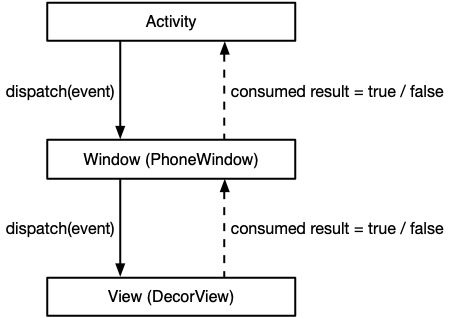

<a name="index">**目录**</a>

- <a href="#ch1">**1 触摸事件分发对象**</a>

 
 

### <a name="ch1">1 触摸事件分发对象</a><a style="float:right;text-decoration:none;" href="#index">[Top]</a>

手机的本质是一台计算机，所以我们在讨论触摸事件的时候，就应该认识到手机屏幕实际上就是外部输入设备。这和台式机的鼠标和键盘并无二致，而触摸事件就是一个输入事件。

一个触摸输入事件一般经由手机屏幕（硬件）-> 驱动程序 -> 操作系统（内核）-> framework（用户空间）这样一条传达路线。作为应用层开发者，我们关注触摸事件（以下简称事件）在用户空间中的分发机制。

事件在用户空间中会在三个对象中进行派发，分别是：Activity，Window，View。整体来看，事件会在这三个对象中按照层次关系先自顶向下进行事件派发到达目标 View，再自底向上将目标 View 对事件的处理结果进行回传：

具体来说：

1. event 经由 Activity.dispatchTouchEvent() 传递给 PhoneWindow。
2. 然后经由 PhoneWindow.superDispatchTouchEvent() 传递给 DecorView（ViewGroup）。
3. event 在 DecorView 的视图树中经过一系列分发策略进行处理，之后返回处理结果 R（true or false）。
4. R 从 DecorView 返回给 PhoneWindow。
5. PhoneWindow 直接将 R 返回给 Activity。
6. 如果 R=false，Activity.onTouchEvent() 将进一步处理未被消费的 event；否则直接返回。 

以上 6 步事件往返步骤中，PhoneWindow 只进行事件传递，于事件分发并无实质作用；Activity 的主要作用是对未处理（未消费）的事件进行收尾工作；而第 3 步中事件在 View 中的分发策略是整个事件分发原理的核心，接下来将讨论事件在 View 中的分发策略。

 
 

### <a name="ch2">2 View 事件分发策略</a><a style="float:right;text-decoration:none;" href="#index">[Top]</a>

在讲分发策略之前，首先说一下事件与操作的区别。

#### <a name="ch2.1">2.1 事件和操作</a>

**事件** 就是我们前面说的触摸事件，或者叫手势，主要包括：

- ACTION_DOWN：按下，即手指刚刚接触屏幕。
- ACTION_MOVE：接触屏幕后手指在屏幕上移动。
- ACTION_UP：手指离开屏幕。
- ACTION_CANCEL：事件被取消，一种常见的场景是在一个 View 上按下但在松开手指前手指移动到该 View 的点击区域外就会触发该事件。
- ACTION_POINTER_XXX 系列事件：两个手指操纵时，表示第二个手指的触摸事件。

而 **操作** 是由一系列事件组成的事件序列，从 ACTION_DOWN 开始，到 ACTION_UP 或 ACTION_CANCEL 结束。常见的操作有：

- 点击：DOWN -> UP
- 滑动：DOWN -> MOVE...MOVE -> UP
- 放大：DOWN -> POINTER_DOWN -> MOVE...MOVE -> UP

#### <a name="ch2.2">2.2 ViewGroup 对事件的处理</a>

事件在 View 中的分发总是先从一个顶层 ViewGroup（DecorView）开始，然后自顶向下经过一系列子 ViewGroup，最终传递到一个目标 ViewGroup 或 View 为止。所以我们看到，处理事件的主体只有两个：ViewGroup 和 View。

无论是 ViewGroup 还是 View，当事件到达的时候，都由一个事件策略函数——dispatchTouchEvent(event) 来决定如何处理当前的事件。 

我们知道，ViewGroup 既是一个 View，也是 View 的容器。一个常见的场景是：我们需要直接对 ViewGroup 执行一个操作，无论手势范围是否落在 ViewGroup 内部的子 View 中，我们希望只由指定的上层 ViewGroup 响应这个操作。这就要求事件在到达指定的 ViewGorup 之后被拦截下来，不再继续往下面的子 View 传递了。

所以在 ViewGroup 的事件分发策略中有一个很重要的策略——事件拦截（onInterceptTouchEvent）。事件拦截方法 onInterceptTouchEvent 由 ViewGroup 的子类去实现，返回 true 表示执行拦截，返回 false 表示不拦截。

- **onInterceptTouchEvent 返回 true**

如果执行拦截操作，ViewGroup 需要将正在处理事件的子 View（如果有的话）派发 CANCEL 事件，即中断可能存在的子 View 的操作。接下来，ViewGroup 将退化为一个普通的 View，执行普通 View 的事件分发策略，即 super.dispatchTouchEvent(event)，该函数返回事件是否被消费。普通 View 的事件分发策略将在下一小节介绍。

一旦 ViewGroup 拦截一个事件，则在下一个 DOWN 事件发生之前（即下一个操作开始），后续的所有其它事件都不再传递到子 View，且无需再经过拦截，而是直接走普通 View 的事件分发流程。

- **onInterceptTouchEvent 返回 false**

如果 ViewGroup 不执行拦截，则需要分两种情况讨论：

1. ViewGroup 不拦截 DOWN 事件

即，从一个操作开始阶段，ViewGroup 就对其放行。这时，ViewGroup 将按照先根遍历的顺序遍历下层的各个子 View，若子 View 在手势范围内，则将 DOWN 事件派发给它并执行普通 View 的事件分发策略。若在遍历过程中有子 View 消费了 DOWN 事件，则 ViewGroup 记录它，往后的事件就无需再次遍历，而是直接交给它处理。若 ViewGroup 的所有子 View 都不消费 DOWN 事件，则 ViewGroup 退化成普通 View，执行普通 View 的事件分发策略。

2. ViewGroup 不拦截其它事件

这说明 ViewGroup 也没有拦截 DOWN 事件，否则其它事件不会有机会执行拦截判断。此时，若 ViewGroup 有子 View 消费了 DOWN 事件，说明该子 View 正在执行一个操作，后续的事件都将交给该子 View 处理；若 ViewGroup 没有任何子 View 消费了 DOWN 事件，则 ViewGroup 退化成普通 View，执行普通 View 的事件分发策略。

以上说明，在 ViewGroup 不拦截 DOWN 事件后，虽然有可能其某个子 View 消费了该 DOWN 事件，但是后续的事件还是有可能被 ViewGroup 拦截的。一个典型的例子是 ViewPager，这是一个自定义的 ViewGroup。考虑在 ViewPager 的某一页中有一个按钮，该按钮是 ViewPager 的子 View，当用户的手指一开始按在了按钮上时，DOWN 事件不会被 ViewPager 拦截，而是会被按钮消费。因为，如果接下里的手势是 UP，则按钮继续消费该事件，完成了一个点击操作；而如果接下来的手势是 MOVE，则 ViewPager 应该拦截，并向按钮派发 CANCEL 事件，表示此时应该是一个滑动操作了。

ViewGrop 事件分发策略的流程如下图所示：

