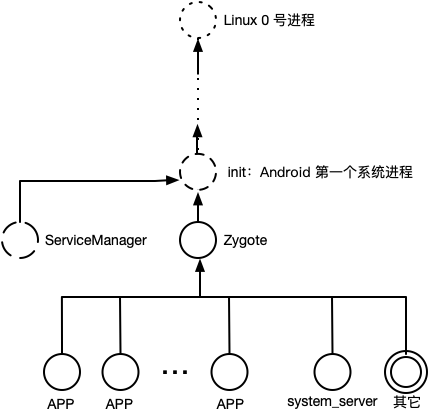
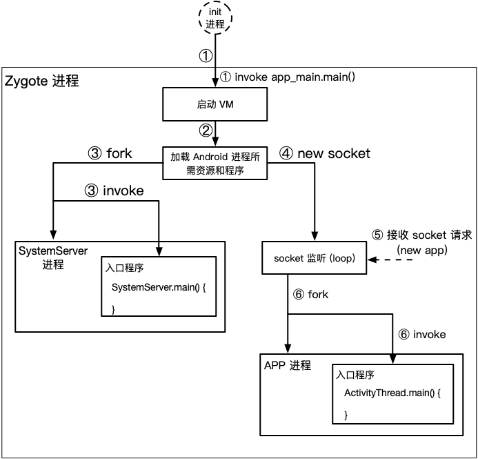
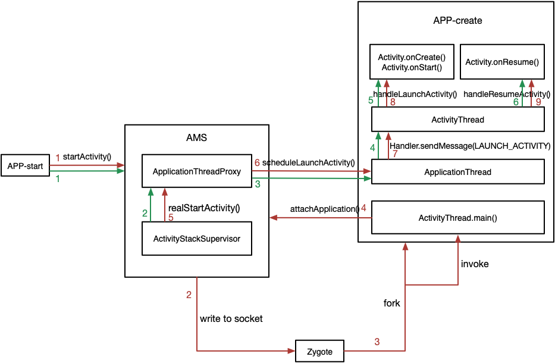

<a name="index">**目录**</a>

- <a href="#ch1">**1 一个 Android 进程都有啥**</a>
- <a href="#ch2">**2 Zygote 进程的生成**</a>

 
 

### <a name="ch1">1 一个 Android 进程都有啥</a><a style="float:right;text-decoration:none;" href="#index">[Top]</a>

众所周知，Android 是基于 Linux 内核的，所以一个 Android 进程其本质也是一个 Linux 进程。Android 进程拥有 Linux 进程所有的一切，包括：进程 ID，所有者，进程状态，程序计数器，调度信息、内存指针等，因为在 Linux 下，绝大部分进程都是由一个祖先进程 fork 而来。除此以外，在 Android 进程的内存空间中还运行着如下特定的资源和程序：

- 运行 Java 字节码的虚拟机（Dalvik or ART）。
- 所需的各种 Java 类，包括各种系统组件类（Activity，Service 等等）。
- framework 资源文件，比如各种系统主题，系统 res 资源等。
- 图形处理相关库，如 OpenGL。
- 其它共享库。
- 文本库，如字体文件等。
- 其它相关资源（与 Android 系统版本演进有关）。

每当我们启动一个新的 Android 进程，比如一个新的 APP，以上这些资源和程序都是新进程运行所必须的。一种直接简单的方案就是每次启动新进程后，将这些资源都重新加载一遍，这样各个进程之间都是彻底隔离的，安全性得到保障。但是我们知道，即便是一个普通的 Linux 进程的生成也不是将所有资源重新拷贝一份的，因为这既耗时、也浪费内存空间。

我们知道，在 Linux 中，新进程的生成是遵循 `copy on write` 原则的。即，所有的子进程与父进程默认都共享所有资源，父进程 fork 一个子进程之后，子进程只需要生成共享资源的引用即可。只有当子进程需要对某个资源进行写入时，才需要拷贝一份原资源，从而保证资源的独立性。这样的原则既保证共享资源的访问安全，又能实现进程的快速生成，同时也节省内存空间。因为，对于大部分进程而言，有太多的共享资源仅仅是只读而已。

基于以上的分析，一个 Android 进程同样也需要遵循 `copy on write` 原则。所以，我们必须为所有的 Android 进程先生成一个共同的祖先进程——Z，这个 Z 进程首先是一个普通的 Linux 进程，然后在此基础上加载 Android 进程运行所需的所有特定资源和程序。这样每当需要生成一个新的 Android 进程时，比如启动一个新的 APP 时，就只需要从这个 Z 进程 fork 出来（新的 Android 进程将继承 Z 进程的所有资源），然后运行新进程的入口程序（main 函数）即可。

这个 Z 进程就如同所有 Android 子进程的母体一样，不停地孵化出新的 Android 子进程，它有一个形象的名字——Zygote！

 
 

### <a name="ch2">2 Zygote 进程的生成</a><a style="float:right;text-decoration:none;" href="#index">[Top]</a>

以下是 Zygote 进程树结构图：

需要注意的是，充当 Binder 驱动服务 DNS 角色的 ServiceManager，是从 init 进程 fork 而来，而不是由 Zygote 进行孵化的。这也容易理解，ServiceManager 负责 Android 服务的注册和查询，本身不需要通用 Android 进程的特定资源和虚拟机环境，所以不必从 Zygote 进行孵化。

从进程继承关系可以看出，Android 在 Linux 内核加载完成后，将启动第一个系统进程——init。init 进程将从一个脚本文件中（init.rc）读取需要启动的服务，其中就包括启动 ServiceManager 和 Zygote 进程。

Zygote 进程启动后，会完成以下几项重要工作：

- 启动 Android 虚拟机。
- 预加载 APK 运行所需类、资源和库。这两项就是上节所述 Android 进程所需的特定资源和程序。
- 启动 SystemServer，调用 SystemServer 的入口程序 main。SystemServer 是各种 Android 系统服务的容器，这些系统服务包括：AMS（ActivityManagerService）、WMS（WindowManagerService）、PMS（PowerManagerService）等。
- 创建 Socket 接口，作为 Socket 服务端接收进程孵化请求（如：AMS 将通过 Socket 向 Zygote 发出创建 APP 进程的请求）。
- 轮询监听 Socket 请求，并启动孵化出的子进程（即调用子进程（比如某个具体的 APP）的入口程序 main）。

需要注意的是，Zygote 作为 Android 进程孵化服务方，与发起进程孵化请求的客户端（如 AMS）进程之间是通过 Socket 来进行进程间通信的。

Zygote 进程启动流程如下图所示：

流程涉及到的类传递如下：app_main.main() -> AppRuntime.start() -> AndroidRuntime.start() -> ZygoteInit.main()

 
 

### <a name="ch3">3 startActivity 的流程</a><a style="float:right;text-decoration:none;" href="#index">[Top]</a>

假设发起 startActivity 命令的进程为 APP-start，而最终执行 startActivity 命令的进程为 APP-create。不难推断，APP-start 和 APP-create 可能是同一个进程也可能是不同的进程。

启动一个 Activity 一般分为两种情况：

1. 该 Activity 所在进程正在运行中，即 APP-create 正在运行。
2. 该 Activity 所在进程不存在，即 APP-create 还没有创建。

对于情况 1 只需要通过 binder 通信方式在 APP-start -> AMS -> APP-create 之间以 CS 交互的方式完成整个 startActivity 流程即可。

而对于情况 2，很显然必须先为 APP-create 新建一个进程，根据前文分析，新建 APP 进程的任务由 Zygote 来完成。具体而言：

1. APP-start 向 AMS 发送 startActivity 请求，这一步由 binder 实现。
2. AMS 判断目标 Activity 所在进程不存在，即 APP-create 不存在，发起新建 APP-create 的请求。
3. AMS 作为 socket 客户端向 Zygote 进程发起 APP-create 孵化请求，并缓存 startActivity 所需参数以待 APP-create 孵化后回头再触发执行。
4. Zygote 作为 socket 服务端收到来自 AMS 的 APP-create 孵化请求，fork 出一个新的 APP-create，并调用 APP-create 的入口函数（ActivityThread.main())。
5. APP-create (APP-create 的入口函数 main) 向 AMS 发起应用程序创建请求（attach application），这一步又回到 binder 通信。
6. AMS 为 APP-create 创建和绑定应用程序，并提取缓存的 startActivity 参数，通知 APP-create 可以创建并启动 Activity。这一步与情况 1 的后半段流程是一样的。

综合情况 1 和情况 2，startActivity 的流程图如下：

如图所示，绿线表示情况 1 的流程；红线表示情况 2 的流程。

