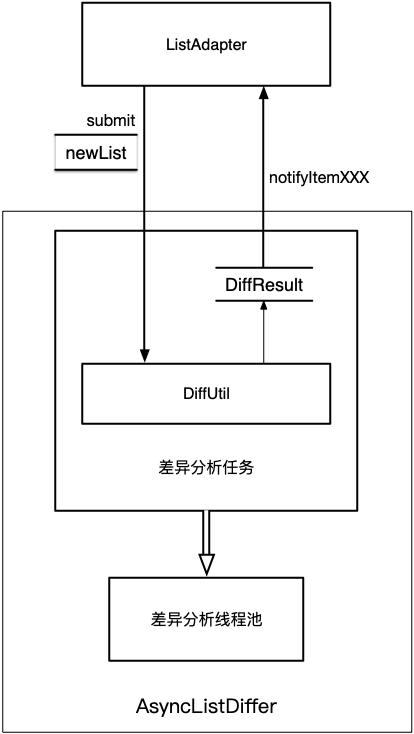
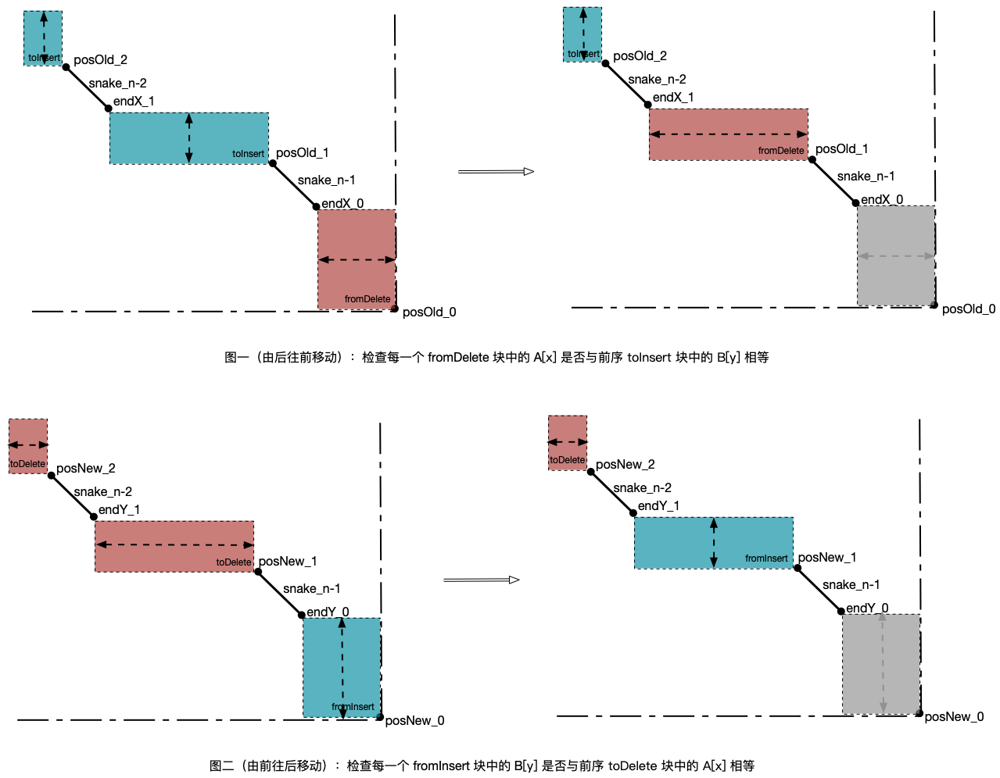

<a name="index">**目录**</a>

- <a href="#ch1">**1 解决的问题**</a>
- <a href="#ch2">**2 问题抽象——Myers差异算法**</a>
- <a href="#ch3">**3 DiffUtil——Myers差异算法的核心实现和扩展**</a>
    * <a href="#ch3.1">3.1 实现分析</a>
    * <a href="#ch3.2">3.2 差异分析扩展——移动判断</a>
    * <a href="#ch3.3">3.3 通知变化</a>

<br>
<br>

### <a name="ch1">1 解决的问题</a><a style="float:right;text-decoration:none;" href="#index">[Top]</a>

RecyclerView（后简称 RV）是如何判断里面的 items 发生了变化的？又是如何知道发生了哪些变化？是删除了一项，还是增加了一项，还是移动了一项？是在哪个位置删除，哪个位置增加，从哪里移动到哪里呢？

首先，需要明确的是，item 的变化有两种：

1. **内容变化：** 指的是 item 里面的数据发生了变化。
2. **结构变化：** 指的是 item 在列表中的整体迁移，包括 item 从列表删除、插入到列表、从列表的一个位置移动到另一个不同的位置这三种变化。

我们通常在调用 RV.Adapter.notifyDataSetChanged() 的时候，RV 不会区分是内容变化还是结构变化，而会粗暴地当做两者都发生了变化，从而全部 item 都进行重新绑定和布局，所以性能是最低的。

所以 RV.Adapter 还提供了各种精细化的变化控制以避免不必要的重绘，包括：

- notifyItemChanged/notifyItemRangeChanged：内容变化通知。
- notifyItemInserted/notifyItemRangeInserted/notifyItemRemoved/notifyItemRangeRemoved/notifyItemMoved：结构变化通知。

这些方法可以通过手动和自动两种方式进行调用：

- 手动调用：这是最早通常用到的方式，基本过程是，改变数据列表，同时得知是发生了何种变化，然后由业务程序员自己手动调用 RV.Adapter.notifyItemXXX。
- 自动调用：直接把最新的数据列表交给 RV.Adapter，由 RV.Adapter 自动判断发生了何种变化并内部调用 notifyItemXXX。

本篇我们就讲自动调用（或自动化差异分析）的原理，且重点分析结构变化。

<br>
<br>

### <a name="ch2">2 问题抽象——Myers差异算法</a><a style="float:right;text-decoration:none;" href="#index">[Top]</a>

首先，在结构变化中，移动操作实际上可以转化为一对删除和插入操作：从 i 移动到 j 等价于将 i 处删除的 item 再插入到位置 j。

其次，我们可以把数据列表当做一个字符串，把列表项当成字符串中的字符，于是 RV 的结构变化问题就转化为求解字符串差异问题：从字符串 A 变成字符串 B 需要经过哪些编辑操作。我们可以自义定列表项之间的等价函数 `areItemsTheSame(oldItem, newItem)`，这对应于字符串差异问题中两个字符是否相等的判断。

求解字符串差异问题，在时间和空间复杂度上同时具有明显优势的算法，目前来说就是 Myers差异算法，该算法的时间复杂度为 O(ND)，优于传统的 O(N²) 算法，在差异度比较小的情况下也不输 O(NlogN) 的改进型算法；更重要的是，其空间复杂度可以优化到线性复杂度的规模，这对于移动设备来讲具有明显的优势。

接下来的内容需要先了解一下 [Myers差异算法](https://github.com/huanzhiyazi/articles/issues/10) 的原理，因为接下里的一些新的概念和基础都来自于其算法原理的分析。

<br>
<br>

### <a name="ch3">3 DiffUtil——Myers差异算法的核心实现和扩展</a><a style="float:right;text-decoration:none;" href="#index">[Top]</a>

RV 的自动化差异分析的入口在 ListAdapter 中，它是 RV.Adapter 的一个子类，如果需要进行自动化差异分析，就可以使用这个适配接口。而核心的差异分析算法实现在 DiffUtil 这个工具类。ListAdapter 实现自动化差异分析的结构图如下：



从图中可以看出，总体上来看，差异分析过程是一个计算耗时型任务，所以将其作为一个异步任务放入线程池中，待 DiffUtil 完成差异分析之后，向主线程返回一个差异分析结果——DiffResult，然后通过分析差异结果将差异变化通知给 ListAdapter，RV 观察到 ListAdapter 中的差异变化之后对视图进行重新布局。

#### <a name="ch3.1">3.1 实现分析</a>

Myers 差异算法的实现在 DiffUtil.calculateDiff() 方法中，采用了 Myers 差异算法的空间优化版本（分治策略）实现：

- 将新老数据列表构造成编辑图，开始求解 D-path。
- 在编辑图中从 (0,0)→(N,M) 和 (N,M)→(0,0) 两个方向用贪心策略同时求解 D-path。
- 当两个方向发生覆盖，说明 D-path 已被等分为二，从覆盖路径中求得 middle snake 并保存。
- 从编辑图中删除 middle snake 并计算左上角的 ⌈D/2⌉-path 和右下角的 ⌊D/2⌋-path 两个子问题的范围，并用相同的贪心策略求解两个子问题并保存子问题对应的 middle snake。
- 将所有求得的 middle snake 序列按坐标排序，保存到 DiffResult 中并返回。

相关的概念请参考 [Myers差异算法](https://github.com/huanzhiyazi/articles/issues/10)。

DiffUtil.calculateDiff() 方法如下，可与 [Myers差异算法](https://github.com/huanzhiyazi/articles/issues/10) 中的伪代码实现对照：

```java
public static DiffResult calculateDiff(@NonNull Callback cb, boolean detectMoves) {
    final int oldSize = cb.getOldListSize();
    final int newSize = cb.getNewListSize();

    final List<Snake> snakes = new ArrayList<>();

    // 该列表用于保存子问题，方便进行广度优先遍历求解子问题，避免用递归导致栈溢出
    final List<Range> stack = new ArrayList<>();
    // 初始化为原问题
    stack.add(new Range(0, oldSize, 0, newSize));

    // 正方向：因为 D∈[0,N+M]，以 k=0 为对称轴，所以 k∈{-(N+M),-(N+M)+2,...,N+M]}，
    // 反方向：以 k=∆=N-M为对称轴，所以 k∈{-(N+M)+∆,-(N+M)+∆+2,...,N+M+∆}，
    // 而数组 V 以 k 为索引，所以给 forwardV 和 backwardV 都分配 2*(N+M+∆) 个空间
    final int max = oldSize + newSize + Math.abs(oldSize - newSize);
    final int[] forward = new int[max * 2];
    final int[] backward = new int[max * 2];

    // 子问题 range 缓存池
    final List<Range> rangePool = new ArrayList<>();
    while (!stack.isEmpty()) {
        // 广度优先遍历每个子问题实现分治策略
        final Range range = stack.remove(stack.size() - 1);

        // 采用贪心策略求解每个子问题的 middle snake
        final Snake snake = diffPartial(cb, range.oldListStart, range.oldListEnd,
                range.newListStart, range.newListEnd, forward, backward, max);

        if (snake != null) {
            if (snake.size > 0) {
                // 保存有效 middle snake
                snakes.add(snake);
            }
            // 将 middle snake 的坐标转换为编辑图中的全局坐标
            snake.x += range.oldListStart;
            snake.y += range.newListStart;

            // 计算左上角子问题 ⌈D/2⌉-path 的边界——右下角坐标
            final Range left = rangePool.isEmpty() ? new Range() : rangePool.remove(
                    rangePool.size() - 1);
            left.oldListStart = range.oldListStart;
            left.newListStart = range.newListStart;
            if (snake.reverse) { // middle snake 取自右下角
                left.oldListEnd = snake.x;
                left.newListEnd = snake.y;
            } else { // middle snake 取自左上角
                if (snake.removal) {
                    left.oldListEnd = snake.x - 1;
                    left.newListEnd = snake.y;
                } else {
                    left.oldListEnd = snake.x;
                    left.newListEnd = snake.y - 1;
                }
            }
            stack.add(left);

            // 计算右下角子问题 ⌊D/2⌋-path 的边界——左上角坐标
            final Range right = range;
            if (snake.reverse) { // middle snake 取自右下角
                if (snake.removal) {
                    right.oldListStart = snake.x + snake.size + 1;
                    right.newListStart = snake.y + snake.size;
                } else {
                    right.oldListStart = snake.x + snake.size;
                    right.newListStart = snake.y + snake.size + 1;
                }
            } else { // middle snake 取自左上角
                right.oldListStart = snake.x + snake.size;
                right.newListStart = snake.y + snake.size;
            }
            stack.add(right);
        } else {
            // 没有 middle snake 的子问题是一个空问题，无需继续求解，其 Range 
            // 可以缓存，避免多次分配空间
            rangePool.add(range);
        }

    }

    // 按坐标排序 middle snakes
    Collections.sort(snakes, SNAKE_COMPARATOR);

    // 构造 DiffResult 并返回
    return new DiffResult(cb, snakes, forward, backward, detectMoves);
}
```

贪心策略求解子问题的 middle snake 的方法 DiffUtil.diffPartial()：

```java
private static Snake diffPartial(Callback cb, int startOld, int endOld,
            int startNew, int endNew, int[] forward, int[] backward, int kOffset) {
    final int oldSize = endOld - startOld;
    final int newSize = endNew - startNew;

    if (endOld - startOld < 1 || endNew - startNew < 1) {
        return null;
    }

    final int delta = oldSize - newSize; // ∆ ← N−M
    final int dLimit = (oldSize + newSize + 1) / 2;

    // 初始化 forwardV[1] = 0（(0,-1)→(0,0)）
    Arrays.fill(forward, kOffset - dLimit - 1, kOffset + dLimit + 1, 0);
    // 初始化 backwardV[N-M-1] = N（(N,M+1)→(N,M)）
    Arrays.fill(backward, kOffset - dLimit - 1 + delta, kOffset + dLimit + 1 + delta, oldSize);
    final boolean checkInFwd = delta % 2 != 0;
    for (int d = 0; d <= dLimit; d++) {
        for (int k = -d; k <= d; k += 2) {
            // 从左上角求解 D-k-path，依赖的前向子问题为 (D-1)-(k±1)-path
            int x;
            final boolean removal;
            if (k == -d || (k != d && forward[kOffset + k - 1] < forward[kOffset + k + 1])) {
                x = forward[kOffset + k + 1];
                removal = false;
            } else {
                x = forward[kOffset + k - 1] + 1;
                removal = true;
            }
            // set y based on x
            int y = x - k;
            // move diagonal as long as items match
            while (x < oldSize && y < newSize
                    && cb.areItemsTheSame(startOld + x, startNew + y)) {
                x++;
                y++;
            }
            forward[kOffset + k] = x;
            if (checkInFwd && k >= delta - d + 1 && k <= delta + d - 1) {
                // 缩小 k 判断范围
                if (forward[kOffset + k] >= backward[kOffset + k]) {
                    // 左上角 d-path 覆盖右下角 (d-1)-path，计算 middle snake
                    Snake outSnake = new Snake();
                    outSnake.x = backward[kOffset + k];
                    outSnake.y = outSnake.x - k;
                    outSnake.size = forward[kOffset + k] - backward[kOffset + k];
                    outSnake.removal = removal;
                    outSnake.reverse = false;
                    return outSnake;
                }
            }
        }
        for (int k = -d; k <= d; k += 2) {
            // 从右下角求解 D-k-path，依赖的前向子问题为 (D-1)-(k±1)-path
            final int backwardK = k + delta;
            int x;
            final boolean removal;
            if (backwardK == d + delta || (backwardK != -d + delta
                    && backward[kOffset + backwardK - 1] < backward[kOffset + backwardK + 1])) {
                x = backward[kOffset + backwardK - 1];
                removal = false;
            } else {
                x = backward[kOffset + backwardK + 1] - 1;
                removal = true;
            }

            // set y based on x
            int y = x - backwardK;
            // move diagonal as long as items match
            while (x > 0 && y > 0
                    && cb.areItemsTheSame(startOld + x - 1, startNew + y - 1)) {
                x--;
                y--;
            }
            backward[kOffset + backwardK] = x;
            if (!checkInFwd && k + delta >= -d && k + delta <= d) {
                // 缩小 k 判断范围
                if (forward[kOffset + backwardK] >= backward[kOffset + backwardK]) {
                    // 右下角 d-path 覆盖左上角 d-path，计算 middle snake
                    Snake outSnake = new Snake();
                    outSnake.x = backward[kOffset + backwardK];
                    outSnake.y = outSnake.x - backwardK;
                    outSnake.size =
                            forward[kOffset + backwardK] - backward[kOffset + backwardK];
                    outSnake.removal = removal;
                    outSnake.reverse = true;
                    return outSnake;
                }
            }
        }
    }
    throw new IllegalStateException("DiffUtil hit an unexpected case while trying to calculate"
            + " the optimal path. Please make sure your data is not changing during the"
            + " diff calculation.");
}
```

#### <a name="ch3.2">3.2 差异分析扩展——移动判断</a>

在第 2 节中已经说明，移动操作实际上可以转化为一对删除和插入操作，所以作为一类通用算法， Myers 算法不需要单独处理移动操作。但是在实际应用中，我们可能需要单独检查这种操作，比如在 RV 中，如果确切知道其中一个 item 的变化是从位置 i 移动到位置 j，那就可以据此对该 item 添加位移动画，做出让人舒适的动效，而不是生硬地变化位置，这对于提升用户体验很有帮助。

移动操作有两种，一种是从前移（i→i-∆），一种是后移（i→i+∆）：

- 对于前移，判断的方法是，从数据列表的末端开始，检查每一个被删除的项是否等于前面插入项，如果相等，则说明该项是前移过来的。检查过程中可以跳过所有 snake，因为这些没有进行编辑无需检查。
- 对于后移，判断的方法是，从数据列表的末端开始，检查每一个插入项是否等于前面被删除的项，如果相等，则说明该项是后移过来的。同样，可以跳过 snake。

下图是两种移动判断的示意图：



在 DiffUtil.calculateDiff() 返回时，会构造 DiffResult 对象，其构造过程中会根据需要完成移动判断：

```java
DiffResult(Callback callback, List<Snake> snakes, int[] oldItemStatuses,
                int[] newItemStatuses, boolean detectMoves) {
    // 省略...

    // 检查移动和内容变化
    findMatchingItems();
}
```

```java
private void findMatchingItems() {
    int posOld = mOldListSize;
    int posNew = mNewListSize;
    // 由末端往前进行遍历
    for (int i = mSnakes.size() - 1; i >= 0; i--) {
        final Snake snake = mSnakes.get(i);
        final int endX = snake.x + snake.size;
        final int endY = snake.y + snake.size;
        if (mDetectMoves) { // 是否需要检查移动
            // 前移检查
            while (posOld > endX) { // 检测到 fromDelete 块，遍历之
                // 前序遍历每一个 toInsert 块，检查 fromDelete 中的每一个删除元素是否
                // 与 toInsert 中的插入元素相等
                findAddition(posOld, posNew, i);
                posOld--;
            }

            // 后移检查
            while (posNew > endY) { // 检测到 fromInsert 块，遍历之
                // 前序遍历每一个 toDelete 块，检查 fromInsert 中的每一个插入元素是否
                // 与 toDelete 中的删除元素相等
                findRemoval(posOld, posNew, i);
                posNew--;
            }
        }
        // 检查内容变化，省略...
        posOld = snake.x;
        posNew = snake.y;
    }
}
```

我们再看一下前移检查 findAddition() 的具体实现：

```java
private void findAddition(int x, int y, int snakeIndex) {
    // 省略...
    findMatchingItem(x, y, snakeIndex, false);
}
```

```java
private boolean findMatchingItem(final int x, final int y, final int snakeIndex,
                final boolean removal) {
    final int myItemPos;
    //int curX;
    int curY;
    if (removal) {
        // 后移省略...
    } else {
        myItemPos = x - 1; // fromInsert 块中的当前删除项
        //curX = x - 1;
        curY = y; // 第一个 toDelete 块
    }

    // 逆序遍历所有 toDelete 块
    for (int i = snakeIndex; i >= 0; i--) {
        final Snake snake = mSnakes.get(i);
        final int endX = snake.x + snake.size;
        final int endY = snake.y + snake.size;
        if (removal) {
            // 后移省略...
        } else {
            // 遍历当前 toDelete 块
            for (int pos = curY - 1; pos >= endY; pos--) {
                // 检查当前 toDelete 中的当前插入项是否等于 fromInsert 中的当前删除项
                if (mCallback.areItemsTheSame(myItemPos, pos)) {
                    // 判断为前移，记录状态并返回
                    final boolean theSame = mCallback.areContentsTheSame(myItemPos, pos);
                    final int changeFlag = theSame ? FLAG_MOVED_NOT_CHANGED
                            : FLAG_MOVED_CHANGED;
                    mOldItemStatuses[x - 1] = (pos << FLAG_OFFSET) | FLAG_IGNORE;
                    mNewItemStatuses[pos] = ((x - 1) << FLAG_OFFSET) | changeFlag;
                    return true;
                }
            }
        }
        //curX = snake.x;
        curY = snake.y; // 当前 toDelete 块中检查到没有前移项，检查下一个 toDelete 块
    }
    return false;
}
```

后移检查是前移检查的对称操作，详细代码可阅读 DiffUtil 源码。

不难判断，移动检查需要额外 O(N²) 的时间复杂度，如果在应用中实际无需进行移动渲染操作，建议关闭移动检查开关，避免额外的耗时。


#### <a name="ch3.3">3.3 通知变化</a>

ListAdapter 完成异步差异分析之后，会通知主线程进行差异变化通知，RV 作为 ListAdapter 的观察者将观察到这个变化并进行重绘。

经过前面构造出差异分析结果 DiffResult 之后，通知变化的过程就比较简单了，其主要流程就是检查其中的 snake 序列和移动状态记录。关键代码如下：

```java
public void dispatchUpdatesTo(@NonNull ListUpdateCallback updateCallback) {
    final BatchingListUpdateCallback batchingCallback;
    if (updateCallback instanceof BatchingListUpdateCallback) {
        batchingCallback = (BatchingListUpdateCallback) updateCallback;
    } else {
        batchingCallback = new BatchingListUpdateCallback(updateCallback);
        updateCallback = batchingCallback;
    }

    final List<PostponedUpdate> postponedUpdates = new ArrayList<>();
    int posOld = mOldListSize;
    int posNew = mNewListSize;
    // 逆序遍历每条 snake
    for (int snakeIndex = mSnakes.size() - 1; snakeIndex >= 0; snakeIndex--) {
        final Snake snake = mSnakes.get(snakeIndex);
        final int snakeSize = snake.size;
        final int endX = snake.x + snakeSize;
        final int endY = snake.y + snakeSize;
        if (endX < posOld) { // 检查到删除
            // 通知删除变化，如果需要检查移动，也要通知移动变化
            dispatchRemovals(postponedUpdates, batchingCallback, endX, posOld - endX, endX);
        }

        if (endY < posNew) { // 检查到插入
            // 通知插入变化，如果要检查移动，也要通知移动变化
            dispatchAdditions(postponedUpdates, batchingCallback, endX, posNew - endY,
                    endY);
        }

        // 遍历 snake 是否有内容变化，如有，通知之
        for (int i = snakeSize - 1; i >= 0; i--) {
            if ((mOldItemStatuses[snake.x + i] & FLAG_MASK) == FLAG_CHANGED) {
                batchingCallback.onChanged(snake.x + i, 1,
                        mCallback.getChangePayload(snake.x + i, snake.y + i));
            }
        }
        posOld = snake.x;
        posNew = snake.y;
    }
    batchingCallback.dispatchLastEvent();
}
```

dispatchRemovals() 和 dispatchAdditions() 的主要任务是检查移动状态并通知移动变化，代码略。


