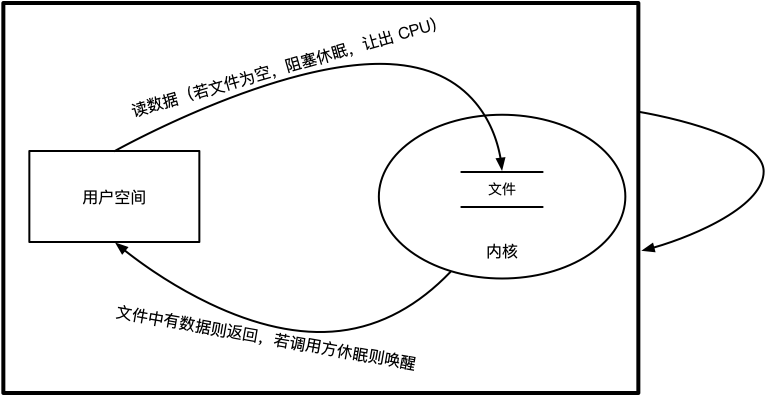

<a name="index">**目录**</a>

- <a href="#ch1">**1 Looper 中事件通知的疑问**</a>
- <a href="#ch2">**2 基于阻塞IO的事件通知机制**</a>
- <a href="#ch3">**3 Looper 实现阻塞IO**</a>
- <a href="#ch4">**4 Looper 阻塞IO技术选型思考**</a>
- <a href="#reference">参考</a>

<br>
<br>

### <a name="ch1">1 Looper 中事件通知的疑问</a><a style="float:right;text-decoration:none;" href="#index">[Top]</a>

我们知道，在 Android 中的大部分事件通知（比如 Activity 的生命周期通知）都是通过 Handler 机制来实现的。在 [线程间通信模型——Handler](https://github.com/huanzhiyazi/articles/issues/4) 一文中曾提到：

>消费者从共享队列中取消息，是通过 Handler 不停地访问消息队列来实现的。

也就是说，是 Handler 委托 Looper 轮询检查 MessageQueue 中是否有待处理的 Message。我们看一下 Looper.loop() 的关键代码：

```java
public static void loop() {
    // ...省略
    final MessageQueue queue = me.mQueue;

    // ...省略

    for (;;) {
        Message msg = queue.next(); // might block
        if (msg == null) {
            // No message indicates that the message queue is quitting.
            return;
        }

        // ...省略

        msg.target.dispatchMessage(msg);

        // ...省略

        msg.recycleUnchecked();
    }
}
```

我们看到，loop() 在一个死循环中不停地从消息队列中取下一个消息，看看是否有待处理的非空消息，如果没有，紧接着下次循环马上再去检查。咋一看，这样马不停蹄地轮询应该非常消耗 CPU 资源，给人的感觉是 CPU 一直被 UI 线程占用着（一般 loop() 运行在主线程中），应该会导致 ANR 才对。但是为什么我们没有看到这样的现象发生呢？

<br>
<br>

### <a name="ch2">2 基于阻塞IO的事件通信机制</a><a style="float:right;text-decoration:none;" href="#index">[Top]</a>

实际上，Looper.loop() 之所以没有引起 ANR，是因为其底层实现了阻塞IO事件通信，一个典型的阻塞IO通信模型如下图所示：



调用方（进程或线程）从用户空间通过系统调用读取内核中打开的一个文件，若文件中没有数据，则调用方让出 CPU 进入休眠，直到事件产生方写入事件到文件为止，这时内核唤醒调用方并返回通知事件。

可以看到，上述的过程即便在一个死循环当中也不会无休止地占用 CPU 资源。在操作系统原理进程生命周期管理中，我们知道当运行中的进程因为缺少资源时会挂起进入等待队列，从运行态进入阻塞态。所以调用方即便在死循环中通过系统调用访问空文件时，内核的进程管理会将其从运行态转变为阻塞态。

那么 Looper.loop() 是如何实现了阻塞 IO 的呢？在继续往下阅读之前，需要提前理解一下 [阻塞IO和IO多路复用机制——select/poll/epoll](https://github.com/huanzhiyazi/articles/issues/13)、[管道（pipe）原理](https://github.com/huanzhiyazi/articles/issues/14)、[Linux eventfd](https://github.com/huanzhiyazi/articles/issues/15)。

<br>
<br>

### <a name="ch3">3 Looper 实现阻塞IO</a><a style="float:right;text-decoration:none;" href="#index">[Top]</a>

继续第一节的 Looper.loop() 源代码，其关键在于下面这行代码：

```java
Message msg = queue.next(); // might block
```

注意后面的注释 `might block`（可能发生阻塞），所以秘密应该就隐藏在 MessageQueue.next() 方法中，我们继续看看：

```java
Message next() {
    // Return here if the message loop has already quit and been disposed.
    // This can happen if the application tries to restart a looper after quit
    // which is not supported.
    final long ptr = mPtr;
    if (ptr == 0) {
        return null;
    }

    int pendingIdleHandlerCount = -1; // -1 only during first iteration
    int nextPollTimeoutMillis = 0;
    for (;;) {
        if (nextPollTimeoutMillis != 0) {
            Binder.flushPendingCommands();
        }

        // 底层实现：epoll IO 阻塞
        nativePollOnce(ptr, nextPollTimeoutMillis);

        synchronized (this) {
            //...省略消息（Message）处理
            //...省略 idle handler
        }

        //...省略
        nextPollTimeoutMillis = 0;
    }
}
```

因为阻塞IO一定是在 native 层实现的，所以在 MessageQueue.next() 方法中我们只需要关注死循环中的一个本地方法——nativePollOnce()。该方法在 native 层通过 epoll 系统调用以阻塞的方式来向内核询问是否有新消息产生。

nativePollOnce() 的实现在 [android_os_MessageQueue.cpp](https://android.googlesource.com/platform/frameworks/base/+/master/core/jni/android_os_MessageQueue.cpp) 中：

```c++
//...

static void android_os_MessageQueue_nativePollOnce(JNIEnv* env, jobject obj,
        jlong ptr, jint timeoutMillis) {
    NativeMessageQueue* nativeMessageQueue = reinterpret_cast<NativeMessageQueue*>(ptr);
    nativeMessageQueue->pollOnce(env, obj, timeoutMillis);
}

//...

void NativeMessageQueue::pollOnce(JNIEnv* env, jobject pollObj, int timeoutMillis) {
    mPollEnv = env;
    mPollObj = pollObj;
    mLooper->pollOnce(timeoutMillis);
    mPollObj = NULL;
    mPollEnv = NULL;
    if (mExceptionObj) {
        env->Throw(mExceptionObj);
        env->DeleteLocalRef(mExceptionObj);
        mExceptionObj = NULL;
    }
}

//...
```

从代码中可以看到，其核心实现在 Looper.cpp 中的 pollOnce() 方法中。需要注意的是，Android 5.0 及之前的版本与 Android 6.0 及以后的版本中，Looper.cpp 的实现有所不同。

在 ≤Android5.0 中，Looper.cpp 采用 **epoll+pipe** 来实现阻塞IO事件通知；在 ≥Android6.0 中，Looper.cpp 采用 **epoll+eventfd** 来实现阻塞IO事件通知。

- **≤Android5.0 Looper.cpp 关键代码**

构造方法：

```c++
Looper::Looper(bool allowNonCallbacks) :
        mAllowNonCallbacks(allowNonCallbacks), mSendingMessage(false),
        mResponseIndex(0), mNextMessageUptime(LLONG_MAX) {
    // 创建管道
    int wakeFds[2];
    int result = pipe(wakeFds); 

    //...省略

    // 保存管道读端文件描述符（用于读线程）和写端文件描述符（用于写线程）
    mWakeReadPipeFd = wakeFds[0];
    mWakeWritePipeFd = wakeFds[1];

    //...省略

    // 创建 epoll 实例
    mEpollFd = epoll_create(EPOLL_SIZE_HINT);

    //...省略

    // 初始化 epoll 请求事件
    struct epoll_event eventItem;
    memset(& eventItem, 0, sizeof(epoll_event)); // zero out unused members of data field union
    eventItem.events = EPOLLIN; // 期待读数据
    eventItem.data.fd = mWakeReadPipeFd; // epoll 监控管道读端
    // 添加管道读端描述符和请求事件参数
    result = epoll_ctl(mEpollFd, EPOLL_CTL_ADD, mWakeReadPipeFd, & eventItem);

    //...省略
}
```

Looper.pollOnce()

```c++
int Looper::pollOnce(int timeoutMillis, int* outFd, int* outEvents, void** outData) {
    int result = 0;
    for (;;) {
        //...省略
        result = pollInner(timeoutMillis);
    }
}

int Looper::pollInner(int timeoutMillis) {
    //...省略

    // Poll.
    int result = POLL_WAKE;

    //...省略

    // epoll 返回事件，用于指定稍后pipe中发生了什么事件
    struct epoll_event eventItems[EPOLL_MAX_EVENTS];
    // epoll_wait 系统调用，若 pipe 为空则阻塞，让出 CPU
    int eventCount = epoll_wait(mEpollFd, eventItems, EPOLL_MAX_EVENTS, timeoutMillis);

    //...省略

    for (int i = 0; i < eventCount; i++) {
        int fd = eventItems[i].data.fd;
        uint32_t epollEvents = eventItems[i].events;
        if (fd == mWakeReadPipeFd) {
            if (epollEvents & EPOLLIN) { // 期待的可读事件发生
                // 从 pipe 中读取发生的事件，该调用主要是确认管道是否真的能读到消息，如果能读到直接返回，java 层的 Looper.loop() 就知道 MessageQueue 中有 Message 可读了
                awoken();
            } else {
                //...省略
            }
        } else {
            //...省略
        }
    }

    //...省略

    return result;
}

void Looper::awoken() {
    //...省略
    char buffer[16];
    ssize_t nRead;
    do {
        // 读取 pipe 中的字节流
        nRead = read(mWakeReadPipeFd, buffer, sizeof(buffer));
    } while ((nRead == -1 && errno == EINTR) || nRead == sizeof(buffer));
}
```

Looper.wake()

```c++
void Looper::wake() {
    //...省略
    ssize_t nWrite;
    do {
        // 向 pipe 写端写入通知消息
        nWrite = write(mWakeWritePipeFd, "W", 1);
    } while (nWrite == -1 && errno == EINTR);
    //...省略
}
```

Looper.wake() 方法一般在 java 层的 Handler 往 MessageQueue 中插入新的 Message 后通过本地方法调用。这样内核马上就能知道 pipe 中有新的消息，Looper.pollOnce() 中的 epoll_wait 系统调用就可以解除阻塞得到返回。

MessageQueue.enqueueMessage()

```java
boolean enqueueMessage(Message msg, long when) {
    //...省略

    synchronized (this) {
        //...省略

        msg.markInUse();
        msg.when = when;
        Message p = mMessages;
        boolean needWake;

        //...省略消息插入代码

        // We can assume mPtr != 0 because mQuitting is false.
        if (needWake) {
            // 底层由 Looper.cpp 中的 wake() 方法实现，即直接想 pipe 写入端写通知事件
            nativeWake(mPtr);
        }
    }
    return true;
}
```

android_os_MessageQueue.cpp

```c++
static void android_os_MessageQueue_nativeWake(JNIEnv* env, jclass clazz, jlong ptr) {
    NativeMessageQueue* nativeMessageQueue = reinterpret_cast<NativeMessageQueue*>(ptr);
    nativeMessageQueue->wake();
}

void NativeMessageQueue::wake() {
    // Looper.cpp 中的 wake()
    mLooper->wake();
}
```

- **≥Android6.0 Looper.cpp 关键代码**

构造方法：

```c++
Looper::Looper(bool allowNonCallbacks)
    : mAllowNonCallbacks(allowNonCallbacks),
      mSendingMessage(false),
      mPolling(false),
      mEpollRebuildRequired(false),
      mNextRequestSeq(0),
      mResponseIndex(0),
      mNextMessageUptime(LLONG_MAX) {

    // 构造 eventfd 计数器实例并保存 eventfd 文件描述符
    // mWakeEventFd 是一个 android::base::unique_fd 对象，是一个文件描述符容器
    mWakeEventFd.reset(eventfd(0, EFD_NONBLOCK | EFD_CLOEXEC));

    //...省略

    rebuildEpollLocked();
}

void Looper::rebuildEpollLocked() {
    //...省略

    // 创建 epoll 实例
    // 和 mWakeEventFd 类似，mEpollFd 也是一个 android::base::unique_fd 类型的文件描述符容器
    mEpollFd.reset(epoll_create1(EPOLL_CLOEXEC));
    
    //...省略

    // 初始化 epoll 请求事件
    struct epoll_event eventItem;
    memset(& eventItem, 0, sizeof(epoll_event));
    eventItem.events = EPOLLIN; // 期待读数据
    eventItem.data.fd = mWakeEventFd.get();
    // 添加 eventfd 描述符和请求事件参数
    int result = epoll_ctl(mEpollFd.get(), EPOLL_CTL_ADD, mWakeEventFd.get(), &eventItem);
    
    //...省略
}
```

Looper.pollOnce()

```c++
int Looper::pollOnce(int timeoutMillis, int* outFd, int* outEvents, void** outData) {
    int result = 0;
    for (;;) {
        //...省略
        result = pollInner(timeoutMillis);
    }
}

int Looper::pollInner(int timeoutMillis) {
    //...省略

    // Poll.
    int result = POLL_WAKE;

    //...省略

    // epoll 返回事件，用于指定稍后 eventfd 中发生了什么事件
    struct epoll_event eventItems[EPOLL_MAX_EVENTS];
    // epoll_wait 系统调用，若 eventfd 计数器为 0 则阻塞，让出 CPU
    int eventCount = epoll_wait(mEpollFd.get(), eventItems, EPOLL_MAX_EVENTS, timeoutMillis);

    //...省略

    for (int i = 0; i < eventCount; i++) {
        int fd = eventItems[i].data.fd;
        uint32_t epollEvents = eventItems[i].events;
        if (fd == mWakeEventFd.get()) {
            if (epollEvents & EPOLLIN) { // 期待的可读事件发生
                // 从 eventfd 中读取发生的事件，该调用主要是确认 eventfd 计数器是否真的能读到消息，如果能读到直接返回，java 层的 Looper.loop() 就知道 MessageQueue 中有 Message 可读了
                awoken();
            } else {
                //...省略
            }
        } else {
            //...省略
        }
    }

    //...省略

    return result;
}

void Looper::awoken() {
    //...省略

    uint64_t counter;
    // 读取 eventfd 计数器的值
    TEMP_FAILURE_RETRY(read(mWakeEventFd.get(), &counter, sizeof(uint64_t)));
}
```

Looper.wake()

```c++
void Looper::wake() {
    //...省略
    uint64_t inc = 1;
    // 向 eventfd 计数器写入一个无符号64位整型通知消息
    ssize_t nWrite = TEMP_FAILURE_RETRY(write(mWakeEventFd.get(), &inc, sizeof(uint64_t)));
    //...省略
}
```

Looper.wake() 方法一般在 java 层的 Handler 往 MessageQueue 中插入新的 Message 后（MessageQueue.enqueueMessage() 方法）通过本地方法调用。这样内核马上就能知道 eventfd 计数器中有新的消息，Looper.pollOnce() 中的 epoll_wait 系统调用就可以解除阻塞得到返回。

MessageQueue.enqueueMessage() 方法的调用与 ≤Android5.0 中的一致，无须赘述。

<br>
<br>

### <a name="ch4">4 Looper 阻塞IO技术选型思考</a><a style="float:right;text-decoration:none;" href="#index">[Top]</a>

- **同一个进程内的线程间通信为什么选择 pipe/eventfd 这种跨进程通信方案？**

原因是为了做到事件通知更及时。如果采用常规的线程间通信方法实现事件通知，则需要手动休眠线程，然后反复去轮询检查事件队列是否有新事件产生。但是这个休眠时间不好控制，设置短了浪费 CPU，设置长了，新事件半天得不到响应和处理。

而 select/poll/epoll + pipe/eventfd 这种跨进程通信方案的本质是让内核监控一个打开的文件的 IO 行为，通过注册事件、监听、阻塞、通知来实现的一套底层观察者模式。如果把 select/poll/epoll + pipe/eventfd 抽象成只是一个观察者模式，那么就不必限定其只能用于 IPC 了。

当然，也可以采用典型的观察者模式，通过线程间引用共享变量+锁实现同步的方案来实现事件通知。但是这无疑引入了更多的耦合性，线程间无法做到很好的隔离，增加了实现的复杂性和出错的可能性。既然 Linux 内核已经提供了更简单更有效的通信方案，何必要重复造轮子呢？

- **IO多路复用方案中为什么选择 epoll，而不用 select/poll？**

在 [IO多路复用——selct,poll,epoll](https://github.com/huanzhiyazi/articles/issues/13) 中我们总结 epoll 相对于 select/poll 的主要性能优势有两点：

1. 在监控大量文件描述符的应用场景中，epoll 比 select/poll 有更大的时间复杂度优势（epoll 查询就绪文件描述符的时间复杂度是 O(1)，而 select/poll 是 O(n)）。
2. epoll 系统调用比 select/poll 系统调用需要更少的内存拷贝次数（epoll 只需要在返回就绪文件描述符时从内核往用户空间拷贝一次；而 select/poll 需要在调用时从用户空间和内核空间进行两次拷贝）。

很显然，在 Looper 事件通知中，监控的文件描述符数量非常少（2个或者1个），所以第一条优势并不明显。所以，更少的内存拷贝次数应该是选择 epoll 的主要原因。

- **为什么 Android6.0 及以后的版本用 eventfd 替代 pipe 作为通信方案？**

关于这一点，可以参考 [跨进程通信之管道](https://github.com/huanzhiyazi/articles/issues/14) 和 [跨进程通信之eventfd](https://github.com/huanzhiyazi/articles/issues/15)

总结来说，主要原因有两点：

1. pipe 本质上是内核空间分配的一个字节流缓冲器，需要预先为期分配至少 4K 的内存空间，这对于简单的事件通知来说是一种空间浪费。而 eventfd 只是内核空间的一个 64位无符号整型计数器，相比 pipe 可以节省很大的内存空间。
2. pipe 是单向的，读端和写端是分开的，各需要分配一个文件描述符，对于事件通知模型来说显得过重。且在创建管道的过程中需要通信双方各自关闭未使用的文件描述符，虽属必要，但使用复杂性过高，容易出错。而 eventfd 只需一个文件描述符（内核分配的文件描述符数量是有限的），且对 eventfd 的读操作就是直接清空计数器（如果没有设置信号量原语），操作非常简单高效，几乎就是为事件通知模型量身定做的方案。

<br>
<br>

### <a name="reference">参考</a><a style="float:right;text-decoration:none;" href="#index">[Top]</a>

- [android_os_MessageQueue.cpp](https://android.googlesource.com/platform/frameworks/base/+/master/core/jni/android_os_MessageQueue.cpp)

- [Looper.h](https://android.googlesource.com/platform/system/core/+/master/libutils/include/utils/Looper.h)

- [≤Android5.0 Looper.cpp](https://android.googlesource.com/platform/system/core/+/android-5.0.0_r2/libutils/Looper.cpp)

- [≥Android6.0 Looper.cpp](https://android.googlesource.com/platform/system/core/+/master/libutils/Looper.cpp)


