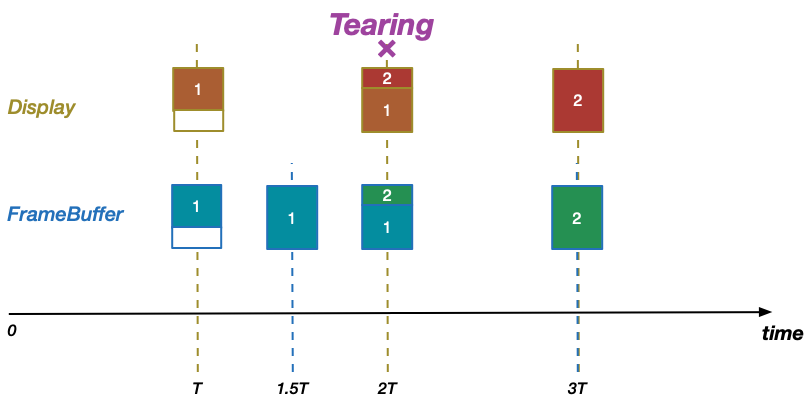

<a name="index">**目录**</a>

- <a href="#ch1">**1 什么是framebuffer**</a>

 
 

### <a name="ch1">1 什么是framebuffer</a><a style="float:right;text-decoration:none;" href="#index">[Top]</a>

我们知道，在计算机中表示一张图像实际就是在一张足够密集的网格中，给每一个网格单元设置不同的像素值（比如用 RGB 表示的像素值）。而手机屏幕就是这样一张网格，每个网格单元都可以”涂上“不同的像素值，所以在屏幕上绘制图像就是把该图像的像素值涂到屏幕的网格里。

那么在将图像涂到屏幕上之前，必须先有一个地方提前把图像的像素值存储起来，也就是说要有一块内存区，里面存储了一整屏画面的像素值，若要显示该屏画面，就从这块内存里把像素值一个个取出来”填“到屏幕对应的格子里。这块内存区叫做 **framebuffer**，即 **帧缓冲区**，实际上它是一块虚拟空间，其对应的物理空间可能在物理内存也可能在显存。

假设屏幕的分辨率是 1920*1080，即屏幕网格有 1920*1080 个像素格子，那么 framebuffer 就是一个长度为 1920*1080=2073600 的一维数组，数组中的每个元素对应一个屏幕格子中的像素值。

在 Linux 中，framebuffer 即是一块缓冲区，也是一个设备，其设备文件名为 `/dev/fb[0|1|...|31]`，主设备号为29，每个设备文件表示一个显示设备，因为允许多个屏幕。所以，理论上，可以通过 open、mmap、ioctl 系统调用来读写 framebuffer，从而实现图像绘制。关于 Linux设备，可以参考 [Android匿名共享内存（ashmem）原理](https://github.com/huanzhiyazi/articles/issues/27#ch1.3) 中的有关说明。

Android 是基于 Linux 的，所以在 Android 设备上绘制图像同样也是通过读写 framebuffer 来实现的。所以我们 **可以把表示 Android 主屏幕的 framebuffer 作为一个全屏窗口来看待**。

需要注意的是，要将 framebuffer 中的数据真正显示到屏幕上，还必须通过总线将数据拷贝到显示屏存储空间。所以在分析绘制原理的时候，我们可以把 framebuffer 直接表示为显示设备，而在分析显示过程的时候应该还有一个 framebuffer -> display 的过程。

 
 

### <a name="ch2">2 VSync 和 framebuffer多缓冲</a><a style="float:right;text-decoration:none;" href="#index">[Top]</a>

#### <a name="ch2.1">2.1 屏幕刷新频率</a>

我们知道，在某一个时刻，将图像数据涂到屏幕上我们就能直观地看到一幅静态的画面，但这显然不能满足用户需求。我们需要看到的是屏幕上的动画——即不断切换的连续衔接的画面。在动画术语中，每一张这样的衔接画面被称作帧。也就是说，为了看到动画，我们需要以恒定的速度取到连续的帧，并将帧涂到屏幕上。

如上，要显示屏幕动画，我们要设置两个时机：

**时机一：生成帧**，产生了新的画面（帧），将其填充到 framebuffer 中，这个过程由 CPU（计算绘制需求）和 GPU（完成数据绘制）完成；
**时机二：显示帧**，显示屏显示完一帧图像之后，等待一个固定的间隔后，从 framebuffer 中取下一帧图像并显示，这个过程由 GPU 完成。

对于设备而言，其 **屏幕的刷新频率** 就相当于显示帧的时机和速度，可以看做是额定不变的。一般来讲，屏幕刷新频率为 60HZ，即每秒刷新 60 次，即每隔 1/60≈16ms 刷新一次，我们可以说显示帧时机为 16ms。

在理想状态下，生成帧时机与显示帧时机保持完全一致，这同时也意味着它们的速度也是一致的，这样我们就能看到 **可靠的动画**，即无误且完整的动画序列。

#### <a name="ch2.2">2.2 同步生成帧和显示帧——Vsync</a>

如上节所述，生成帧和显示帧的时机保持同步才能产生可靠的动画，那么在不做任何处理的情况下，我们有理由相信，两个时机的步调是完全有可能不一致的。那么不一致会导致什么后果呢？我们分两种情况讨论：

**情况一：** 生成帧的速度 < 显示帧的速度。

设显示一帧的时间为 T，生成一帧的时间为 1.5T，如下图所示：

可以看到，当第一个显示帧时机到（时间T），因为生成帧还没有完成，framebuffer 中只存储了第一帧的 2/3，这个时候 GPU 取过去的也只有第一帧的 2/3；

当第一个生成帧时机到（时间1.5T），framebuffer 中终于生成了第一个完整帧，但因为第二个显示帧时机还没到，所以第一个完整帧无法显示出来；

当第二个显示帧时机到（时间2T）时，第二帧生成已经开始，且已经有 1/3 填充进 framebuffer 了，此时 framebuffer 中有一部分第一帧，也有一部分第二帧，可惜的是，GPU 在此时把这个半成品的脏帧拿去显示了，从用户视角看，就好像图片撕裂了一样，即产生了 tearing 现象；

当第二个生成帧时机到（时间3T），此时也是第三个显示时机，第二帧的完整数据已经填充到 framebuffer 中了，正好赶上显示时机，于是第二帧可以完整显示出来。

**情况二：** 生成帧的速度 > 显示帧的速度。

设显示一帧的时间为 1.5T，生成一帧的时间为 T，如下图所示：

可以看到，当第一个生成帧时机到（时间T），第一个完整帧已经生成了，但因为此时显示帧时机还未到，所以还不会显示到屏幕上；

当第一个显示帧时机到（时间1.5T），这时候第二帧的数据已经处于生成过程中，framebuffer 中已经存储了 1/3 的第二帧新数据和 2/3 的第一帧老数据，这是一个半成品的脏帧，可惜因为显示帧时机到了，于是把这个脏帧显示到设备上，产生了 tearing 现象；

当第二个生成帧时机到（时间2T），第二个完整帧终于生成了，但因为第二个显示帧时机是在 3T，所以第二个完整帧没有机会显示；

当第二个显示帧时机到（时间3T），同时也是第三个生成帧时机到了，此时 framebuffer 中已经存放了第三个完整帧，并显示到屏幕上。

可以看到，**由于生成帧和显示帧的步调不一致，会导致很容易产生 tearing 现象**。为了解决这个问题，引入了垂直同步（Vsync）机制。

在解释 Vsync 之前，我们需要理解显示器的扫描顺序：对于一帧画面，在屏幕上的显示是按照先从左往右扫描完一行，然后从上往下扫描下一行的顺序来渲染的。当扫描完一屏之后，需要重新回到第一行继续刚才的过程，而在进入下一轮扫描之前有一个空隙，这段空隙时间叫做 VBI（Vertical Blanking Interval）。在 VBI 期间，正好就是用于生成帧的最佳时间。而要保证这一点，我们需要在一屏扫描完进入下一轮扫描之前，即在一个 VBI 的开始时刻通知 CPU/GPU 去立即产生下一帧。恰好，硬件会在这个时刻触发垂直同步脉冲（Vertical Sync Pulse），正好可以用来进行通知，这个机制就叫 Vsync。

在 Android 中，Vsync 需要做两件事：

1. 产生 Vsync 信号，通知 CPU/GPU 立即生成下一帧，通知 GPU 从 framebuffer 中将当前帧 post 到显示屏；
2. 对 framebuffer 进行加锁，在一帧完整数据写完之前，不能将其 post 到显示屏显示，若 Vsync 信号到，则仍然显示上一帧。

Vsync 的第一个作用可以保证在上述情况二（生成帧的速度 > 显示帧的速度）中，生成帧和显示帧的步调是一致的，即给生成帧过程降速，规定只有在 Vsync 信号触发的时候才能生成下一帧数据，其它时刻不能进行新帧的生成，引用 Google 2012 I/O 中的示意图如下：

