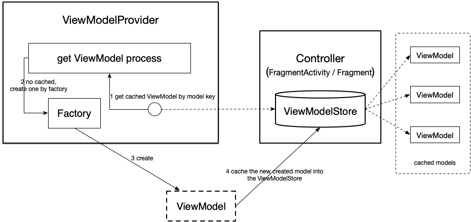
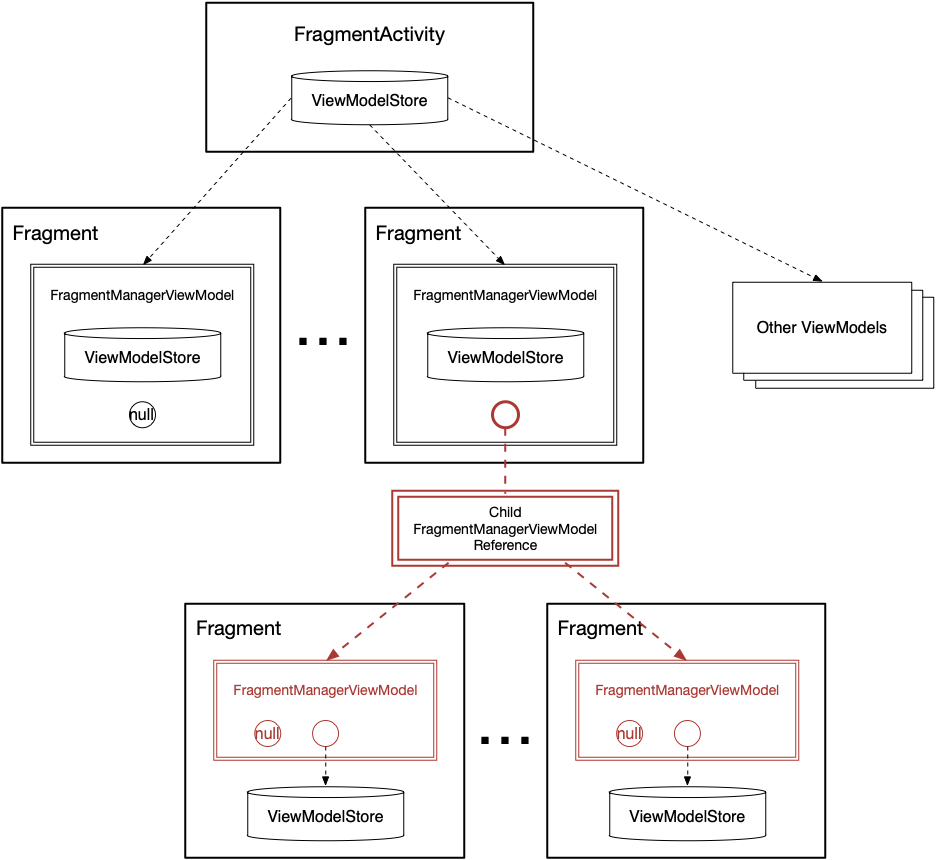
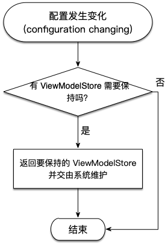
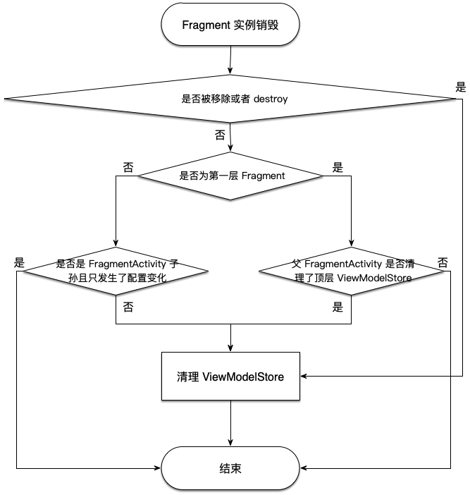

### 1 什么是 ViewModel

#### 1.1 先考虑两个场景

- 场景一：我们开发的 APP 可以转屏，转屏后将触发 Controller(Activity or Fragment) 的重建，为了维护转屏前后数据的一致性，我们要么将需要维护的数据以 Bundle 的形式在 onSaveInstance 中保存，必要的时候需要对复合数据实现繁琐的 Parceable 接口，如果数据量太大则我们必须将数据持久化，在转屏后重新拉取数据（from database or networks）；
- 场景二：我们的 Activity 中同时维护了多个 Fragment，每个 Fragment 需要共享一些数据，传统的做法是由宿主 Activity 持有共享数据，并暴露数据获取接口给各个寄生 Fragment。

#### 1.2 缺点
随着业务规模的扩大，以上的两种场景在传统实现方法中显得越来越繁琐且不易维护，且数据模块不易独立进行测试。

#### 1.3 特别说明
关于场景一，同样的场景还适用于各种配置相关的信息发生变化的情况，比如键盘、系统字体、语言区域等，它们的共同作用是都会导致当前 Controller 的重建。

#### 1.4 ViewModel 解决的问题
ViewModel 是 android 新的 mvvm 框架的一部分，它的出现就是为了解决以上两个场景中数据与 Controller 耦合过度的问题。其 **基本原理** 是：*维护一个与配置无关的对象，该对象可存储 Controller 中需要的任何数据，其生命周期与宿主 Controller 的生命周期保持一致，不因 Controller 的重建而失效（注意：Controller 的重建仍然在 Controller 生命周期内，并不会产生一个新的生命周期，即 Controller 的 onDestroy 并不会调用）*

这意味着无论是转屏还是系统字体变化等因配置变化产生的 Controller 重建都不会回收 ViewModel 中维护的数据，重建的 Controller 仍然可以从同一个 ViewModel 中通过获取数据恢复状态。

<br>
<br>


### 2 ViewModel 实现原理

#### 2.1 ViewModel 类
如果大家去看一下 ViewModel 类的实现，会发现虽然它是一个 abstract 类，但是没有暴露任何外部可访问的方法，其预留的方法都是 package 访问权限的，
其预留了一些数据清理工作的功能，推测可能是系统保留用作以后扩展，因为与我们对 ViewModel 原理的理解没有什么关联，我们暂且略过。

#### 2.2 ViewModel 的构造过程
我们用一个结构图来剖析 ViewModel 的构造过程：



如图所示：

- 所有已经实例化的 ViewModel 都缓存在一个叫做 ViewModelStore 的封装对象中，其实质是一个 HashMap;
- ViewModelStore 与具体的 Controller 绑定，并与宿主 Controller 俱生俱灭，所以这就解释了为何 ViewModel 与宿主 Controller 的生命周期是一样长了，因为缓存它的 ViewModelStore 与宿主 Controller 寿命相等；
- 获取 ViewModel 实例的过程委托给了一个叫做 ViewModelProvider 的工具类，它包含一个创建 ViewModel 的工厂类 Factory 和一个对 ViewModelStore 的引用；
- 总的构造过程为：先从 ViewModelStore 中获取缓存的 ViewModel，若没有缓存过则用 Facotry 实例化一个新的 ViewModel 并缓存，具体的过程分为 4 步，具体可参考图示。


**本小节剩下部分分析源码，对于只关心原理的同学此部分可以略过：**

我们在获取 ViewModel 的时候，一般通过如下方式：

```java
// 在 Controller（这里以 Fragment 为例）的 onCreate 方法中调用
final UserModel viewModel = ViewModelProviders.of(this).get(UserModel.class);
```

我们看一下 ViewModelProviders.of() 的实现：

```java
public static ViewModelProvider of(@NonNull Fragment fragment) {
    return of(fragment, null);
}
public static ViewModelProvider of(@NonNull Fragment fragment, @Nullable Factory factory) {
    Application application = checkApplication(checkActivity(fragment));
    if (factory == null) {
        factory = ViewModelProvider.AndroidViewModelFactory.getInstance(application);
    }

    // 最终用宿主 Controller 的 ViewModelStore 和一个 Factory 实例化一个
    // ViewModelProvider
    return new ViewModelProvider(fragment.getViewModelStore(), factory);
}
```

我们再看一下 ViewModelProvider.get() 方法获取 ViewModel 实例的过程：

```java
public <T extends ViewModel> T get(@NonNull Class<T> modelClass) {
    String canonicalName = modelClass.getCanonicalName();
    if (canonicalName == null) {
        throw new IllegalArgumentException("Local and anonymous classes can not be ViewModels");
    }

    // 我们看到了 ViewModel 在 ViewModelStore 中的 key 表示
    return get(DEFAULT_KEY + ":" + canonicalName, modelClass);
}

public <T extends ViewModel> T get(@NonNull String key, @NonNull Class<T> modelClass) {

    // 先检查缓存中是否存在
    ViewModel viewModel = mViewModelStore.get(key);
    if (modelClass.isInstance(viewModel)) {
        //noinspection unchecked
        return (T) viewModel;
    } else {
        //noinspection StatementWithEmptyBody
        if (viewModel != null) {
            // TODO: log a warning.
        }
    }

    // 缓存中没有，通过 Factory 构造
    if (mFactory instanceof KeyedFactory) {
        viewModel = ((KeyedFactory) (mFactory)).create(key, modelClass);
    } else {
        viewModel = (mFactory).create(modelClass);
    }

    // 新实例保存缓存
    mViewModelStore.put(key, viewModel);
    //noinspection unchecked
    return (T) viewModel;
}
```
<br>
<br>

### 3 ViewModel 与配置无关的原理（与宿主 Controller 俱生俱灭）

上一节我们说到，ViewModel 之所以能够与宿主 Controller 保持生命周期一致，是因为存储它的 ViewModelStore 与宿主 Controller 生命周期一致。那么为什么 ViewModelStore 能够保持和 Controller 生命周期一致呢？

这里我们需要先理清 FragmentActivity 和其寄生的 Fragment 的 ViewModelStore 之间的关系：

#### 3.1 ViewModelStore 树



如图所示：

- 每个 ViewModelStore 依附于其宿主 Controller，所以各个 Controller 的 ViewModelStore 组成一个树状的引用关系；
- 处于顶层的 ViewModelStore 依附于 FragmentActivity，它除了保存用户级的 ViewModel 以外，还保存其儿子 Fragment 的 FragmentManagerViewModel；
- FragmentManagerViewModel 主要维护两个对象：所属 Fragment 的 ViewModelStore 和其儿子 Fragment 的 FragmentManagerViewModel 的引用，注意图中的红色部分，所有二级及以下的子孙 Fragment 都共用同一个父节点的 ChildFragmentManagerModel，这样当父 Fragment 销毁的时候方便一次性清除其所有子 Fragment 的 ViewModelStore；

**所以，我们看到，处于顶层的 FragmentActivity 的 ViewModelStore 是一个超级 Store，它引用了所有的 ViewModels，包括自身的数据、所有子孙 Fragment 的 ViewModels，只要各子孙 Fragment 不清除自有 ViewModelStore，则所有的数据都维护在这棵 ViewModelStore 树中。**

那么在配置发生变化的时候，ViewModelStore 树如何保持不变呢？

#### 3.2 系统级的配置无关支持

将 ViewModelStore 作为配置无关数据进行保持，在 FragmentActivity 中是这么做的：

<center></center>

是的，流程就是这么简单，只需要将 ViewModelStore 封装在一个特殊对象中保存并在 FragmentActivity 的 onRetainNonConfigurationInstance() 方法中返回即可：

```java
/**
 * Called by the system, as part of destroying an
 * activity due to a configuration change, when it is known that a new
 * instance will immediately be created for the new configuration.  You
 * can return any object you like here, including the activity instance
 * itself, which can later be retrieved by calling
 * {@link #getLastNonConfigurationInstance()} in the new activity
 * instance.
 */
@Override
@Nullable
public final Object onRetainNonConfigurationInstance() {
    Object custom = onRetainCustomNonConfigurationInstance();
    ViewModelStore viewModelStore = mViewModelStore;

    // ...省略与原理无关代码

    NonConfigurationInstances nci = new NonConfigurationInstances();
    nci.custom = custom;
    nci.viewModelStore = viewModelStore;
    return nci;
}
```

这样，在顶层源头上就保证了所有 Controller 的 ViewModels 不会在发送配置变化的时候由于 Controller 重建而被销毁。

另外在 Fragment 层中，必须区分 Fragment 实例销毁时到底是因为调用了 onDestroy 还是配置发生了变化，如果是前者则必须清理自身持有的 ViewModelStore，如果是后者则不能清理：

<center></center>

如图所示，也说明了 Fragment 的 ViewModel 生命周期与该 Fragment 生命周期是一致的。

```java
// FragmentManagerImpl.moveToState()
//...省略
boolean beingRemoved = f.mRemoving && !f.isInBackStack(); // 是否 destroy，如果只是配置变化，则为 false
if (beingRemoved || mNonConfig.shouldDestroy(f)) {
    boolean shouldClear;
    if (mHost instanceof ViewModelStoreOwner) {
        // 说明这是第一层 Fragment，只要顶层 ViewModelStore 没有清除该 FragmentManagerViewModel 就说明不用清理
        shouldClear = mNonConfig.isCleared();
    } else if (mHost.getContext() instanceof Activity) {
        // 说明是 FragmentActivity 的子孙 Fragment，根据是否是配置变化来判断是否需要清理
        Activity activity = (Activity) mHost.getContext();
        shouldClear = !activity.isChangingConfigurations();
    } else {
        shouldClear = true;
    }
    if (beingRemoved || shouldClear) {
        // 只有确实 destroy 了才需要清理
        mNonConfig.clearNonConfigState(f);
    }
    f.performDestroy();
    dispatchOnFragmentDestroyed(f, false);
}
//...省略
```
<br>
<br>

### 4 FragmentActivity 中的 ViewModel 生命周期

最后，我们还需要说明一下，FragmentActivity 中的 ViewModel 的生命周期是如何保持与 FragmentActivity 一致的，除了上一节中 FragmentActivity.onRetainNonConfigurationInstance() 中的配置无关保证以外，还需要保证在 Activity 真正销毁的时候其所持有的 ViewModel 也应该被清理。

其代码实现非常简单，只需要观察该 Activity 的 Lifecycle 状态，并在销毁状态时进行清理即可，关于 Lifecycle 我们将用专门的章节进行说明，以下为清理代码：

```java
getLifecycle().addObserver(new LifecycleEventObserver() {
    @Override
    public void onStateChanged(@NonNull LifecycleOwner source,
            @NonNull Lifecycle.Event event) {
        if (event == Lifecycle.Event.ON_DESTROY) {
            // 观察到 Activity 被销毁
            if (!isChangingConfigurations()) {
                // 若不是配置变化，则清理
                getViewModelStore().clear();
            }
        }
    }
});
```
<br>
<br>

### 5 关于工厂模式的一点思考

回到第2节中如何获取一个 ViewModel 实例的过程，我们发现，ViewModelProviders 实际相当于一个 **简单工厂** 模式，而 Facotry 则是一个 **工厂方法** 模式，前者根据不同的参数构造不同的 ViewModelProvider，后者则可以实现不同的具体 Factory 来构造不同的 ViewModel。

这里有两层抽象：

- 如何实现并实例化一个数据模型，各个数据模型的实现细节是不可预知的 -> ViewModel；
- 采用什么样的规则去得到一个 ViewModel 实例，且该规则是一个统一可预知的规则，但并不关心 ViewModel 实现的细节 -> ViewModelProvider。

所以我们看到，当一个对象的构造是采用了统一的规则时（比如 ViewModelProvider），适合用简单工厂模式来实现，因为该规则本身可以被封装；而当一个对象的构造方式没有统一规则可以遵循，其实现细节更多与业务相关时，其可被封装的部分仅为它的 new 方法，这时更适合用工厂方法模式来实现。


> 说明：
> 
> 该文档参考的 androidx 版本为 
> 
> core: 1.1.0
> 
> lifecyle: 2.2.0-alpha01
> 
> fragment: 1.1.0-alpha09

