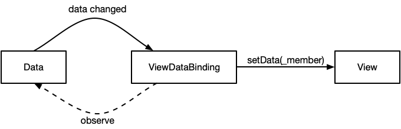
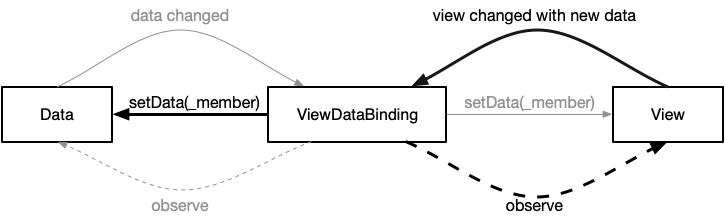
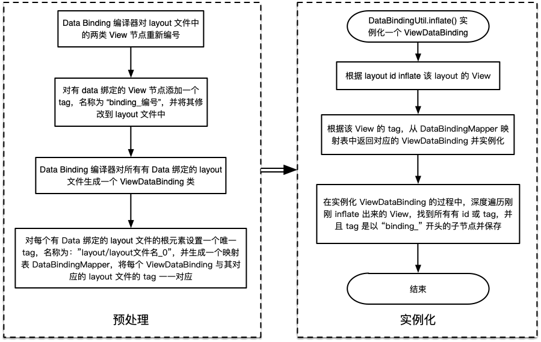

<a name="index">**目录**</a>

- <a href="#ch1">**1 Data Binding 的结构**</a>
    * <a href="#ch1.1">1.1 rebind 行为</a>
    * <a href="#ch1.2">1.2 observe data 行为</a>
    * <a href="#ch1.3">1.3 observe view 行为</a>
- <a href="#ch2">**2 样例分析——谷歌 sunflower 的改造**</a>
    * <a href="#ch2.1">2.1 Data——FakeData</a>
    * <a href="#ch2.2">2.2 View——fragment_plant_detail.xml</a>
    * <a href="#ch2.3">2.3 ViewDataBinding——FragmentPlantDetailBinding</a>
    * <a href="#ch2.4">2.4 adapter 绑定说明</a>
- <a href="#ch3">**3 免 findViewById 的实现**</a>

<br>
<br>

### <a name="ch1">1 Data Binding 的结构</a><a style="float:right;text-decoration:none;" href="#index">[Top]</a>

作为在 Android 开发中体现 MVVM 架构思想的 Data Binding，其核心是 **观察者模式** 的特定实现。首先，它有三个主要的实体：

1. **Data**：与 View 相关的数据，它可以是 View 的可观察者对象；
2. **View**：展示给用户的视图，如果有交互功能且能更新数据，它可以是 Data 的可观察者对象；
3. **ViewDataBinding**：连接 Data 和 View 的中介，当 Data 或 View 作为可观察者对象时，它充当可观察者对象的代理。假如当我们写了一个名为 demo.xml 的 Data Binding 的 layout 文件后，编译工具会生成一个相应的类——DemoBinding，它的原型就是 ViewDataBinding。我们通常通过 ```DataBindingUtil.inflate(inflater, R.layout.demo, container, false)``` 来实例化的 DemoBinding 对象，即 ViewDataBinding。

其次，它主要提供了以下三个方面的功能：

1. 将特定的 View 与特定的 Data 进行绑定，便于模块化；
2. View 自动感知和响应 Data 的变化，使得处理数据的业务层不必关心 View 的状态，便于解耦；
3. Data 也可以自动同步带有交互功能的 View 对数据的修改，使得 UI 层的交互不必担心数据是否能同步 View 状态的问题，仍然便于解耦。

基于这三个功能，Data Binding 的结构也可以划分为三个行为模式，以下一一介绍：

#### <a name="ch1.1">1.1 rebind 行为</a>

首先，Data 往往是一个数据的集合，数据绑定的第一步就是要将整个 Data 集合绑定到 View，比如初始化和数据的整体更新，如下图所示：


可以观察到，rebind 的过程就是一个简单的赋值操作，将 View 的值设置为 Data，只不过由 ViewDataBinding 这个代理来完成这个工作。图中的 ```_all``` 参数表示将 View 的所有需要更新的节点都设置为 Data 的所有对应的成员值。当我们在 layout 文件中进行如下设置时，ViewDataBinding 将代理完成 View 中所有数据绑定节点的 data rebind 操作：

```xml
<data>
    <variable
        name="demoData"
        type="com.sample.DemoData" />
</data>
...

<!-- 将 DemoData.element1 绑定到 ChildView1 -->
<ChildView1
    android:id="..."
    android:width="..."
    android:height="..."
    app:element1="@{demoData.element1}"/>
...

<!-- 将 DemoData.element2 绑定到 ChildView2 -->
<ChildView2
    android:id="..."
    android:width="..."
    android:height="..."
    android:text="@{demoData.element2}"/>
...
```

#### <a name="ch1.2">1.2 observe data 行为</a>

有时候，我们并不需要每次更新整个 Data 集合，而只需要更新集合中的某一个成员。我们希望看到的结果是，当 Data.element_i 发生变化的时候，View.child_i 更新就可以了，而不需要将 View 的所有视图节点都重新渲染一遍。要做到这一点，我们必须要让 View 可以观察 Data 的行为。换句话说，Data 是一个可观察者对象——这是 Data Binding 中另一个魅力所在，其行为模式如下：



我们可以将任何数据作为一个 Observable，然后将 ViewDataBinding 作为 View 的代理观察者，订阅 Data 的成员变化，一旦 Data 成员变化，便通知所有观察者对象——即 ViewDataBinding，然后 ViewDataBinding 再将 View 的相应节点的值设置为 Data 相应成员的新值——即图中的 ```_member``` 参数。

在 Data Binding 框架中，将 Data 设置为 Observable 的方式类似于下面的代码：

```java
public class DemoData extends BaseObservable {
    private int element;

    // 定义其它成员，省略

    @Bindable
    public int getElement() {
        return this.element;
    }

    public void setElement(int e) {
        this.element = e;
        notifyPropertyChanged(BR.element);
    }

    // 省略其它成员操作
}
```

这里有三个关键部分：

1. **BaseObservable**：可观察者基类（实际的祖先基类是一个 Observable 接口），实现改接口后，ViewDataBinding 就会在每次 rebind 的时候去订阅 Data 的变化；
2. **@Bindable 标注**：声明该成员是可被观察的，以及在 layout 中可以以 Data.xxx（标注的方法名如果为 getXXX）的方式进行访问；
3. **notifyPropertyChanged 方法**：BaseObservable 用于通知具体成员发送变化的方法，只要该方法被调用，ViewDataBinding 就会检索出是哪一个 element 的变化，并只对 View 相应的节点进行更新。

#### <a name="ch1.3">1.3 observe view 行为</a>

在开发中，根据业务需求，我们一般能遇到两种类型的 View：

- 一种是只用于展示的 View，它只展示 UI 状态，而不反馈状态，我们称之为 **单工View**；
- 另一种除了展示以外，还会反馈状态给监听者，我们称之为 **双工View**。
 
在 Android 的 UI事件流中，因为所有的 View 都是可以反馈状态的，所以准确来说，所有的 View 其实都是双工的。我们在这里区分单工和双工是针对业务需求的，比如：我们很多的视图只需要它们展示就可以了，不需要监听它们的状态变化，那么我们将其归为单工View。

费尽心思进行这样的划分，是因为，单工View 只需要有 observe data 行为就可以了；而双工View 往往就需要 observe view 行为。具体来说，在反馈状态时需要更新 Data 的双工 View，我们需要进行 observe view 行为。

因为双工View 会更新 Data，所以为了保证数据的一致性，Data 需要观察双工View 的状态变化。要做到这一点，这样的双工View 必须是一个可观察者对象。得益于 UI事件流的实现，双工View天然是可观察的（只要能反馈状态，就意味着能被观察）。在自定义的双工View中，可以间接引用 ViewDataBinding，这样 ViewDataBinding 就可以代理 Data 订阅 View 的状态变化：



图中我们可以看到，observe view 行为是伴随着 observe data 行为一起实现的。我们可以单独只实现 observe data 行为，但是如果要实现 observe view，必须同时实现 observe data 行为，因为该双工View 本身是也是要绑定 Data 的，也需要观察 Data 的变化——即 observe view 行为的实现需要通过双向绑定来达到，View 和 Data 同时都是对方的可观察者对象。

Data Binding 的原理基本上都在这三种行为模式的图解上，为了更深入一些实现的细节，我们下面通过一个样例来分析一下。

<br>
<br>

### <a name="ch2">2 样例分析——谷歌 sunflower 的改造</a><a style="float:right;text-decoration:none;" href="#index">[Top]</a>

sunflower app 是谷歌推出的 jetpack 库应用的最佳实践，官方只提供了 kotlin 的版本，如果大家更想看 java 版本，我改写了一个，文末放送。

我们通过 sunflower 中的一个植物种植详情页面作为具体的案例分析。为了说明 observe view 行为，我对原来的实现做了一些修改，具体不表，大家直接看现有修改后的代码分析就可以了。另外，代码也不会全贴，只贴出少量关键代码便于大家抓住重点理解。

#### <a name="ch2.1">2.1 Data——FakeData</a>

我们定义了一个数据类——FakeData，其中有两个成员：

- viewModel：植物的详细信息，用于 data observe 行为分析；
- name: 一个测试字段，表示页面标题，用于 view observe 行为分析；

其代码如下：

```java
public class FakeData extends BaseObservable {
    private PlantDetailViewModel viewModel;
    private String name;

    public void setViewModel(PlantDetailViewModel viewModel) {
        this.viewModel = viewModel;

        // 同时通知 plant 和 isPlanted 的变化，因为这两个成员被保存在组合成员 viewModel 里
        notifyPropertyChanged(BR.plant);
        notifyPropertyChanged(BR.isPlanted);
    }

    @Bindable
    public Plant getPlant() {
        return viewModel != null ? viewModel.getPlant() : null;
    }

    @Bindable
    public Boolean getIsPlanted() {
        return viewModel != null ? viewModel.getIsPlanted() : false;
    }

    public void setName(String name) {
        this.name = name;

        // 通知 ViewDataBinding，name 成员变化了
        notifyPropertyChanged(BR.name);
    }

    @Bindable
    public String getName() {
        return name;
    }
}
```

这里，FakeData 暴露给外面的成员实际是三个：plant，isPlanted，name。其中 plant 和 isPlanted 由 viewModel 提供，所以当更新 viewModel 时，必须同时通知 ViewDataBinding 两个属性的更新。

#### <a name="ch2.2">2.2 View——fragment_plant_detail.xml</a>

植物详情页的布局文件便是我们的 View 定义，我们只关注它与 FakeData 绑定的部分，且只列出部分节点：

```xml
<layout xmlns:android="http://schemas.android.com/apk/res/android"
    xmlns:app="http://schemas.android.com/apk/res-auto"
    xmlns:tools="http://schemas.android.com/tools">

    <data>
        <!-- rebind -->
        <variable
            name="fakeData"
            type="com.google.samples.apps.sunflower.data.FakeData" />

        <!-- 其它Data声明 -->
        ......
    </data>

    <androidx.coordinatorlayout.widget.CoordinatorLayout
        ...>
    ......

            <!-- ① 绑定：observe data（赋值绑定） -->
            <com.google.android.material.appbar.CollapsingToolbarLayout
                android:id="@+id/toolbar_layout"
                android:layout_width="match_parent"
                android:layout_height="match_parent"
                android:fitsSystemWindows="true"
                app:contentScrim="?attr/colorSurface"
                app:statusBarScrim="?attr/colorSurface"
                app:collapsedTitleGravity="center"
                app:collapsedTitleTextAppearance="@style/TextAppearance.Sunflower.Toolbar.Text"
                app:layout_scrollFlags="scroll|exitUntilCollapsed"
                app:title="@{fakeData.name}"
                app:titleEnabled="false"
                app:toolbarId="@id/toolbar">

                <!-- ② 绑定：observe data（adapter绑定） -->
                <ImageView
                    android:id="@+id/detail_image"
                    android:layout_width="match_parent"
                    android:layout_height="@dimen/plant_detail_app_bar_height"
                    android:contentDescription="@string/plant_detail_image_content_description"
                    android:fitsSystemWindows="true"
                    android:scaleType="centerCrop"
                    app:imageFromUrl="@{fakeData.plant.imageUrl}"
                    app:layout_collapseMode="parallax" />

                ......

            </com.google.android.material.appbar.CollapsingToolbarLayout>

        ......

                <!-- ③ 绑定：observe data（adapter绑定） -->
                <TextView
                    android:id="@+id/plant_detail_name"
                    android:layout_width="0dp"
                    android:layout_height="wrap_content"
                    android:layout_marginStart="@dimen/margin_small"
                    android:layout_marginEnd="@dimen/margin_small"
                    android:gravity="center_horizontal"
                    android:text="@{fakeData.plant.name}"
                    android:textAppearance="?attr/textAppearanceHeadline5"
                    app:layout_constraintEnd_toEndOf="parent"
                    app:layout_constraintStart_toStartOf="parent"
                    app:layout_constraintTop_toTopOf="parent"
                    tools:text="Apple" />

                ......

                <!-- ④ 绑定：observe view（双向adapter绑定） -->
                <com.google.samples.apps.sunflower.views.FakeEditText
                    android:id="@+id/plant_title_input"
                    android:layout_width="match_parent"
                    android:layout_height="wrap_content"
                    android:layout_marginStart="@dimen/margin_small"
                    android:layout_marginTop="@dimen/margin_small"
                    android:layout_marginEnd="@dimen/margin_small"
                    android:hint="type in title name"
                    android:text="@={fakeData.name}"
                    app:layout_constraintEnd_toEndOf="parent"
                    app:layout_constraintStart_toStartOf="parent"
                    app:layout_constraintTop_toBottomOf="@id/plant_description"/>

            ......

        ......

    </androidx.coordinatorlayout.widget.CoordinatorLayout>

</layout>
```

在上面的代码中，我们标注了 4 个绑定节点，总共有三种类型的绑定方式：

1. 赋值绑定：待绑定的 View 的属性带有 set 方法，这样可以直接将 Data 成员作为参数传递给 set 方法即可。

2. adapter 绑定：如果待绑定的 View 的属性没有 set 方法，或者默认的 set 方法不足以处理数据设置中的复杂流程，我们需要单独定义一个带有 @BindingAdapter 标注的方法来更新该 View 节点。比如：要异步加载图片（绑定②）。注意到绑定③的情况，TextView 是有 setText() 方法的，为什么这里也是 adpter 绑定呢？稍后我们就会看到，官方对 TextView 提供了一套规范的 adapter 绑定方法集合，所以 TextView 自带的 set 方法就被这套 adapter 绑定方法集合替换了。我们以绑定②的 adapter 绑定方法定义为例：

```java
// 来自类：PlantDetailBindingAdapters.java

@BindingAdapter("imageFromUrl")
public static void bindImageFromUrl(ImageView view, String imageUrl) {
    if (!TextUtils.isEmpty(imageUrl)) {
        Glide.with(view.getContext())
                .load(imageUrl)
                .transition(DrawableTransitionOptions.withCrossFade())
                .into(view);
    }
}
```

只要遇到 @BindingAdapter 标注，Data Binding 编译器在生成的 ViewDataBinding 中会将对应的 adapter 绑定方法和相关联的 View 的属性设置对应起来，稍后再说明 ViewDataBinding 的时候会有更详细的描述。

3. 双向 adapter 绑定：这种绑定方式对应的是 observe view 行为模式。在这种模式下，adapter 绑定完成两个功能：绑定值；绑定对 View 的观察者。除此以外，还需要一个 inverse adapter 绑定，该绑定作为观察者读取新值的一个方法（还记得在 observe view 行为模式中介绍过的可以反馈新状态的双工View 吗？在这里，FakeEditText 就是一个双工View）。我们来看一下绑定④的双向 adapter 绑定方法定义：

```java
// 来自类：PlantDetailBindingAdapters.java

@BindingAdapter(value = "android:text", requireAll = false)
public static void setName(FakeEditText view, String name) {
    if (!TextUtils.equals(view.getText(), name)) { // 避免无限循环绑定
        view.setText(name);
    }
}

// InverseBindingListener 是 FakeEditText 的一个观察者，其实现保存在 ViewDataBinding 
// 中，所以这等价于 ViewDataBinding 在观察 FakeEditText 的状态反馈。
// 注意：textAttrChanged 是这个观察者的 id
@BindingAdapter(value = {"textAttrChanged"}, requireAll = false)
public static void setTextAttrChanged(FakeEditText view, InverseBindingListener inverseBindingListener) {
    view.setInverseBindingListener(inverseBindingListener);
}

// 用于上述 InverseBindingListener 调用，该方法将返回 FakeEditText 
// 反馈的最新值，textAttrChanged 用于编译器识别是哪一个 InverseBindingListener
@InverseBindingAdapter(attribute = "android:text", event = "textAttrChanged")
public static String getName(FakeEditText view) {
    final Editable editable = view.getText();
    return editable != null ? editable.toString() : null;
}
```

#### <a name="ch2.3">2.3 ViewDataBinding——FragmentPlantDetailBinding</a>

我们先看一下 FragmentPlantDetailBinding 的部分定义：

```java
public abstract class FragmentPlantDetailBinding extends ViewDataBinding {
  @NonNull
  public final ImageView detailImage;

  @NonNull
  public final TextView plantDetailName;

  @NonNull
  public final FakeEditText plantTitleInput;

  @NonNull
  public final CollapsingToolbarLayout toolbarLayout;

  // ... 省略其它 View 引用

  @Bindable
  protected FakeData mFakeData;

  // ... 省略其它 Data 引用

  protected FragmentPlantDetailBinding(Object _bindingComponent, View _root, int _localFieldCount,
      ImageView detailImage, TextView plantDetailName, FakeEditText plantTitleInput, CollapsingToolbarLayout toolbarLayout, /* 其它 View 参数 */) {
    super(_bindingComponent, _root, _localFieldCount);
    this.detailImage = detailImage;
    this.plantDetailName = plantDetailName;
    this.plantTitleInput = plantTitleInput;
    this.toolbarLayout = toolbarLayout;

    // 其它 View 初始化
  }

  public abstract void setFakeData(@Nullable FakeData fakeData);

  @Nullable
  public FakeData getFakeData() {
    return mFakeData;
  }

  // ... 省略其它方法定义
}
```

粗一看 FragmentPlantDetailBinding 类的定义，只是一个暴露给业务层的接口，它的功能仅仅是读取每一个 View 节点（带来的好处便是不需要再通过繁琐的 findViewById() 来访问 View 了），以及读写 Data。这正是我们平时需要用到的 ViewDataBinding 的功能。

要理解 ViewDataBinding 的运作原理，我们需要再探索一下 FragmentPlantDetailBinding 的最终实现类（FragmentPlantDetailBinding 只是一个抽象类，所以一定有一个子类来实现它）以及 FragmentPlantDetailBinding 的超类 ViewDataBinding。

我们接下来看一下 FragmentPlantDetailBinding 的实现——FragmentPlantDetailBindingImpl 的定义：

```java
public class FragmentPlantDetailBindingImpl extends FragmentPlantDetailBinding {

    @Nullable
    private static final androidx.databinding.ViewDataBinding.IncludedLayouts sIncludes;
    @Nullable
    private static final android.util.SparseIntArray sViewsWithIds;
    static {
        sIncludes = null;
        sViewsWithIds = new android.util.SparseIntArray();
        sViewsWithIds.put(R.id.appbar, 8);
        sViewsWithIds.put(R.id.toolbar, 9);
        sViewsWithIds.put(R.id.plant_detail_scrollview, 10);
        sViewsWithIds.put(R.id.plant_watering_header, 11);
    }
    // views
    @NonNull
    private final androidx.coordinatorlayout.widget.CoordinatorLayout mboundView0;
    // variables
    // values
    // listeners
    // Inverse Binding Event Handlers
    // 作为 ViewDataBinding 观察 FakeEditText 输入变化的观察者
    private androidx.databinding.InverseBindingListener plantTitleInputtextAttrChanged = new androidx.databinding.InverseBindingListener() {
        @Override
        public void onChange() {
            // Inverse of fakeData.name
            //         is fakeData.setName((java.lang.String) callbackArg_0)
            java.lang.String callbackArg_0 = com.google.samples.apps.sunflower.adapters.PlantDetailBindingAdapters.getName(plantTitleInput);
            // localize variables for thread safety
            // fakeData
            com.google.samples.apps.sunflower.data.FakeData fakeData = mFakeData;
            // fakeData != null
            boolean fakeDataJavaLangObjectNull = false;
            // fakeData.name
            java.lang.String fakeDataName = null;

            fakeDataJavaLangObjectNull = (fakeData) != (null);
            if (fakeDataJavaLangObjectNull) {
                fakeData.setName(((java.lang.String) (callbackArg_0)));
            }
        }
    };

    public FragmentPlantDetailBindingImpl(@Nullable androidx.databinding.DataBindingComponent bindingComponent, @NonNull View root) {
        this(bindingComponent, root, mapBindings(bindingComponent, root, 12, sIncludes, sViewsWithIds));
    }
    private FragmentPlantDetailBindingImpl(androidx.databinding.DataBindingComponent bindingComponent, View root, Object[] bindings) {
        super(bindingComponent, root, 1
            , (android.widget.ImageView) bindings[2]
            , (android.widget.TextView) bindings[3]
            , (com.google.samples.apps.sunflower.views.FakeEditText) bindings[6]
            , (com.google.android.material.appbar.CollapsingToolbarLayout) bindings[1]
            , /* 其它保存在 bindings 中的 View 参数 */);
        this.detailImage.setTag(null);
        this.fab.setTag(null);
        this.mboundView0 = (androidx.coordinatorlayout.widget.CoordinatorLayout) bindings[0];
        this.mboundView0.setTag(null);
        this.plantDetailName.setTag(null);
        this.plantTitleInput.setTag(null);
        this.toolbarLayout.setTag(null);
        // 其它需要重置 tag 的字段

        setRootTag(root);
        // listeners

        invalidateAll();
    }

    @Override
    public void invalidateAll() {
        synchronized(this) {
                // 需要观察 FakeEditText
                mDirtyFlags = 0x20L;
        }
        requestRebind();
    }

    @Override
    public boolean hasPendingBindings() {
        synchronized(this) {
            if (mDirtyFlags != 0) {
                return true;
            }
        }
        return false;
    }

    @Override
    public boolean setVariable(int variableId, @Nullable Object variable)  {
        boolean variableSet = true;
        if (BR.fakeData == variableId) {
            setFakeData((com.google.samples.apps.sunflower.data.FakeData) variable);
        }
        else if (BR.callback == variableId) {
            setCallback((com.google.samples.apps.sunflower.PlantDetailFragment.Callback) variable);
        }
        else {
            variableSet = false;
        }
            return variableSet;
    }

    // rebind 行为模式
    public void setFakeData(@Nullable com.google.samples.apps.sunflower.data.FakeData FakeData) {
        // 将自己注册为 FakeData 的观察者，FakeData 成员发生更新后，其响应顺序为：
        // handleFieldChange -> onFieldChange -> onChangeFakeData -> executeBindings
        updateRegistration(0, FakeData);

        // 整体更新 Data
        this.mFakeData = FakeData;
        synchronized(this) {
            // 标记全部成员都要更新
            mDirtyFlags |= 0x1L;
        }

        // FragmentPlantDetailBindingImpl 作为可观察者对象时需要发起通知
        notifyPropertyChanged(BR.fakeData);

        // 更新所有 FakeData 的成员到对应的 View 节点，实际调用 executeBindings() 方法
        super.requestRebind();
    }

    @Override
    protected boolean onFieldChange(int localFieldId, Object object, int fieldId) {
        switch (localFieldId) {
            case 0 :
                return onChangeFakeData((com.google.samples.apps.sunflower.data.FakeData) object, fieldId);
        }
        return false;
    }
    // 通过唯一的二进制位来判断需要更新的字段
    private boolean onChangeFakeData(com.google.samples.apps.sunflower.data.FakeData FakeData, int fieldId) {
        if (fieldId == BR._all) {
            synchronized(this) {
                    mDirtyFlags |= 0x1L;
            }
            return true;
        }
        else if (fieldId == BR.name) {
            synchronized(this) {
                    mDirtyFlags |= 0x4L;
            }
            return true;
        }
        else if (fieldId == BR.plant) {
            synchronized(this) {
                    mDirtyFlags |= 0x8L;
            }
            return true;
        }
        else if (fieldId == BR.isPlanted) {
            synchronized(this) {
                    mDirtyFlags |= 0x10L;
            }
            return true;
        }
        return false;
    }

    @Override
    protected void executeBindings() {
        long dirtyFlags = 0;
        synchronized(this) {
            dirtyFlags = mDirtyFlags;
            mDirtyFlags = 0;
        }
        java.lang.String fakeDataPlantName = null;
        java.lang.Boolean fakeDataIsPlanted = null;
        com.google.samples.apps.sunflower.data.FakeData fakeData = mFakeData;
        com.google.samples.apps.sunflower.data.Plant fakeDataPlant = null;
        java.lang.String fakeDataName = null;
        java.lang.String fakeDataPlantImageUrl = null;
        // 其它 Data 字段声明

        if ((dirtyFlags & 0x3dL) != 0) {


            if ((dirtyFlags & 0x31L) != 0) {

                    if (fakeData != null) {
                        // read fakeData.isPlanted
                        fakeDataIsPlanted = fakeData.getIsPlanted();
                    }
            }
            if ((dirtyFlags & 0x29L) != 0) {

                    if (fakeData != null) {
                        // read fakeData.plant
                        fakeDataPlant = fakeData.getPlant();
                    }


                    if (fakeDataPlant != null) {
                        // read fakeData.plant.name
                        fakeDataPlantName = fakeDataPlant.name;
                        // read fakeData.plant.imageUrl
                        fakeDataPlantImageUrl = fakeDataPlant.imageUrl;

                        // 其它 Data 字段更新
                    }
            }
            if ((dirtyFlags & 0x25L) != 0) {

                    if (fakeData != null) {
                        // read fakeData.name
                        fakeDataName = fakeData.getName();
                    }
            }
        }
        // batch finished
        if ((dirtyFlags & 0x29L) != 0) {
            // api target 1

            com.google.samples.apps.sunflower.adapters.PlantDetailBindingAdapters.bindImageFromUrl(this.detailImage, fakeDataPlantImageUrl);
            androidx.databinding.adapters.TextViewBindingAdapter.setText(this.plantDetailName, fakeDataPlantName);
            // 其它 View 节点更新
        }
        if ((dirtyFlags & 0x20L) != 0) {
            // api target 1

            // 完成对 FakeEditText 的观察行为
            com.google.samples.apps.sunflower.adapters.PlantDetailBindingAdapters.setTextAttrChanged(this.plantTitleInput, plantTitleInputtextAttrChanged);
        }
        if ((dirtyFlags & 0x31L) != 0) {
            // api target 1

            com.google.samples.apps.sunflower.adapters.PlantDetailBindingAdapters.bindIsGone(this.fab, fakeDataIsPlanted);
        }
        if ((dirtyFlags & 0x25L) != 0) {
            // api target 1

            com.google.samples.apps.sunflower.adapters.PlantDetailBindingAdapters.setName(this.plantTitleInput, fakeDataName);
            this.toolbarLayout.setTitle(fakeDataName);
        }
    }
    // dirty flag
    private  long mDirtyFlags = 0xffffffffffffffffL;

    // 省略其它 Data 相关
}
```

结合上一节我们谈到的 Data Binding 的三种行为模式，我们分部进行探讨：

1. **rebind 行为模式**：

rebind 行为的逻辑体现在 setFakeData() 的实现里，该方法有以下几个功能：

* **将自己注册为 FakeData 的一个观察者，为 observe data 做准备**。
 
该功能由 updateRegistration() 方法完成，实现细节在超类 ViewDataBinding 中，我们不关心该细节如何，只需要知道基本的原理就是：FakeData 是一个可观察者对象，FragmentPlantDetailBindingImpl 是一个观察者对象，FakeData 将 FragmentPlantDetailBindingImpl 或者 FragmentPlantDetailBindingImpl 的一个引用保存到自己的观察者列表中，这个观察者列表在 FakeData 的父类 BaseObservable 中：

```java
public class BaseObservable implements Observable {
    // 观察者列表
    private transient PropertyChangeRegistry mCallbacks;

    public BaseObservable() {
    }

    // 当 ViewDataBinding 调用 updateRegistration() 时，触发该方法执行注册行为 
    @Override
    public void addOnPropertyChangedCallback(@NonNull OnPropertyChangedCallback callback) {
        synchronized (this) {
            if (mCallbacks == null) {
                mCallbacks = new PropertyChangeRegistry();
            }
        }
        mCallbacks.add(callback);
    }

    @Override
    public void removeOnPropertyChangedCallback(@NonNull OnPropertyChangedCallback callback) {
        synchronized (this) {
            if (mCallbacks == null) {
                return;
            }
        }
        mCallbacks.remove(callback);
    }

    // 遍历观察者列表，通知所有观察者，有 data 成员发生变化
    public void notifyPropertyChanged(int fieldId) {
        synchronized (this) {
            if (mCallbacks == null) {
                return;
            }
        }
        mCallbacks.notifyCallbacks(this, fieldId, null);
    }

    // ...省略其它方法
}

```

当 FakeData（即 BaseObservable） 调用 notifyPropertyChanged() 来通知某些成员发生更新时，FragmentPlantDetailBindingImpl（即 ViewDataBinding） 将收到对应的通知：

```java
// ViewDataBinding.java

// 响应通知
private void handleFieldChange(int mLocalFieldId, Object object, int fieldId) {
    // ...省略非关键代码

    boolean result = onFieldChange(mLocalFieldId, object, fieldId);
    if (result) {
        requestRebind();
    }
}
```

在 handleFieldChange() 中，首先通过 onFieldChange() 方法来判断是否有字段要更新，如果有则调用 requestRebind() 来完成更新。onFieldChange() 是一个抽象方法，其实现代码由 Data Binding 编译器填充到 FragmentPlantDetailBindingImpl 的 onFieldChange() 方法中。

在 Data Binding 编译阶段，对所有的 FakeData 成员都进行了编号，每一个成员都唯一对应一个二进制数字的一个位，如果某个成员发生了修改，其对应的二进制位将被记录，记录的位置保存在变量 mDirtyFlags 中。这样就做到了只需要更新实际需要更新的字段，避免重复更新和渲染。

* **整体更新 FakeData，标记 mDirtyFlags 为全部成员都需要更新**。

若 FakeData 有多个绑定成员，那么每个成员都共享一位标记位，只要这个共享位是置位的，那么所有的绑定成员都会更新到对应 View 节点。

* **通知自身的观察者，FakeData发生了变化**。

ViewDataBinding 本身也是一个 BaseObservable，所以它也可以成为其它观察者观察的目标。**这里我还没有找到相关的应用场景，留待后续跟进**。

* **发送 rebind 命令，执行整体更新 FakeData 操作**。

ViewDataBinding.requestRebind() 最终调用抽象方法 executeBindings()，由 FragmentPlantDetailBindingImpl.executeBindings() 实现 Data 到 View 的更新。

2. **observe data 行为模式**：

在上文中我们已经知道，rebind 行为如何通过将 ViewDataBinding 注册为 FakeData 的观察者来实现 observe data 行为的。

当 FakeData 通过 notifyPropertyChanged(/\*属性ID\*/) 来通知 ViewDataBinding 其某个成员发生变化时，FragmentPlantDetailBindingImpl 最终要做的工作就是更新 mDirtyFlags，将该成员对应的标记位置位，并通过 executeBindings() 执行 Data 成员到对应 View 的更新操作（**注意：executeBindings() 只会更新 mDirtyFlags 中置位对应的成员**）。

3. **observe view 行为模式**：

我们首先看一下在 2.2 节中提到的双工View——FakeEditText 的定义：

```java
public class FakeEditText extends AppCompatEditText {
    private InverseBindingListener inverseBindingListener;
    // 供双向 adapter 绑定调用
    public void setInverseBindingListener(InverseBindingListener listener) {
        this.inverseBindingListener = listener;
    }
    
    // ...省略

    public FakeEditText(Context context, AttributeSet attrs, int defStyleAttr) {
        super(context, attrs, defStyleAttr);
        init();
    }

    private void init() {
        this.addTextChangedListener(new TextWatcher() {
            // ...省略

            @Override
            public void afterTextChanged(Editable s) {
                if (inverseBindingListener != null) {
                    inverseBindingListener.onChange();
                }
            }
        });
    }
}

```

在 observe view 行为中，双工View 是一个可观察者，而 Data 和 ViewDataBinding 是观察者。我们看到在 FakeEditText 中，有一个 InverseBindingListener 对象，它响应 FakeEditText 中用户输入的变化。这个 InverseBindingListener 对象是 ViewDataBinding 的一个间接引用，它对 FakeEditText 的输入响应就相当于 ViewDataBinding 对 FakeEditText 的输入响应。换句话说，InverseBindingListener 的存在实现了 ViewDataBinding 观察 FakeEditText 的目的。

而我们看到，InverseBindingListener 的实际对象被 data binding 编译器编译进了 ViewDataBinding 的实现 FragmentPlantDetailBindingImpl 中——plantTitleInputtextAttrChanged。FakeEditText 中的 InverseBindingListener 对象如何被设置为 plantTitleInputtextAttrChanged 的呢？这就需要我们回忆一下在 2.2 节中的双向 adapter 绑定，在其中的 setTextAttrChanged() 方法中，我们已经做好了这种设置。现在只需要知道 setTextAttrChanged() 是何时被调用的。

很简单，在 FragmentPlantDetailBindingImpl 的构造方法中，最后会通过 invalidateAll() 对 mDirtyFlags 进行置位标记。在双向 adapter 绑定中，对 View 的观察行为也被当做一个置位标记，置位后再通过发送 rebind 命令，就可以在 executeBindings() 中调用 setTextAttrChanged()。

在 plantTitleInputtextAttrChanged 的 onChange() 方法中，我们注意两个有趣的方法：

- com.google.samples.apps.sunflower.adapters.PlantDetailBindingAdapters.getName()
- fakeData.setName()：该方法将通过 observe data 行为最终调用 com.google.samples.apps.sunflower.adapters.PlantDetailBindingAdapters.setName()

第一个方法的目的是读取 FakeEditText 反馈的最新值，第二方法的目的是将最新值更新到 FakeData 中，这就是我们需要在双向 adapter 绑定中必须定义三个方法的原因。

通过这一系列操作，最终实现了 observe view 行为。

#### <a name="ch2.4">2.4 adapter 绑定说明</a>

在 executeBindings() 方法中，我们看到，View 对 Data 变化的更新操作，很多都是通过 adapter 绑定方法来实现的。在 @BindingAdapter 标注中，要指定该方法对应的 Data 成员名称，这样 Data Binding 编译器就知道，当哪个 Data 成员被置位时，应该调用哪个 adapter 绑定方法完成更新，从而把该方法填充到 executeBindings() 方法中的正确位置。

我们注意到 androidx.databinding.adapters.TextViewBindingAdapter 这个类，这是官方专门针对 TextView 及其子类提供的一整套规范的 adapter 方法集合，在 observe data 行为中，凡是针对的 View 为 TextView 或其子类，其 View 更新方法都将替换为 TextViewBindingAdapter 中的 adapter 方法。除了 TextViewBindingAdapter 以外，官方还提供了很多其它 View 的通用 adapter 方法，这些方法都是默认的。我们也可以通过自定义的 adapter 方法来替换官方的方法，而这是由编译器来判定的。

<br>
<br>

### <a name="ch3">3 免 findViewById 的实现</a><a style="float:right;text-decoration:none;" href="#index">[Top]</a>

我们在 2.3 节中提到，在暴露给业务层的 ViewDataBinding 类——FragmentPlantDetailBinding 中，保存了 layout 文件中的 View 节点引用，但并不是所有的节点都会引用，准确来说，其保存的 View 节点有两类：

1. 与 Data 有绑定关系的节点，Data Binding 编译器在编译过程中会在 layout 文件中将这样的节点添加一个以 "binding_" 开头的 tag；
2. 设置了 id 的节点，这样的节点因为程序员后面需要访问到，所以必须引用进来。

假如在 layout 文件中有 include 标签，并且也绑定了 Data，那么还会引用一个该 include 包含的 layout 文件对应的 ViewDataBinding 对象。

ViewDataBinding 实现免 findViewById 的方法可以用以下的一个流程图简单概括：



如图所示，总的流程分为两大部分：

- 预处理：由 Data Binding 编译器对 layout 文件进行一些必要的 patch 操作，主要是进行 tag 处理，以及生成必要的映射表和 ViewDataBinding 类；
- 实例化：在运行时，通过 DataBindingUtil.inflate() 方法实例化具体的 ViewDataBinding 对象，主要的作用在于映射准确的 ViewDataBinding，深度遍历根 View 并保存必须的子节点视图。


