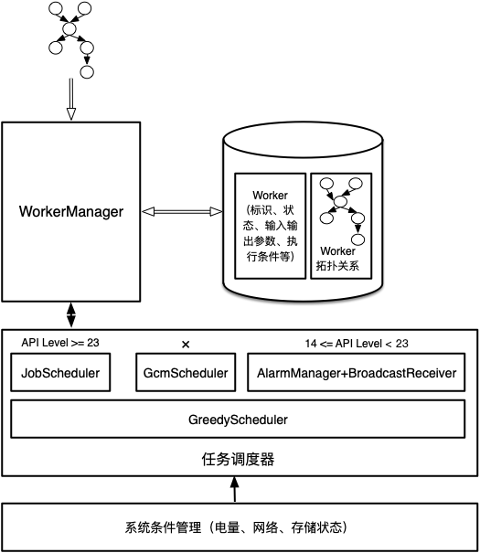
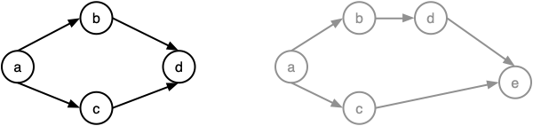
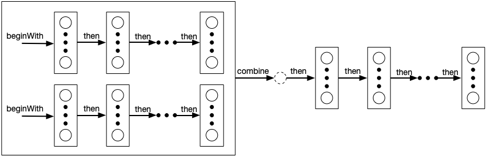
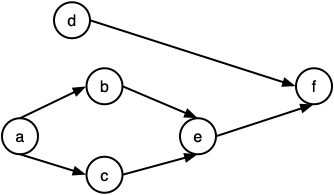
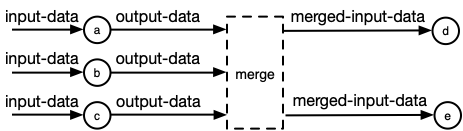

<a name="index">**目录**</a>

- <a href="#ch1">**1 WorkerManager的适用场景**</a>
- <a href="#ch2">**2 WorkerManager的结构**</a>
- <a href="#ch3">**3 WorkerManager的初始化和后台线程池**</a>
- <a href="#ch4">**4 WorkerManager的任务链**</a>
    * <a href="#ch4.1">4.1 合法的任务链</a>
    * <a href="#ch4.2">4.2 任务链的执行顺序——拓扑排序</a>
- <a href="#ch5">**5 任务数据传递**</a>
- <a href="#ch6">**6 一些思考**</a>

<br>
<br>

### <a name="ch1">1 WorkerManager的适用场景</a><a style="float:right;text-decoration:none;" href="#index">[Top]</a>

我们知道不运行在主线程中的任务叫做后台任务。在实际应用中，根据不同的应用场景有两类后台任务是我们常遇到的，如下图所示：


我们通常在应用内部会向服务器请求数据、加载图片并显示等等，这种任务的特点是需要在发起请求后马上执行，但是允许有一定的执行丢失；还有一部分任务，在构建后不需要马上执行，而是可以适当推迟到合适的时机再执行，比如在手机可用资源（电量、存储、网络等）充足时，但是必须要保证最终一定能够执行，即便APP已经退出了，比如向服务器发送日志这样的工作。

WorkerManager 就是专门用来处理后一种后台任务的。这很像时间管理中的重要紧急四象限法则，而 WorkerManager 处理的任务就对应于重要但不紧急的任务。

虽然 WorkerManager 设计的理想目标是即便在 APP 应用退出或者手机重启的情况下，缓存的推迟任务也会在满足系统条件的时候得到执行。但是实际情况却并非如此，由于众多手机厂商对 Android 系统的定制，导致系统回收 APP 进程之后，其所属的 WorkerManager 创建的推迟任务也不会被唤醒。在 StackOverflow 中对此有一个详细的[回答](https://stackoverflow.com/questions/50682061/android-is-workmanager-running-when-app-is-closed)。我们后面还将对这个问题进一步说明。

<br>
<br>

### <a name="ch2">2 WorkerManager的结构</a><a style="float:right;text-decoration:none;" href="#index">[Top]</a>

为了分析 WorkerManager 的运行原理，我们先看一下它的结构图：



从上面的结构图中我们可以看到，WorkerManager 的运行机理遵循分层的结构设计。要点如下：

- WorkerManager 的输入是一个任务链，链中的每个节点都是一个可独立执行的后台任务，后面我们还将看到，该任务链实际上是一种特殊的有向无环图。

- 任务链需要保存在数据库中，主要保存两类数据：一是每个任务的基本信息，包括 ID、当前状态、输入输出参数、约束条件等；二是所有任务之间的执行依赖关系。我们发现，一旦这些信息被持久化存储后，即便 APP 退出或者手机重启，当再次启动运行未完成的任务时，仍然能够恢复任务的所有状态。

- 需要有一种机制来通知 WorkerManager 去判断缓存的后台任务是否可以执行了，即任务的约束条件是否满足了，这个机制由调度器来完成。在 API Level >= 23 的系统上，采用 JobScheduler，在 API Level 14~22 上如果手机支持 GCM 则采用 GcmScheduler，否则采用 AlarmManager 结合 BroadcastReceiver 来实现调度功能，另外都附加一个贪心调度器——GreedyScheduler，用于马上执行那些没有任何约束条件的任务。

- 调度器的作用是感知系统资源变化的事件，比如是否充电、网络类型切换、存储状况变化等，这些变化同时也对应各个后台任务的约束条件，并通知 WorkerManager 检查排队任务是否满足约束条件，若满足则执行。

- 在实际当中，所有这些底层的调度器都没有办法保证在应用进程被系统回收后一定能够再次被唤醒。正是因为这个原因，WorkerManager 的缓存任务在 APP 进程不活的情况下，即便满足了约束条件，也不一定能得到执行。

- WorkerManager 的主要功能如下：
    * 接收输入的 Worker，并按照输入规则构造任务链。
    * 将任务链保存到数据库中。
    * 根据系统版本选择合适的调度器，并向调度器发送调度命令。
    * 等待调度器通知系统资源变化事件。
    * 事件到达后，从数据库中提取所有没有前置依赖的任务，检查每个任务的约束条件是否满足或周期是否到达。
    * 将满足约束条件和周期的任务放入后台线程池运行，并等待运行结果。
    * 任务结束运行后，将输出写入数据库，并重新激活调度器。

<br>
<br>

### <a name="ch3">3 WorkerManager的初始化和后台线程池</a><a style="float:right;text-decoration:none;" href="#index">[Top]</a>

WorkerManager 执行后台任务，是通过一个后台线程池来实现的，该线程池在 WorkerManager 首次初始化的时候便进行了实例化。

WorkerManager 默认是在一个叫 WorkManagerInitializer 的 ContentProvider 中初始化的，在 apk 编译过程中，该 ContentProvider 将自动导入到 AndroidManifest.xml 文件中：

```xml
<?xml version="1.0" encoding="utf-8"?>
<manifest
    ...>

    ...

    <application
        ...>

        ...

        <provider
            android:name="androidx.work.impl.WorkManagerInitializer"
            android:exported="false"
            android:multiprocess="true"
            android:authorities="com.google.samples.apps.sunflower.workmanager-init"
            android:directBootAware="false" />

        ...

    </application>
</manifest>

```

在 APP 启动的时候，WorkManagerInitializer 便会得到执行，同时执行 WorkerManager 的初始化，其初始化过程如下：

```java
public class WorkManagerInitializer extends ContentProvider {
    @Override
    public boolean onCreate() {
        // Initialize WorkManager with the default configuration.
        WorkManager.initialize(getContext(), new Configuration.Builder().build());
        return true;
    }

    // ...
}
```

用默认的配置来初始化 WorkManager，WorkerManager 的初始化主要包括以下几方面：

- 数据库初始化。
- 线程池初始化。
- 调度器初始化。

其中，重要的线程池初始化如下：

```java
private @NonNull Executor createDefaultExecutor() {
    return Executors.newFixedThreadPool(
            Math.max(2, Math.min(Runtime.getRuntime().availableProcessors() - 1, 4)));
}
```

可以看到，WorkerManager 执行后台任务的线程池是一个 FixedThreadPool，其固定允许运行的线程数量为 2 ~ 4 个。所以最多可以同时运行的后台任务数量就是 4 个，另外还受到处理器核数的限制，除此以外，因为 WorkerManager 访问数据库的操作也放在后台线程池中，所以，能同时运行的后台任务通常可能达不到 4 个。

关于线程池的原理，可以看这一篇——[Java线程池核心类ThreadPoolExecutor](https://github.com/huanzhiyazi/articles/issues/5)。

<br>
<br>

### <a name="ch4">4 WorkerManager的任务链</a><a style="float:right;text-decoration:none;" href="#index">[Top]</a>

#### <a name="ch4.1">4.1 合法的任务链</a>

WorkerManager 的任务链（**非周期任务**）是一种满足如下条件的有向无环图：**处于同一层的节点有相同的父节点和相同的儿子节点**。如下图，左边的黑色有向图是一个合法的任务链，处于同一层的任务 b 和 c 有相同的父节点 a 和相同的儿子节点 d；而右边的灰色有向图是一个非法的任务链，同层的任务 b 和 c 虽然有相同的父节点，但是不共享相同的儿子节点。



注意到，同一层的任务因为没有依赖关系，所以是可以并发执行的。在抽象层次上，我们可以把同层任务合并为一个任务，这样这个有向无环图就变成了一个单链，再进一步，多条单链又可以合并为一个任务，并可以继续往后延伸。所以，抽象来看，一个有向无环的任务依赖图最终可以规约为一条单链，这就是我将其命名为任务链的原因。

所以，实际的任务链形如下图所示：



图中在矩形框中的竖排圆圈表示同层可并发执行的任务。注意到，执行 combine 操作后，多条链会合并成一个合并任务节点（图中的虚线圆圈），这并非仅仅是图中为了说明而画出，而是在 WorkerManager 中就是这么实现的，这个合并节点是一个无任何约束条件的任务，它的作用仅仅只是将前序链的输出结果进行合并，以备作为后续节点的输入。

#### <a name="ch4.1">4.2 任务链的执行顺序——拓扑排序</a>

既然任务链是一个有向无环图，那么其执行顺序必然满足拓扑排序，即假设在图 G 中的一个有向边为 u→v，那么在拓扑序列中，必然有 u 排在 v 的前面。

以下图为例：



满足该任务链的执行顺序可以是：a,b,c,e,d,f 或 a,d,b,c,e,f 或 a,c,d,b,e,f 等。它们都是该有向图的拓扑排序。该任务链的构造实现如下：

```java
OneTimeWorkerRequest a, b, c, d, e, f;
// 任务初始化略

WorkerManager wm = WorkerManager.getInstance();
WorkContinuation wc1 = wm.beginWith(a).then(Arrays.asList(b, c)).then(e);
WorkContinuation wc2 = wm.beginWith(d);
WorkContinuation.combine(Arrays.asList(wc1, wc2)).enqueue();
```

<br>
<br>

### <a name="ch5">5 任务数据传递</a><a style="float:right;text-decoration:none;" href="#index">[Top]</a>

在初始化任务的时候，除了可以指定任务的约束条件以外，还可以以 key-value 的形式向任务设置必要的输入参数，在任务执行过程中，我们可以将任务的执行结果即任务输出也以 key-value 的方式保存下来，WorkerManager 会将该输出保存到数据库中。当该任务的儿子节点执行的时候，又会从数据库中取出其所有父节点的输出数据，并合并成一个新的 k-v 数据作为其输入。

WorkerManager 的任务数据传递过程如下图所示：



注意，由于任务 a, b, c 都是任务 d 和 e 的父亲节点，所以 d 和 e 的输入数据是一模一样的，都来自合并的 a, b, c 的输出数据。

<br>
<br>

### <a name="ch6">6 一些思考</a><a style="float:right;text-decoration:none;" href="#index">[Top]</a>

- 关于系统设计：分层的设计思想，把层次逻辑一定要划分清晰。比如 WorkerManager 职责应不应该把调度功能包含进来。这里调度功能是独立的层次，因为调度的方式随着 Android 系统的演进可能是不断变化的，将调度功能分离出来，WorkerManager 只负责根据版本选择合适的调度器，这样当一个新的调度组件出现时，WorkerManager 只需要做很小的修改即可。
- 关于数据库的设计：把任务链分为两部分进行存储，一部分是各个任务的基本信息，一部分是整个任务的依赖图。在检查任务约束和状态，执行任务时我们只需要访问任务的基本信息，而不关心当前任务与其它任务的依赖关系；而当任务结束后，需要决定接下来执行哪些任务时，就只需要关心任务依赖关系，而不关心具体的任务信息是什么。可见，根据逻辑功能合理划分数据表，使得上层逻辑访问数据更加清晰。

<br>
<br>
<br>

> 说明：
> 
> 该文档参考的 androidx 版本为 
> 
> core: 1.1.0


