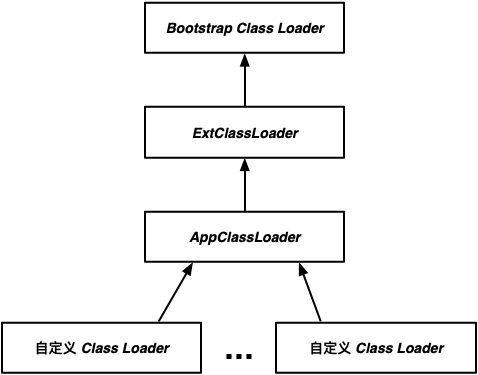
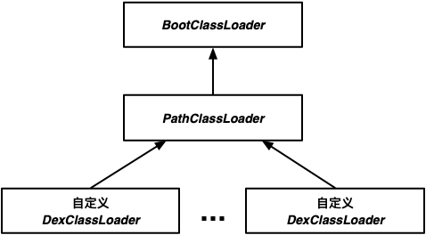

<a name="index">**目录**</a>

- <a href="#ch1">**1 Java 类加载过程**</a>

<br>
<br>

### <a name="ch1">1 Java 类加载过程</a><a style="float:right;text-decoration:none;" href="#index">[Top]</a>

通常，一个 Java 类被使用前，需要经过以下两个步骤：

1. 由 javac 编译成字节码。
2. 将代表该类的字节码文件加载到虚拟机。

Java 的一大魅力在于可以在运行时加载类。理论上，Java 虚拟机可以在应用程序运行过程中根据应用程序的执行要求加载任何一个合法的新类并执行。这体现了 Java 的动态性和灵活性。

我们可以试想一下 Java 类的加载过程：

首先，需要先将该类的字节码文件读到内存中；
其次，肯定需要对字节码进行一些验证，以确保它是合法并安全的，不会危害到系统，因为字节码并非只由 javac 编译 java 源程序得到，理论上只要遵循 java 字节码规范都可以得到一个虚拟机可执行的字节码文件；
然后，需要对这个类进行解析，即虚拟机需要知道这个类长什么样子，有些什么字段，需要分配多少内存，需要告诉应用程序如何才能调用到它；
最后，需要对该类进行一些必要的初始化工作，这种初始化的特点是只需要执行一次，因为类的加载一般也只需要执行一次，所以将这样的工作放到加载过程中是合理的。注意类的初始化不同于构造函数，确切地说，类的初始化是所有对象共有的部分，所以只会有一次，而构造函数应该是对象的初始化，不同的对象都要初始化一遍，所以并不属于类加载过程，从而也可以推断类的初始化应该是指的是静态语句块和静态字段的初始化。

以上是从正常的逻辑分析来看类的加载过程的，实际上，类的加载过程也大致如同上述所言，具体来看，如下图所示：


总体而言，类加载包括三个过程：加载、链接、初始化。其中，链接又包含验证、准备、解析三个阶段。一般而言，这几个过程的开始顺序是不变的，除了在 Java 动态绑定中解析在初始化之后以外。

简单介绍一下这几个过程的作用：

1. **加载**：将类的字节码二进制流读进内存；将该字节流代表的静态存储结构转化为方法区的运行时数据结构；在内存中生成一个代表这个类的 java.lang.Class 对象，作为方法区这个类的各种数据的访问入口。

2. **验证**：如前所述，验证阶段确实就是为了验证字节码的合法性和安全性。理论上用 javac 编译过后的字节码都应该符合虚拟机规范了，所以验证过程实际上可能重复做了很多在编译阶段已经做过的事情，但是由于字节码来源的多样性，这个验证阶段还是很重要的。验证过程包括验证字节码的格式、验证类的语义合法性、方法的语义合法性、代码的语义合法性等。

3. **准备**：准备阶段比较简单，就是给类的静态变量分配内存和赋初值。需要注意的是这里不同于类的初始化阶段给静态变量赋初值，准备阶段给静态变量赋的初值一般是零值，除非该静态变量用 final 进行修饰。

4. **解析**：解析阶段将常量池内的符号引用替换为直接引用。符号引用以一组符号来描述所引用的目标，符号可以是任何形式的字面量，只要使用时能无歧义地定位到目标即可；直接引用则是可以直接指向目标的指针、相对偏移量或者是一个能间接定位到目标的句柄。符号引用与直接引用的关系就好比姓名和身份证之间的关系一样。

5. **初始化**：如前所述，初始化阶段就是根据类的逻辑语义去初始化类中的所有静态语句块和静态变量。需要注意的是，初始化的顺序将按照各个静态语句在代码中的顺序进行，特别地，静态语句块可以对在其后的静态变量重新赋值，但是不能引用它；虚拟机会保证父类的类初始化优先于子类的类初始化；类初始化是线程安全的，所以当多个线程同时初始化一个类时，若类的初始化过程太长，另一个线程将长久处在等待锁的状态。

接下来重点分析一下在应用程序端可控的第一个过程——加载。我们约定，后文提及的类加载默认情况下都指的是类加载的第一个过程——加载。

<br>
<br>

### <a name="ch2">2 类加载的双亲委派模式</a><a style="float:right;text-decoration:none;" href="#index">[Top]</a>

一般来讲，虚拟机启动后，在应用程序运行之前，都会提前预加载一些常用的基本类，比如 `java.lang.*` 里面的类，这些都不需要应用程序去重新加载，不光不需要，而且应该做到禁止应用程序去重新加载。因为基本类是 Java 世界里的一个统一标准套件，大家普遍遵守这个标准才能让这个世界运行有序。比如 `java.lang.String` 这个类就是一个基本类，如果应用程序也有权限加载一个自己写的 `java.lang.String`，且和 JDK 的版本非常不一致，这样会让其他协作的程序员感到非常困惑，本以为这是一个 JDK 自带的字符串类型，结果发现表现出来的行为不一致。所以必须有一种可靠的类加载方案，既能让应用程序动态加载第三方的字节码，同时又能保证 Java 基本类的安全。JDK 给我们提供的这种方案叫 **类加载双亲委派模式**。

双亲委派模式的基本原理是：

1. 负责加载类的类叫做类加载器。
2. 如果一个类加载器加载了一个类，那么这个类加载器将这个类缓存起来。每次加载类的时候，首先会先访问指定类加载器的缓存，若缓存中存在，就直接从缓冲区里返回即可，这可以提高类加载的性能。
3. 如果缓冲区找不到，说明是第一次加载，那么如果指定类加载器有父加载器，则优先让父加载器加载该类。所以类加载器具有层级关系。值得注意的是，负责加载 Java 基本类和扩展类的类加载器必须处于类加载器层级中的顶层。父加载器加载类的过程也遵循同样的规则。
4. 如果没有父加载器或者父加载器也加载不到，则返回当前类加载器，由自己读入字节码并委托虚拟机执行后续加载过程且返回生成的类。

上述第 3 条是双亲委派模式的核心。可以这样理解，**一个类加载器加载过的类，都不能被它的所有子孙加载器重新加载**。我们以 JVM 为例，分析一下为何这样的模式可以保证基本类的安全。

先看一下 JVM 的类加载层级关系：



- **Bootstrap Class Loader**：这是所有类加载器的祖先加载器，它负责加载 <JAVA_HOME>/lib 目录下的所有 Java 基本类，`java.lang.String` 即由它加载。

- **ExtClassLoader**：扩展类加载器，负责加载 <JAVA_HOME>\lib\ext 目录中的 Java 扩展类。

- **AppClassLoader**：应用程序类加载器，负责加载应用程序中用户类路径下的所有类，也叫系统类加载器。如果应用程序中没有自定义过自己的类加载器，一般情况下这个就是程序中默认的类加载器。如果自定义类加载没有指定父加载器，则默认就是指定 AppClassLoader 为父加载器（由 ClassLoader.getSystemClassLoader() 指定）。

- **自定义类加载器**：用户自定义的类加载器，一般以 AppClassLoader 作为直接父加载器，加载三方来源的字节码，如磁盘、数据库或者网络等。

上述只有 Bootstrap 加载器是以本地代码编写，应用程序无法直接使用它，剩下的类加载器都是 Java 编写的，并且都有一个共同的父类——ClassLoader，应用程序都可以直接使用。

值得注意的是，双亲委派模式的层级结构并不是由类的继承关系来实现的，而是通过组合关系来实现的。在继承关系上它们都是 ClassLoader 的子类。

由此可见，当我们用自定义的一个类加载器去加载类的时候，会回溯所有的祖先加载器，如果指定的类名与 Java 基本类或者扩展类重合，则会被 Bootstrap 或者 ExtClassLoader 加载，而不会被自定义的类加载。双亲委派的核心逻辑在 ClassLoader.loadClass() 方法中：

```java
protected Class<?> loadClass(String name, boolean resolve)
        throws ClassNotFoundException
{
    synchronized (getClassLoadingLock(name)) {
        // 2. 从缓存获取
        Class<?> c = findLoadedClass(name);
        if (c == null) {
            // ...省略
            try {
                // 3. 从父加载器加载
                if (parent != null) {
                    // 3.1 显示指定了父加载器
                    c = parent.loadClass(name, false);
                } else {
                    // 3.2 父加载器为空，则默认是 Bootstrap 加载器
                    c = findBootstrapClassOrNull(name);
                }
            } catch (ClassNotFoundException e) {
                // ClassNotFoundException thrown if class not found
                // from the non-null parent class loader
            }

            if (c == null) {
                // ...省略

                // 4. 自己加载
                c = findClass(name);

                // ...省略
            }
        }
        if (resolve) {
            resolveClass(c);
        }
        return c;
    }
}
```

所以，自定义类加载器的时候，一般不要重写该方法，以免破坏双亲委派规则。但是因为历史原因，该方法是可以重写的，为了避免恶意程序通过重写该方法，直接调用 ClassLoader.defineClass() 来重新加载基本类，JDK 在 defineClass() 方法里也做了拦截验证，简单说，就是如果加载的类是以 `java.*` 开头的，则直接抛出 `SecurityException` 异常。

<br>
<br>

### <a name="ch3">3 Android 类加载机制</a><a style="float:right;text-decoration:none;" href="#index">[Top]</a>

总体来说，Android 中的类加载机制与 JVM 一样遵循双亲委派模式，在 dalvik/art 启动时就已经将所有的 Java 基本类和 Android 系统框架的基本类加载进来了。以 Android 11 为例，预加载的类记录在 [/frameworks/base/config/preloaded-classes](http://aosp.opersys.com/xref/android-11.0.0_r33/xref/frameworks/base/config/preloaded-classes) 中：

```
android.R$styleable
android.accessibilityservice.AccessibilityServiceInfo$1
android.accessibilityservice.AccessibilityServiceInfo
android.accessibilityservice.IAccessibilityServiceClient$Stub$Proxy
android.accessibilityservice.IAccessibilityServiceClient$Stub
android.accessibilityservice.IAccessibilityServiceClient
android.accounts.AbstractAccountAuthenticator$Transport
android.accounts.AbstractAccountAuthenticator
android.accounts.Account$1
android.accounts.Account
...

java.lang.Short
java.lang.StackOverflowError
java.lang.StackTraceElement
java.lang.StrictMath
java.lang.String$1
java.lang.String$CaseInsensitiveComparator
java.lang.String
java.lang.StringBuffer
java.lang.StringBuilder
java.lang.StringFactory
java.lang.StringIndexOutOfBoundsException
java.lang.System$PropertiesWithNonOverrideableDefaults
java.lang.System
java.lang.Thread$1
...


```

这里大概有一万多个类，这么多类当然不能每次启动一个 APP 的时候都重新加载一遍。实际上，这些类只需要在 Zygote 进程启动的时候加载一遍就可以了，后续每一个 APP 进程或者需要 Android 运行时环境的进程，都是从 Zygote 进程 fork 出来的，天然保留了加载过的类缓存。Zygote 进程预加载基本类可以参考 [ZygoteInit.preload()](http://aosp.opersys.com/xref/android-11.0.0_r33/xref/frameworks/base/core/java/com/android/internal/os/ZygoteInit.java)方法：

```java
static void preload(TimingsTraceLog bootTimingsTraceLog) {
    // ...省略
    preloadClasses();
    // ...省略
}

private static void preloadClasses() {
    final VMRuntime runtime = VMRuntime.getRuntime();

    // 读取 preloaded_classes 文件
    InputStream is;
    try {
        is = new FileInputStream(PRELOADED_CLASSES);
    } catch (FileNotFoundException e) {
        Log.e(TAG, "Couldn't find " + PRELOADED_CLASSES + ".");
        return;
    }

    // ...省略

    try {
        BufferedReader br =
                new BufferedReader(new InputStreamReader(is), Zygote.SOCKET_BUFFER_SIZE);

        int count = 0;
        String line;
        while ((line = br.readLine()) != null) {
            // Skip comments and blank lines.
            line = line.trim();
            if (line.startsWith("#") || line.equals("")) {
                continue;
            }

            Trace.traceBegin(Trace.TRACE_TAG_DALVIK, line);
            try {
                // 逐行加载基本类
                Class.forName(line, true, null);
                count++;
                // ...省略
            } catch (Throwable t) {
                // ...省略
            }
        }

        // ...省略
    } catch (IOException e) {
        Log.e(TAG, "Error reading " + PRELOADED_CLASSES + ".", e);
    } finally {
        // ...省略
    }
}
```

接下来，我们看一下 Android 的类加载器层级关系：




