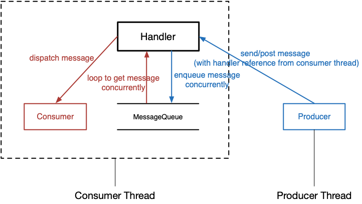

<a name="index">**目录**</a>

- <a href="#ch1">**1 Handler 简介**</a>

<br>
<br>

### <a href="ch1">1 Handler 简介</a><a style="float:right;text-decoration:none;" href="#index">[Top]</a>

在 android 开发中，Handler 通常用于 UI 线程与工作线程之间的通信。由于 UI 线程的高实时性要求，我们必须将一些 IO 或者高计算量的任务分派给一个独立的工作线程去运行，这样在 UI 线程与工作线程之间就需要某种方式来进行通信，比如告知 UI 线程任务的完成情况。Handler 就是为此目的而实现。

在 android 系统的早期版本，Handler 的使用频率相当高，即便是当初用的非常普遍的 AsyncTask，其内部实现也需要 Handler 充当通信桥梁。此外，像 IntentService 也是基于此实现。

如果不谈繁琐的源代码细节，总体来说，**Handler 实现线程间通信是基于生产者-消费者模型。**

<br>
<br>

### <a href="ch2">2 简单的生产者-消费者模型</a><a style="float:right;text-decoration:none;" href="#index">[Top]</a>

一个简单的生产者-消费者模型如下图所示：


在该模型中，有 4 个主要的角色：

- **消息（Mesage）**：消息当中一般存放诸如消息类型、附加数据等信息，由作为发送方的生产者写入，并由作为接收者的消费者读取。
- **消息队列（Message Queue）**：缓存由生产者插入的消息，并等待消费者摘取。所以消息队列是一个共享队列，在具体的实现中，需要进行判空、判满、并发访问操作。
- **生产者（Producer）**：不定期往消息队列插入一个消息。
- **消费者（Consumer）**：从消息队列中取出一个消息，并执行后续操作。

<br>
<br>

### <a href="ch3">3 Handler 中的生产者-消费者模型</a><a style="float:right;text-decoration:none;" href="#index">[Top]</a>

Handler 继承了生产者-消费者模型的思想，如下图所示：



其要点如下：

- 有两个线程——消费者线程和生产者线程，Handler 以及消息队列隶属于消费者线程。如果从内存模型上来判断，这样表述其实并不准确，我们仅从抽象层次来思考，注意，共享的堆并不隶属于某一个线程。
- 生产者往消息队列中插入消息，是通过持有一个 Handler 引用来实现的。
- 生产者通过持有 Handler 引用，可以访问共享的消息队列，往消息队列中写入消息。
- 消费者从共享队列中取消息，是通过 Handler 不停地访问消息队列来实现的。也就是我们在很多博客中看到的 Looper 中的死循环检查。
- 所以，具体实现的时候，通常都是 Handler 提供一个接口给消费者，这样 Handler 便持有了一个消费者的引用，当 Handler 取到消息时，便通过该接口将消息传递给消费者。这通常又引入了 android 当中一个臭名昭著的 Context 泄露问题。

<br>
<br>

### <a href="ch4">4 一些思考</a><a style="float:right;text-decoration:none;" href="#index">[Top]</a>

以上基本上就是 Handler 的实现思想。剩下还有两个点需要注意一下：

1. Handler 循环访问消息队列这个操作，必须是独占的。也就是说，必须只有消费者线程自己能从消息队列中取消息，试想一下，如果其它线程也能从消息队列中取消息，那么本来应该发送给消费者线程的消息就会丢失，造成安全问题。在实现中该操作委托给了一个 **```Looper```** 类，它通过 **```ThreadLocal```** ，用线程本地化操作的方式，将自己绑定到当前的消费者线程。

```java
public final class Looper {
    // ...
    static final ThreadLocal<Looper> sThreadLocal = new ThreadLocal<Looper>();

    // ...

    public static void prepare() {
        prepare(true);
    }

    private static void prepare(boolean quitAllowed) {
        if (sThreadLocal.get() != null) {
            throw new RuntimeException("Only one Looper may be created per thread");
        }

        // 初次实例化，保证一个 thread 只有一个 looper
        sThreadLocal.set(new Looper(quitAllowed));
    }

    // ...

    public static @Nullable Looper myLooper() {
        // 每次都返回的 Looper 都已经被某个消费者线程绑定了，这样 Looper 的所有操作都限定在这个线程里
        return sThreadLocal.get();
    }

    // ...
}
```

2. 我们看到，Handler 是和消费者线程绑定在一起的，那么为什么不和生产者线程绑定呢？其实上述第一点就已经同时解释了这个问题。Handler 绑定到消费者线程的本质就是将 Looper 绑定到消费者线程。那么如果将 Looper 绑定到生产者线程，然后由生产者轮询取得消息后通知消费者线程可以么？如果消费者线程和生产者线程都不是 UI 线程，理论上也是可行的。但是大部分情况下，消费者线程都是 UI 线程，我们知道，UI 线程中的对象都是 UI 线程独占的，不允许其它线程访问，如果生产者来通知 UI 线程，就必须持有 UI 线程的对象，这违反了 UI 线程框架设计的原则。关于 UI 线程框架设计原则的论述，大家可以参考 **```Java Concurrency In Practice```** 这本书的 **```Part II Structuring Concurrent Applications / GUI Appliacations```** 这一章。
