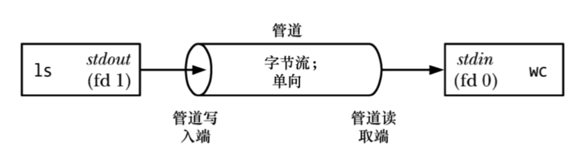
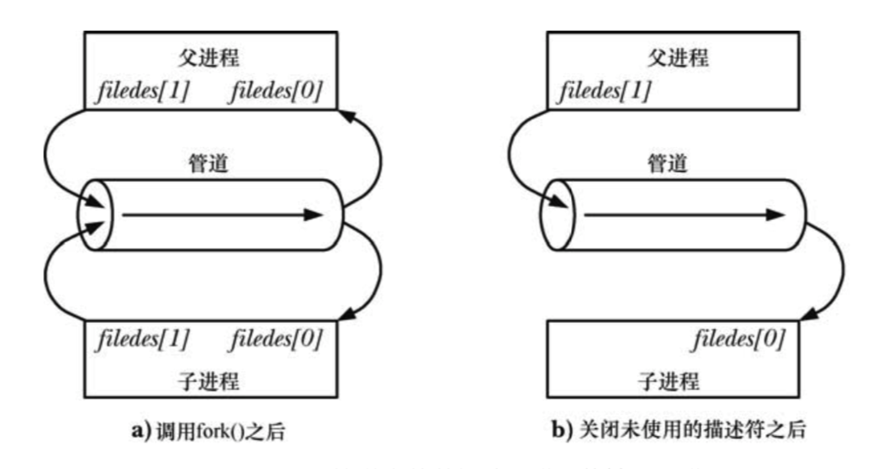

<a name="index">**目录**</a>

- <a href="#ch1">**1 一个典型场景**</a>
- <a href="#ch2">**2 管道要点**</a>
- <a href="#ch3">**3 管道的创建和使用**</a>
- <a href="#reference">**参考**</a>

<br>
<br>

### <a name="ch1">1 一个典型场景</a><a style="float:right;text-decoration:none;" href="#index">[Top]</a>

假如我们在 shell 终端执行以下命令：

```shell
$ ls | wc -l
```

该命令的作用是计算当前目录中文件的个数。这其实是由两个命令组成：`ls` 和 `wc -l`，前者是列出当前目录下的文件名，后者是计算一个给定文件中的字符行数。

可以推测其执行逻辑如下：ls 把列出的文件名按行写入到一个文件，然后 wc 从该文件中逐行统计行数，于是就得到了当前目录下的文件数目。

实际上将 ls 列出的文件名写入到的文件就是管道，组合命令 `ls | wc - l` 的原理就是通过 fork 为 ls 和 wc 各生成一个子进程并通过管道进行通。管道是 Unix 下最古老的跨进程通信方式。



<br>
<br>

### <a name="ch2">2 管道要点</a><a style="float:right;text-decoration:none;" href="#index">[Top]</a>

- **管道是一个字节流**

管道不存在消息和消息边界的概念，从管道中读取数据的进程可以读取任意大小的数据块，而不管写入进程写入管道的数据块的大小是多少。管道中的数据是有序的，读出的字节顺序和写入的字节顺序保持一致。不能通过 lseek 系统调用对管道中的字节流进行随机访问。

- **管道的容量**

管道本质上是一个 **内核** 内存中维护的 **缓冲器**，该缓冲器有一个有限的初始容量，一般来说，该容量一般 **≥ 4096 字节**。

- **管道的阻塞读**

试图从一个空管道中读取数据将会被阻塞直到至少有一个字节被写入管道中为止。如果管道的写入端被关闭了，那么从管道中读取数据的进程在读完管道中剩余的所有数据之后将会看到文件结束(即 read()返回 0)。

- **管道的阻塞写**

如果管道中的数据已经达到其容量限制，后续向该管道的写入操作就会被阻塞直到读者进程从管道中移除一些数据为止。

- **管道是单向的**

在管道中数据的传递方向是单向的。管道的一端用于写入，另一端用于读取。

<br>
<br>

### <a name="ch3">3 管道的创建和使用</a><a style="float:right;text-decoration:none;" href="#index">[Top]</a>

创建一个管道由 pipe 系统调用来完成：

```c
int pipe(int filedes[2]);
```

调用成功后，会在返回参数 filedes 中返回两个文件描述符：`filedes[0]` 用于管道的读取端，`filedes[1]` 用于管道的写入端。

由于是文件描述符，所以可以按照文件描述符的统一操作来在 `filedes[0]` 和 `filedes[1]` 上使用 read() 和 write() 系统调用来在管道上执行 I/O。

但是管道一般是用于在多个 **相关进程** 中进行通信的。这里的相关进程是指有继承关系的进程或者有相同祖先的兄弟进程等。当然在少数情况下也可能是在同一个进程的不同线程间使用（比如 Android 的 Looper 事件通知机制）。

之所以要在相关进程中使用管道，是因为在一个进程上创建管道后，需要将管道的两个文件描述符传递给通信双方的进程。假如是两个不相关的进程，就需要通过另外一种 IPC 方式把文件描述符先传递过去。而如果是相关进程间通信，比如是父子进程，就可以是父进程创建管道，然后通过 fork 一个子进程，子进程把管道的两个文件描述符都继承了过去，这样无需通过三方 IPC 手段进行文件描述符传递了。又比如是兄弟进程间通信，可以通过共同的祖先进程创建管道，然后兄弟进程都共享了该管道的两个文件描述符，从而可以进行通信。

另外，通常情况下，一个进程只负责对管道进行读，另一个进程只负责对管道进行写。当一个进程拥有一个管道的两个文件描述符之后，需要将未使用的文件描述符关闭，这样做的原因如下：

1. 节省文件描述符的使用，内核分配的文件描述符的数量是有限制的。
2. 不关闭未使用的写描述符会导致读进程永久阻塞。读进程读完管道数据后，假设其它写进程已经写完并且关闭了所有的读写描述符，那么因为读进程没有关闭写描述符，其 read() 操作将不会遇到结束标记，因为内核检测到管道上还有进程打开了写描述符，理论上还需要在管道中写入数据（虽然实际并不需要），于是读进程的 read() 系统调用陷入忙等。
3. 不关闭未使用的读描述符会导致写进程永久阻塞。如果写入进程没有关闭管道的读取端，那么即使在其他进程已经关闭了管道的读取端之后写入进程仍然能够向管道写入数据，最后写入进程会将数据充满整个管道，后续的写入请求会被永远阻塞。
4. 不关闭未使用的文件描述符会导致管道得不到释放。

以下为父子进程间使用管道的的图例：



<br>
<br>

### <a name="reference">参考</a><a style="float:right;text-decoration:none;" href="#index">[Top]</a>

[Linux-Unix系统编程手册（第44章）](#)


