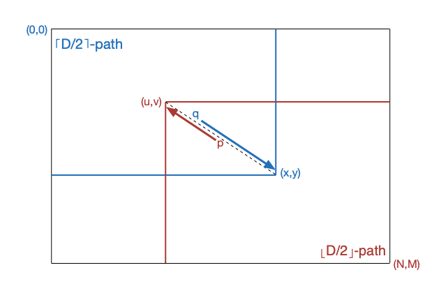

<a name="index">**目录**</a>

- <a href="#ch1">**1 解决的问题**</a>
- <a href="#ch2">**2 Myers贪心策略**</a>
    * <a href="#ch2.1">2.1 编辑图</a>
    * <a href="#ch2.2">2.2 公共轨迹 snake 和轨迹偏移 k</a>
    * <a href="#ch2.3">2.3 两条引理</a>
    * <a href="#ch2.4">2.4 具体实现</a>
- <a href="#ch3">**3 基于分治策略的改进——线性空间复杂度**</a>
    * <a href="#ch3.1">3.1 引理3</a>
    * <a href="#ch3.2">3.2 Myers 分治思想</a>
- <a href="#ch4">**4 彩蛋和参考**</a>

<br>
<br>

### <a name="ch1">1 解决的问题</a><a style="float:right;text-decoration:none;" href="#index">[Top]</a>

Myers差异算法（以下简称 Myers算法）源于解决两个字符串的最长公共子序列问题（LCS）或编辑距离问题（SES）。LCS 和 SES 从本质上讲是等价问题：

- 假设字符串 A 和 B，如果找到了它们的一个最长公共子序列 C，那么从 A 转换到 B，就相当于 `在 A 上删除 A - (A ∩ C)` 然后 `插入 B - (B ∩ C)`，而执行这两步就相当于解最短编辑距离问题。
- 若找到了 A 转换到 B 的最短编辑距离，那么除去需要从 A 中删除和添加的字符以外，剩下的字符都是 A 和 B 都有且相对顺序一致且长度最长的字符集，即最长公共子序列。

基于以上的认识，如果给定一种操作即同时遍历 A 和 B，`x` 表示 A 的当前索引，`y` 表示 B 的当前索引；同时给定三种执行命令：

- `deleteA`：表示删除 A 中当前索引位置的字符。
- `insertB`：表示插入 B 中当前索引位置的字符。
- `skip`：表示同时跳过 A 和 B 中当前索引位置的字符，如果 `A[x] == B[y]` 则执行此命令。

现假设有一段命令序列形如：`Seq = [deleteA, deleteA, insertB, skip, skip, ..., insertB, skip, deleteA, skip]`。且执行 Seq 后，`skip` 跳过过的字符组合过来就是一段 LCS，而 `deleteA` 和 `insertB` 的数量就是 A 到 B 的最短编辑距离长度，那么我们说 Seq 是一个 LCS 和 SES 的可行解，如果我们能找到一种算法，该算法可以返回一个可行的 Seq，那么我们说这个算法是 LCS 和 SES 可行的。

Myers 算法就是一个 LCS 和 SES 可行的算法，其时间复杂度为 `O(ND)`，其中 N 表示字符串 A 和 B 的规模（通常情况下两者的长度差异很小，可以归一为 N），D 表示 A 和 B 的最小差异长度（即最短编辑距离长度）。而常规的动态规划算法解 LCS 问题的时间复杂度为 `O(N²)`，一些改进型算法可以优化到 `O(NlogN)`。可以看到，Myers 算法严格优于常规动态规划算法，当 `D << logN` 的时候也要优于改进型算法，同时 Myers 算法的空间改进版本可以优化到 `O(N)`，在内存空间受限的应用场景具有明显的优势。

<br>
<br>

### <a name="ch2">2 Myers贪心策略</a><a style="float:right;text-decoration:none;" href="#index">[Top]</a>

Myers 算法的执行过程与上一节描述的方法比较类似：同步遍历两个字符串，只不过并不是简单按照索引顺序进行遍历，而是先对问题进行一些形式化处理，并根据形式化的规则来进行遍历。我们先看看 Myers 算法对问题的形式化处理。

#### <a name="ch2.1">2.1 编辑图</a>

**编辑图** 是一个二维坐标图，x 轴表示为源字符串 A，A 中的每个字符索引与 x 坐标点一一对应；y 轴表示为目的字符串 B，B 中的每个字符索引与 y 坐标点一一对应。

一条 **path（路径）** 描述为从原点 (0, 0) 开始或沿着 x 正方向或沿着 y 正方向或同时沿着 x 和 y 对角线方向移动的轨迹。每往右走一步，x + 1，表示删除 A 中当前字符；每往下走一步，y + 1，表示插入 B 中当前字符；每往对角线方向走一步，x + 1 且 y + 1，表示 `A[x] == B[y]` ，跳过当前 A 和 B 的坐标值。

标记 **D-path** 为在一个给定编辑图中需要经过 D 次编辑（删除或插入）操作后的 path。

把 path 的轨迹用坐标点分别列出来，就形成了一条 **trace（追踪）**：(x1, y1) (x2, y2) ... (xL, yL)，其中 L 为 path 的长度。算法结束后将得到一条从 (0, 0) 到 (N, M) 的 trace，其中 N 为 A 的长度，M 为 B 的长度。

将形成 path 的操作列出来就得到一段 **edit script（编辑代码）**。编辑代码包括两条命令：

- *`xD`*：删除 A 中索引位置为 x 的字符，即 `A[x]`。
- *`xIb1,b2,...,bt`*：在 `A[x]` 之后插入字符序列 b1,b2,...,bt。

以下就是一个编辑图的例子（来自 Myers 的论文）：


#### <a name="ch2.2">2.2 公共轨迹 snake 和轨迹偏移 k</a>

一条 **snake** 就是编辑图中的一条对角边，表示的是 A 和 B 的当前字符相等，不需要进行编辑，抑或是公共子序列中的一个公共字符，所以我将 snake 称之为 **公共轨迹**。

一条 snake 所在的直线在编辑图中如果用线性方程表示即为：`y = x - k`。因为每次都同时往 x 和 y 方向走一步，所以不同的 snake 都有相同的斜率为 1，其唯一的不同在于其所在直线以 y 轴（或 x 轴）为基线在 x 轴（或 y 轴）上的偏移位置，而 k 就是这个偏移，归一化为 `k = x - y`。所以这里我称之为 **轨迹偏移 k**。

不难推断，每个 k 都是由两个特定的前向编辑操作之后导出的：要么是从 k + 1 因为插入操作向下变为 k；要么是从 k - 1 因为删除操作往右变为 k。

接下来引出两条关键的引理。


#### <a name="ch2.3">2.3 两条引理</a>

- **引理 1：在一条 D-path 中，最后一条 snake 的轨迹偏移 k ∈ { -D, -D+2, ..., D }**。

引理 1 给出了末端轨迹偏移 k 与编辑距离 D 之间的关系：**编辑距离 D 与 末端 k 有相同的奇偶性**。

该定理容易用数学归纳法证明：首先，0-path 表示 A 和 B 完全等价，不用编辑，只有一条 snake，且 `x == y`，即 `k == 0`；假设 D-path 满足定理要求，对于 (D+1)-path，D-path 是其子问题，且只可能由 D-path 问题经过一系列 snake 之后要么执行删除（往右，k-1），要么执行插入（往下，k+1），然后又经过一系列 snake 完成。于是 (D+1)-path 满足 `k ∈ { (-D)±1, (-D+2)±1, ..., (D)±1 } = { -(D+1), -(D+1)+2, ..., (D+1) }`，得证！


- **引理 2：一个末端轨迹偏移为 k 的 D-path 问题，可以分解为一个末端偏移轨迹为 k-1 的 (D-1)-path 问题和一个插入操作之后跟若干段尽可能长的连续的 snake；或者分解为一个末端偏移轨迹为 k+1 的 (D-1)-path 问题和一个删除操作之后跟若干段尽可能长的连续的 snake。**

引理 2 实际上就是说明 **D-path 问题具有最优子结构性质**。具体来说，D 和 k 决定了问题的规模；引理中描述的 `在一个编辑（删除\插入）操作之后跟若干段尽可能长的连续的 snake` 说明了我们可以考虑在子问题中采用贪心策略。即，在每编辑一次之后，尽可能地把当前位置之后所有连续的相等的字符都跳过，这样做的目的就是尽可能地把问题的规模缩小到极致，这是一种非形式化的证明。


#### <a name="ch2.4">2.4 具体实现</a>

根据上一节的两个引理，我们大致可以按照如下的方法来求解一个差异问题：

首先，如果给定一个差异问题，那么其 D 和末端 k 就是确定的，那么如果将问题分解为子问题，那么每个子问题都一一对应一个 D 和末端 k，且 `子问题 D < 父问题 D`，根据引理 1 可知 `子问题末端 k < 父问题末端 k`。

其次，给定一个差异问题，那么也就确定了该问题 D 和 k 的范围，比如 D-path 问题，`D ∈ [0, M+N]`，`D == 0` 表示 A 和 B 等价，`D == M+N` 表示 A 和 B 没有任何公共字符。

所以，反过来如果对于 D 和末端 k 范围内的每一个值都能计算出最后一个 snake 最远能到达的距离，即 trace 最终能到达的坐标点 (xL, yL)，那么也就确定了该 D 和末端 k 对应的子问题，如果 (xL, yL) == (N, M)，就说明该子问题就是原问题，而此时的 D 和末端 k 就是原问题的解。

大致的流程如下（源于 Myers 的论文）：

```
For D ← 0 to M+N Do
    For k ← −D to D in steps of 2 Do
        计算出 D-path 在末端 k 能到达的最终坐标点 endpoint
        If endpoint == (N,M) Then
            The D-path is an optimal solution.
            Stop
```


我们可以用一个数组 V 来存放上一个子问题（即 (D-1)-path 问题）的相关解，设 `V[k] == x`，那么就相当于数组 V 同时存放了每个子问题的 x,y,k 三个值，即 `一个末端轨迹偏移为 k 的 D-path 问题其 trace 最远能到达 (x, y)`，伪代码如下（源自 Myers 论文）：

```
    Constant MAX ∈ [0,M+N]
    Var V: Array [− MAX .. MAX] of Integer

1.  V[1] ← 0
2.  For D ← 0 to MAX Do
3.      For k ← −D to D in steps of 2 Do
4.          If k = −D or k ≠ D and V[k − 1] < V[k + 1] Then
5.              x ← V[k + 1]
6.          Else
7.              x ← V[k − 1]+1
8.          y ← x − k
9.          While x < N and y < M and a x + 1 = by + 1 Do (x,y) ← (x+1,y+1)
10.         V[k] ← x
11.         If x ≥ N and y ≥ M Then
12.             Length of an SES is D
13.             Stop
14. Length of an SES is greater than MAX
```


注意到代码第 3 行的循环，每次循环中，k 的奇偶性都是确定的，且相邻两次循环的 k 值的奇偶性都不同，即 k 与 k+1 和 k-1 的奇偶性正好相反，又因为 D-path 的计算只与 (D-1)-path 相关，所以上一轮计算出来的 V 的值正好可以被当前轮循环利用到且不用担心脏数据。同时也说明该算法既是一种贪心算法也是一种动态规划算法。

现在来说明代码第 4 到第 8 行，这一段代码用来确定 `V[k]` 即 `x` 的值。也可以说根据末端 k 确定当前子问题的末端 snake 的起始坐标。具体来说：

- **如果 k == -D**，那么前一个子问题 (D-1)-path 的末端 k 可能为 k+1 == -D+1 或者 k-1 == -D-1，而根据引理 1，(D-1)-path 的末端 k ∈ { -(D-1), -(D-1)+2, ..., (D-1) }，所以 (D-1)-path 的末端 k 不可能为 -D-1，即当前问题只能由 (D-1)-path 从末端轨迹偏移 k+1 **插入** 字符后进行转换。所以，当前问题的 x 坐标与子问题 (D-1)-path 的 x 坐标相等，而子问题 (D-1)-path 的 x 坐标保存在 `V[k+1]` 中，所以当前问题的 x 坐标值为：`x = V[k+1]`。

- **如果 k == D**，那么前一个子问题 (D-1)-path 的末端 k 可能为 k+1 == D+1 或者 k-1 == D-1，而根据引理 1，(D-1)-path 的末端 k ∈ { -(D-1), -(D-1)+2, ..., (D-1) }，所以 (D-1)-path 的末端 k 不可能为 D+1，即当前问题只能由 (D-1)-path 从末端轨迹偏移 k-1 **删除** 字符后进行转换。所以，当前问题的 x 坐标是子问题 (D-1)-path 的 x 坐标向右移一步，而子问题 (D-1)-path 的 x 坐标保存在 `V[k-1]` 中，所以当前问题的 x 坐标值为：`x = V[k-1] + 1`。

- **剩下的中间状态 k ∈ (-D, D)**，既可能是末端轨迹偏移为 k-1 的子问题 (D-1)-(k-1)-path 往右走一步删除字符得到，也可能是末端轨迹偏移为 k+1 的子问题 (D-1)-(k+1)-path 往下走一步插入字符得到。算法通过比较两个子问题的 x 坐标值大小（子问题 (D-1)-(k-1)-path 的 x 坐标为 `V[k-1]`；子问题 (D-1)-(k+1)-path 的 x 坐标为 `V[k+1]`）来判断选取哪个子问题作为当前问题的前一个子问题：

    * 若 `V[k+1] > V[k-1] => V[k+1] >= V[k-1] + 1`：若选取子问题 (D-1)-(k-1)-path，则当前问题的末端 snake 起始坐标为 `midPoint1 = (V[k-1] + 1, V[k-1] - k + 1)`；若选取子问题 (D-1)-(k+1)-path，则当前问题的末端 snake 起始坐标为 `midPoint2 = (V[k+1], V[k+1] - k)`。显然有 `midPoint2.x >= midPoint1.x && midPoint2.y >= midPoint1.y`，所以子问题 (D-1)-(k+1)-path 走的更远，选取 (D-1)-(k+1)-path 作为前一个子问题，而当前问题的 x 坐标值为：`x = V[k+1]`。
    * 若 `V[k+1] <= V[k-1] => V[k+1] < V[k-1] + 1`，同理可以证明子问题 (D-1)-(k-1)-path 走的更远，选取 (D-1)-(k-1)-path 作为前一个子问题，而当前问题的 x 坐标值为：`x = V[k-1] + 1`。

从 (D-1)-path 到 D-path 的 path 路径图如下所示：

-path to D-path with insert")

<br>

-path to D-path with delete")

<br>

这样，通过执行代码第 4 到第 8 行，就确定了当前子问题的末端 snake 的起始坐标为 `(V[k-1] + 1, V[k-1] - k + 1)` 或 `(V[k+1], V[k+1] - k)`。

而代码第 9~10 行将沿着末端 snake 尽可能地延伸，最终确定末端 snake 的终点坐标为 `endPoint = (V[k], V[k] - k)`。可以看到在求解每个子问题的时候，数组 V 中存储的前序子问题的末端 snake 都达到了它最远能达到的距离，这就是贪心策略的核心。

需要特别说明的是数组 V 的初始化值为 `V[1] = 0`，这对应的是 0-path 子问题的前序子问题。0-path 问题中 k == -D == D == 0，在上述分析代码第 4~8 行中直接采取 k == -D 的情况得到 0-path 问题的末端 snake 起始坐标为：`(V[0+1], V[0+1]-0) == (0, 0)`。

代码 11 行将判断末端 snake 终止坐标如果已经到达编辑图终点 (N, M)，则说明字符串比较已经结束，当前 `k, V[k], D` 三元组（实际为四元组 `x, y, k, D`）即为最优解的末端 snake 终点、轨迹偏移、最短编辑距离。

如上算法可以直接得到最短编辑距离 `D` 以及 LCS 长度 `(N+M-D)/2`。但是不能直接得到最优解的 path（即最优解的所有 snake 序列），算法中的每一轮循环结束后，数组 V 中保存了该轮子问题的末端轨迹偏移 k 和末端 snake 终点坐标，但是在求解后续子问题的时候，数组 V 中的值有可能被覆盖，所以算法结束后，无法从原问题回溯到子问题还原出 snake 序列。而要做到这一点，需要在算法的每轮外循环中用一个二维数组 Vs 保存该轮 D 对应的数组 V（对应编辑距离为 D 的所有 D-path 问题集合）。当到达终点 (N, M) 之后，再逆向回溯每一个子问题集合（D-1-paths, D-2-paths,...），在每一个子问题序列中找到最优解 path 上的那个子问题的 snake 并保存，算法如下：

```
    Constant MAX ∈ [0,M+N]
    Var V: Array [− MAX .. MAX] of Integer
    Var Vs: Array [0...MAX] of V
    Var Snakes: Array [0...MAX]

1.  V[1] ← 0
2.  For D ← 0 to MAX Do
3.      For k ← −D to D in steps of 2 Do
4.          If k = −D or k ≠ D and V[k − 1] < V[k + 1] Then
5.              x ← V[k + 1]
6.          Else
7.              x ← V[k − 1]+1
8.          y ← x − k
9.          While x < N and y < M and a x + 1 = by + 1 Do (x,y) ← (x+1,y+1)
10.         V[k] ← x        
11.         If x ≥ N and y ≥ M Then
12.             Vs[D] ← V
13.             point ← (x, y)
14.             For d ← D to 0 Do
15.                 If point.x ≤ 0 or point.y ≤ 0 Then Break
16.
18.                 v ← Vs[d], k ← point.x - point.y
19.                 end ← (v[k], v[k] - k)
20.
21.                 If k = -D or k ≠ D and v[k − 1] < v[k + 1] Then
22.                     start ← (v[k+1], v[k+1] - (k+1))
23.                     mid ← (start.x, startx - k)
24.                 Else
25.                     start ← (v[k-1], v[k-1] - (k-1))
26.                     mid ← (start.x + 1, start.x + 1 - k)
27.
28.                 Snakes.add(mid, end)
29.
30.                 point ← start
31.             Stop
32.     Vs[D] ← V
33. Length of an SES is greater than MAX
```


这样在原算法的基础上从第 12 行开始添加一个回溯 snakes 的过程。这种回溯 snakes 的方法因为需要一个二维数组来保存每个子问题的解，所以其空间复杂度为 `O(N²)`，这不太适应于问题规模较大且内存空间受限的应用场景。为了对空间复杂度进行渐进意义的优化，接下来继续讨论一种基于分治策略的改进型 Myers 算法，它能将空间复杂度优化为线性复杂度 `O(N)`。

<br>
<br>

### <a name="ch3">3 基于分治策略的改进——线性空间复杂度</a><a style="float:right;text-decoration:none;" href="#index">[Top]</a>

Myers 算法的空间优化版基于以下一个引理，这是该算法的第三个重要引理：

#### <a name="ch3.1">3.1 引理3</a>

- **引理 3：在编辑图中，存在一条从 (0,0) 到 (N,M) 的 D-path 路径当且仅当存在一条从 (0,0) 到某个点 (x,y) 的 ⌈D/2⌉-path 路径以及存在一条从某个点 (u,v) 到 (M,N) 的 ⌊D/2⌋-path 路径，并满足如下条件：**

    * **可行性质：** `u+v ≥ ⌈D/2⌉ 且 x+y ≤ N+M-⌊D/2⌋ 且`
    * **重叠性质：** `x-y = u-v 且 x ≥ u`

**同时，(0,0)-(x,y)-⌈D/2⌉-path 和 (u,v)-(N,M)-⌊D/2⌋-path 都被包含在一条 (0,0)-(N,M)-D-path 路径当中。**

为了能够真正理解接下来的分治策略，需要清楚的知道该引理的本质，现证明如下：

**充分性：**假设存在一条 (0,0)-(N,M)-D-path 路径，那么该路径一定有一条中间 snake（长度可以为 0），从该 snake 的起点 (x,y) 处可以把路径一分为二： (0,0)-(x,y)-⌈D/2⌉-path 和 (u,v)-(N,M)-⌊D/2⌋-path，且 (u,v)=(x,y)。那么如果从 (0,0) 到 (u,v) 之间求解路径，那么该路径至多有 u+v 条非对角边，又因为 (u,v)=(x,y)，则 (0,0)-(u,v)-⌈D/2⌉-path 存在，所以有 u+v ≥ ⌈D/2⌉；同理，从 (x,y) 到 (N,M) 的路径至多有 N+M-(x+y) 条非对角边，又因为 (u,v)=(x,y)，则 (x,y)-(N,M)-⌊D/2⌋-path 存在，所以有 N+M-(x+y) ≥ ⌊D/2⌋ 即 x+y ≤ N+M-⌊D/2⌋，于是可行性质得证。最后因为 (u,v)=(x,y) 所以有 u-v = x-y 且 x ≥ u，重叠性质得证。

**必要性：**假设 (0,0)-(x,y)-⌈D/2⌉-path 和 (u,v)-(N,M)-⌊D/2⌋-path 存在，且满足可行性质和重叠性质。另从 (0,0) 到 (u,v) 求解得路径 k-path，因为根据重叠性质有 u ≤ x 所以有 k ≤ ⌈D/2⌉。令 ∆ = ⌈D/2⌉-k，从重叠性质 x-y = u-v 可知，(0,0)-(x,y)-⌈D/2⌉-path 和 (0,0)-(u,v)-k-path 有相同的末端轨迹偏移 K，而根据引理 1，⌈D/2⌉,k,K 三者有相同的奇偶性，所以 ∆ 必然是偶数。然后可知 (0,0)-(u,v)-k-path 有 (u+v-k)/2 ≥ ∆/2 条对角边（根据 LCS 和 SES 之间的关系以及可行性质 u+v ≥ ⌈D/2⌉ 可知）。所以，如果我们将 (0,0)-(u,v)-k-path 中的其中 ∆/2 条对角边替换成两条非对角边之后，(0,0)-(u,v)-k-path 中的编辑距离将变为 k+2×∆/2 = ⌈D/2⌉-∆+2×∆/2 = ⌈D/2⌉，即转换成为 (0,0)-(u,v)-⌈D/2⌉-path，其与原本的 (u,v)-(N,M)-⌊D/2⌋-path 将组合成 (0,0)-(N,M)-D-path，且该组合路径相当于可以分割成 (0,0)-(x,y)-⌈D/2⌉-path 和 (u,v)-(N,M)-⌊D/2⌋-path，且 (u,v)=(x,y) 的形式，这又回到了上述充分性的假设前提中，重要的是 (u,v)-(N,M)-⌊D/2⌋-path 被包含在新组合的 (0,0)-(N,M)-D-path 中；根据对称性可知，(0,0)-(x,y)-⌈D/2⌉-path 也被包含在一条新组合的 (0,0)-(N,M)-D-path 中。综上，必然存在一条 (0,0)-(N,M)-D-path 路径，必要性得证。

#### <a name="ch3.2">3.2 Myers 分治思想</a>

从 2.4 节求解 snakes 的过程可以看出，要求解差异问题，实际就是要把所有的 snakes 求解出来。而根据引理 3，每一个 D-path 都可以被一条中间 snake 进行等分（⌈D/2⌉-path, middle snake, ⌊D/2⌋-path），这样我们可以如下考虑分治策略的思路：

1. 试图找出 D-path 的 middle snake。
2. 原问题被分解为 ⌈D/2⌉-path, middle snake, ⌊D/2⌋-path，保存 middle snake。
3. 对于 ⌈D/2⌉-path，若 ⌈D/2⌉ > 0，转步骤 1。
4. 对于 ⌊D/2⌋-path，若 ⌊D/2⌋ > 0，转步骤 1。
5. 将保存的 middle snake 序列按坐标排序返回，得解！

可见，该分治策略的关键在于如何找到 middle snake？求解这个关键问题的关键仍然需要用到引理 3。假设我们已经通过贪心策略求解出 (0,0)-(x,y)-⌈D/2⌉-path，那么 ⌈D/2⌉-path 的末端 snake 就求解出来了，该 snake 就是 D-path 的 middle snake。然而问题是，我们一开始并不知道 D-path 的 D 是多少，所以并不能确定 ⌈D/2⌉-path 的结束时机，所以问题又转化为如何确定 ⌈D/2⌉-path 的结束时机。为此，我们可以采取从左上角和右下角同时相向求解的方法，根据引理 3，因为两个方向的求解速度是一样的，所以当两个方向的 path 发生重叠的时候，说明已经求解到 D/2 了。那么如何确定发生了重叠呢？实际上引理 3 的重叠性质已经给出了答案：判断 x ≥ u 是否成立即可，其中，x ∈ (0,0)-(x,y)-⌈D/2⌉-path，u ∈ (N,M)-(u,v)-⌊D/2⌋-path。

接下来我们还需要证明如下一个结论：**相向求解 ⌈D/2⌉-path 和 ⌊D/2⌋-path 并发生重叠之后， D-path 的 middle snake 就是连接 (u,v) 和 (x,y) 的对角边。**

考虑发生重叠后，D-path，⌈D/2⌉-path 和 ⌊D/2⌋-path 之间的关系图如下所示：



如图所示，当发生重叠时，⌈D/2⌉-path 的末端 snake 为点 q 到 (x,y) 的对角边；⌊D/2⌋-path 的末端 snake 为点 p 到 (u,v) 的对角边。由引理 3 重叠性质可知，(u,v),p,q,(x,y) 四点共线。

接下来我们需要讨论 D 为奇数和偶数两种情况：

- 当 D 为奇数时，令 ⌈D/2⌉ = d, ⌊D/2⌋ = d-1。

    * 首先，当发生重叠时，在求解 ⌈D/2⌉-path 时可以率先得知 x ≥ u 成立。且一定有 q.x ≥ u，可以用反证法证明，如果 q.x < u，则 q 到 (x,y) 之间的字符都相等，(u,v) 将可以继续延伸到 q 点，这与 (u,v) 是 ⌊D/2⌋-path 反向可达的最远距离矛盾。
    
    * 然后，因为在求解 ⌈D/2⌉-path 时，只有在求解到 d-path 的时候才发生重叠，而在 (d-1)-path 的时候不发生重叠，此时末端 snake 的终点为 q'，而 q'.x=q.x（末端轨迹偏移为 k+1）或者 q'.x=q.x-1（末端轨迹偏移为 k-1），即有 q'.x < u，这等价于 q.x ≤ u。综上，必有 q.x = u，又因为共线，所以 q 和 (u,v) 共点。

    * 另外，我们还能得出 p.x ≤ x，如果不这样，因为 p 到 (u,v) 之间的字符都相等，根据贪心策略，(x,y) 必将继续延伸到 p 为止，这与 (x,y) 是 ⌈D/2⌉-path 可达的最远距离矛盾。然而根据已有条件，我们并不能得出 p.x ≥ x，即不能判断 p 和 (x,y) 是否共点。所以只能判断 ⌈D/2⌉-endSnake.length ≥ ⌊D/2⌋-endSnake.length。
    
    * 于是，D-path 的 middle snake 两端点即为 (u,v) 到 (x,y)，即 ⌈D/2⌉-endSnake。那么为什么不取 ⌊D/2⌋-endSnake 即 p→(u,v) 为 middle snake 呢？假设如此取，则接下来将求解子问题 (0,0)-(u,v)-⌈D/2⌉-path 和 p-(N,M)-⌊D/2⌋-path，对于第二个子问题，根据贪心策略，p→(x,y) 必然被选为 snake，既然在后续子问题中该对角边也会被选择，不如现在就取 ⌈D/2⌉-path 和 ⌊D/2⌋-path 的末端 snake 中的最大者，同时还能减少右下角子问题的规模。

- 当 D 为偶数时，令 ⌈D/2⌉ = ⌊D/2⌋ = d。

    * 首先，当发生重叠时，在求解 ⌊D/2⌋-path 时可以率先得知 x ≥ u 成立。且一定有 p.x ≤ x，用反证法，如果 p.x > x，则 p 到 (u,v) 之间的字符都相等，(x,y) 将可以继续延伸到 p 点，这与 (x,y) 是 ⌈D/2⌉-path 可达的最远距离矛盾。

    * 然后，因为在求解 ⌊D/2⌋-path 时，只有在求解到 d-path 的时候才发生重叠，而在 (d-1)-path 的时候不发生重叠，此时末端 snake 的终点为 p'，而 p'.x=p.x（末端轨迹偏移为 k+1）或者 p'=p.x+1（末端轨迹偏移为 k-1），即有 p'.x > x，这等价于 p.x ≥ x。综上，必有 p.x = x，又因为共线，所以 p 和 (x,y) 共点。

    * 另外，我们还能得出 q.x ≥ u，如果不这样，因为 q 到 (x,y) 之间的字符都相等，根据贪心策略，(u,v) 必将继续延伸到 q 为止，这与 (u,v) 是 ⌊D/2⌋-path 可达的最远距离矛盾。然而根据已有条件，我们并不能得出 q.x ≤ u，即不能判断 q 和 (u,v) 是否共点。所以只能判断 ⌊D/2⌋-endSnake.length ≥ ⌈D/2⌉-endSnake.length。

    * 于是，D-path 的 middle snake 两端点即为 (x,y) 到 (u,v)，即 ⌊D/2⌋-endSnake.length。和 D 为奇数的情况同理，可以证明不能取 q→(x,y) 为 middle snake。

所以，无论当 D 奇数还是偶数，我们都可以得出 D-path 的 middle snake 为连接 (u,v) 和 (x,y) 的对角边。结论证毕。

根据这个结论，就可以写出下面的伪代码（源自 Myers 的论文）实现了：

```
∆ ← N−M
For D ← 0 to 2 (M + N)/23 Do
    For k ← −D to D in steps of 2 Do
        Find the end of the furthest reaching forward D-path in diagonal k.
        If ∆ is odd and k ∈ [∆ − (D − 1), ∆ + (D − 1)] Then
            If the path overlaps the furthest reaching reverse (D − 1)-path in diagonal k Then
            Length of an SES is 2D−1.
            The last snake of the forward path is the middle snake.
    For k ← −D to D in steps of 2 Do
        Find the end of the furthest reaching reverse D-path in diagonal k+∆.
        If ∆ is even and k + ∆ ∈ [−D, D] Then
            If the path overlaps the furthest reaching forward D-path in diagonal k+∆ Then
            Length of an SES is 2D.
            The last snake of the reverse path is the middle snake.
```

该伪代码只写出了分治算法的一次迭代，但也足以说明其实现过程。和前面分析 D 的奇偶性一致，当 D 为奇数时，只需要从 ⌈D/2⌉-path 分支判断是否发生重叠；当 D 为偶数时，只需要从 ⌊D/2⌋-path 分支判断是否发生重叠。另外，需要说明一下两个分支中判断是否重叠的 k 值的范围。

对于正方向而言，当 D=0 时是最小子问题，只存在从 (0,0) 出发的对角边，即 k=0，所以 D-path 的轨迹偏移 k 是以 0 为对称轴的 `[-D, D]` 区间；而对于反方向而言，当 D=N-M=∆ 时是最小子问题，只存在从 (N,M) 出发的对角边，即 k=∆，所以 D-path 的轨迹偏移 k 是以 ∆ 为对称轴的 `[∆ - (-D), ∆ + D]` 区间。

如果记正方向的轨迹偏移为 fk，反方向的轨迹偏移 bk，则 fk 和 bk 有如下关系：

```
bk = fk - ∆
fk = bk + ∆
```

所以在伪代码中，

- 当 D 为奇数，从正方向分支判断是否发生重叠时，反方向已经计算完 (D-1)-path，所以有：

```
fk = k ∈ [-D, D]，而
fk - ∆ = bk ∈ [-(D-1), D-1]，即有
k = fk = bk + ∆ ∈ [∆ - (D-1), ∆ + (D-1)]
```

所以，在已知 `k ∈ [-D, D]` 时，还可以通过 `k ∈ [∆ - (D-1), ∆ + (D-1)]` 来缩小判断范围。

- 当 D 为偶数，从反方向分支判断是否发生重叠时，正方向已经计算完 D-path，所以有：

```
bk = k ∈ [-D, D]，而
bk + ∆ = k + ∆ = fk ∈ [-D, D]
```

所以，在已知 `k ∈ [-D, D]` 时，还可以通过 `k + ∆ ∈ [−D, D]` 来缩小判断范围。

<br>
<br>

### <a name="ch4">4 彩蛋和参考</a><a style="float:right;text-decoration:none;" href="#index">[Top]</a>

Myers 的论文中提供了一个很有意思的问题迁移：如果在编辑图中，往又走一步或下走一步均表示代价为 1，而往对角线方向走一步代价为 0，那么差异问题就转换为一个在有向无环图中寻找点 (0,0) 到点 (N,M) 的单源最短路径问题，该问题的 Dijkstra 算法版本需要的时间复杂度为 O(NlogN)。

<br>

**参考：**

1. [Myers差异算法论文](images/diff2.pdf)
2. [Myers' Diff Algorithm : The basic greedy algorithm](http://simplygenius.net/Article/DiffTutorial1)
3. [Myers算法的在线演示](https://blog.robertelder.org/diff-algorithm/)


